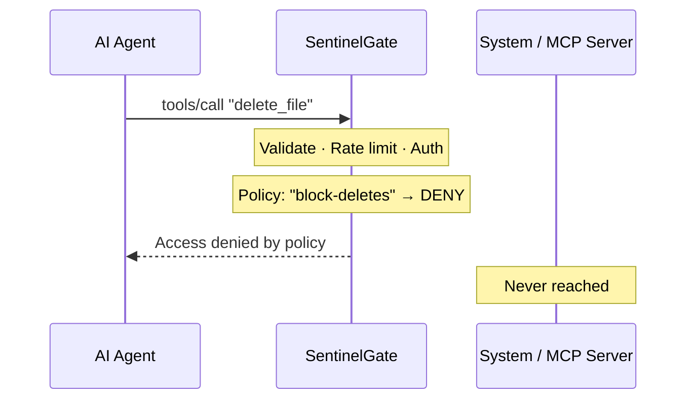
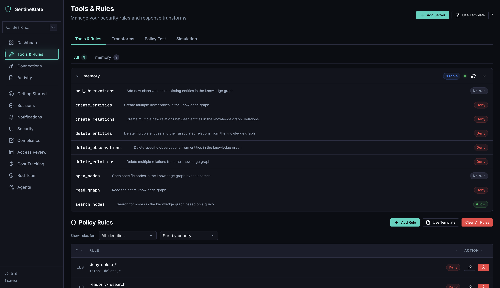
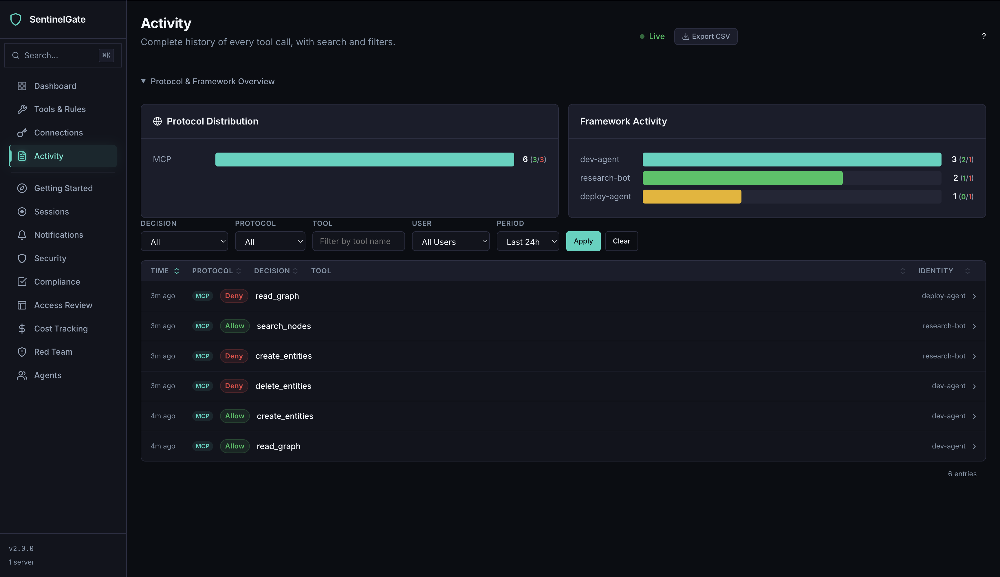
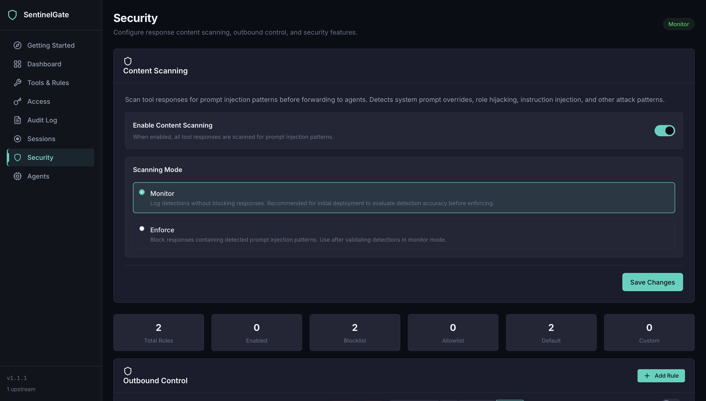

<h1 align="center">SentinelGate</h1>

<p align="center">
  <strong>Universal firewall for AI agents.</strong><br>
  Intercepts MCP tool calls, shell commands, file access, and HTTP requests.<br>
  RBAC · CEL policies · Full audit trail
</p>

<p align="center">
  <a href="https://github.com/Sentinel-Gate/Sentinelgate/actions/workflows/ci.yml"></a>
  <a href="LICENSE"></a>
  <a href="https://go.dev"></a>
  <a href="https://github.com/Sentinel-Gate/Sentinelgate/releases"></a>
</p>

<p align="center">
  <a href="#quick-start">Get Started</a> · <a href="https://www.sentinelgate.co.uk">Website</a> · <a href="docs/Guide.md">Docs</a>
</p>

---

## The problem

AI agents have unrestricted access to your machine — every tool call, shell command, file read, and HTTP request runs with no policy, no authentication, and no audit trail. One prompt injection or one hallucination is all it takes.

## How SentinelGate works

SentinelGate sits between the AI agent and your system. Every action is intercepted, evaluated against your policies, and logged — before it reaches anything. Denied actions are blocked at the proxy.



No code changes. No agent modifications.

### Design philosophy                                                                                                                                                                                             
SentinelGate is built around one observation: AI agents are not malware. They use standard libraries, follow HTTP conventions, and call tools through documented protocols. A policy layer at these choke points — MCP protocol, runtime hooks, HTTP proxy — catches mistakes, prompt injection, and overreach effectively.                                                                                                           
                                                                                                                                                  This is a deliberate trade-off. OS-level sandboxing (seccomp, Seatbelt) would provide stronger isolation but requires root, is platform-specific, and breaks agent workflows. SentinelGate runs in userspace, works cross-platform, and needs zero configuration. As MCP becomes the standard protocol for agent-tool interaction, the protocol-level enforcement becomes the primary defense — and that layer is airtight.

                                                                                                                                                  
For defense-in-depth against adversarial code, combine SentinelGate with container or VM sandboxes.
                                                                                                                                                  
---

## Quick start

**Install** (macOS / Linux):

```bash
curl -sSfL https://raw.githubusercontent.com/Sentinel-Gate/Sentinelgate/main/install.sh | sh
```

> **Windows:** download the `.zip` from [GitHub Releases](https://github.com/Sentinel-Gate/Sentinelgate/releases) — see details below.

<details>
<summary>Manual download or build from source</summary>

**Download** from [GitHub Releases](https://github.com/Sentinel-Gate/Sentinelgate/releases):

| Platform | Archive |
|----------|---------|
| macOS (Apple Silicon) | `sentinel-gate_darwin_arm64.tar.gz` |
| macOS (Intel) | `sentinel-gate_darwin_amd64.tar.gz` |
| Linux (x86_64) | `sentinel-gate_linux_amd64.tar.gz` |
| Linux (ARM64) | `sentinel-gate_linux_arm64.tar.gz` |
| Windows (x86_64) | `sentinel-gate_windows_amd64.zip` |

**macOS / Linux:**
```bash
tar xzf sentinel-gate_*.tar.gz
chmod +x sentinel-gate
sudo mv sentinel-gate /usr/local/bin/
```

**Windows:** extract the `.zip` and add `sentinel-gate.exe` to your `PATH`.

**Build from source** (Go 1.24+):

```bash
git clone https://github.com/Sentinel-Gate/Sentinelgate.git
cd Sentinelgate && go build -o sentinel-gate ./cmd/sentinel-gate
```

</details>

**Run:**

```bash
sentinel-gate run -- claude          # Claude Code
sentinel-gate run -- gemini          # Gemini CLI
sentinel-gate run -- python agent.py # Python agent
sentinel-gate run -- node agent.js   # Node.js agent
```

Open **http://localhost:8080/admin** to manage policies, upstreams, and identities from the browser.

> **`run` handles everything:** starts the server, configures runtime hooks and HTTP proxy for your agent, generates a per-session API key, and cleans up on exit. To give your agent access to external MCP tools, add upstream servers in the Admin UI.

---

## MCP server mode

`run` wraps an agent process. To run SentinelGate as a standalone MCP proxy — without wrapping an agent — use `start`:

```bash
sentinel-gate start
```

The MCP endpoint is available at `http://localhost:8080/mcp`. Point your client there and add the API key from the Admin UI.

Add upstream MCP servers through the Admin UI — your client sees all their tools through a single endpoint, with policies applied.

---

## Features

**Deterministic enforcement** — Explicit rules, not AI judgment. `deny delete_*` means denied. Always. No probabilistic filtering, no drift.

**MCP-native** — Built as an [MCP](https://modelcontextprotocol.io) proxy from the ground up. Aggregates multiple upstream MCP servers, applies per-tool policies, and exposes a single endpoint to your client. Also intercepts shell commands, file access, and HTTP requests through runtime hooks.

**CEL-powered rules** — [Common Expression Language](https://github.com/google/cel-go), the same engine behind Kubernetes, Firebase, and Envoy:

```cel
action_arg_contains(arguments, "secret")                      // block by content
action_type == "command_exec" && !("admin" in identity_roles)  // role-based shell control
dest_domain_matches(dest_domain, "*.pastebin.com")             // outbound blocking
```

Simple tool patterns (`read_*`, `delete_*`) cover most cases. CEL handles the rest.

**Full audit trail** — Every action logged with identity, decision, timestamp, and arguments. Stream live via SSE, filter, or export to CSV.

**Admin UI** — Browser-based policy editor, test playground, security settings, audit viewer. No config files, no restarts.

**Identity and access control** — API keys, roles, per-identity policies. Each agent session gets isolated credentials.

---

## Admin UI

| Policy Rules | Audit Log |
|:-:|:-:|
|  |  |

| Security | Policy Test |
|:-:|:-:|
|  |  |

---

## Configuration

Works with **zero configuration**. Everything is managed from the Admin UI and persisted automatically. For infrastructure tuning, an optional YAML config is available:

```yaml
server:
  http_addr: ":8080"
rate_limit:
  enabled: true
  ip_rate: 100
```

Full reference: [Configuration](docs/Guide.md#8-configuration-reference) · [CLI](docs/Guide.md#9-cli-reference) · [API](docs/Guide.md#10-admin-api-reference)

---

## Limitations

SentinelGate is not an OS-level sandbox. A deliberately malicious process could bypass runtime hooks or ignore proxy settings. AI agents use standard libraries and respect these conventions, making SentinelGate effective against mistakes, prompt injection, and overreach. For adversarial isolation, combine with container or VM sandboxes. Full [threat model](docs/Guide.md#15-threat-model-and-limitations).

---

## SentinelGate Pro

SSO · SIEM integration · Human-in-the-loop approval · Multi-tenancy · Compliance reports — [sentinelgate.co.uk](https://www.sentinelgate.co.uk)

## Contributing

Bug fixes, features, docs, and feedback welcome. See [CONTRIBUTING.md](CONTRIBUTING.md). A CLA is required for code contributions — see [CLA.md](CLA.md).

## License

[AGPL-3.0](LICENSE) — free to use, modify, and self-host. For commercial licensing, [contact us](mailto:hello@sentinelgate.co.uk).

---

<p align="center">
  <a href="https://www.sentinelgate.co.uk">Website</a> · <a href="docs/Guide.md">Docs</a> · <a href="https://github.com/Sentinel-Gate/Sentinelgate/discussions">Discussions</a>
</p>
