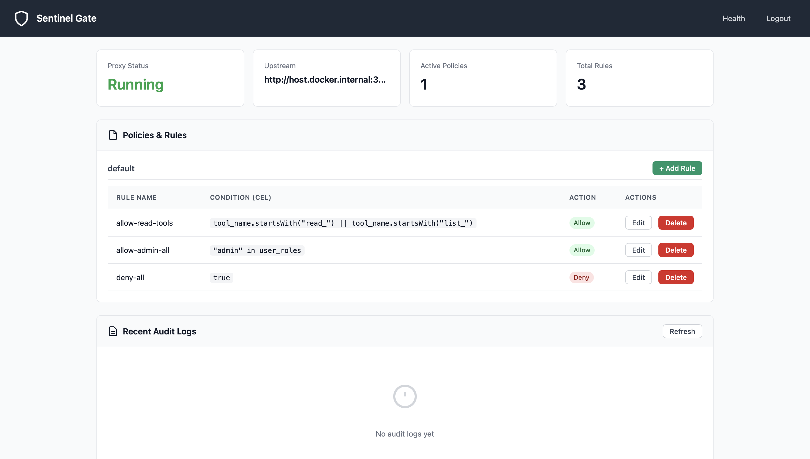

<p align="center">
  
</p>

# Sentinel Gate

[](LICENSE)
[](https://go.dev)

MCP proxy with policy enforcement for AI agents. Sits between your agents and MCP tools to provide authentication, access control, rate limiting, and audit logging.

```
┌─────────────┐      ┌─────────────────┐      ┌─────────────┐
│  AI Agent   │ ───► │  Sentinel Gate  │ ───► │  MCP Server │
│  (Claude,   │      │                 │      │  (tools)    │
│   GPT, etc) │      │  ✓ Auth         │      └─────────────┘
└─────────────┘      │  ✓ Policy       │
                     │  ✓ Audit        │
                     │  ✓ Rate Limit   │
                     └─────────────────┘
```

---

<p align="center">
  
</p>

---

## Why Sentinel Gate?

AI agents can read files, query databases, send emails, and execute code. Sentinel Gate gives you control over what they can actually do.

| Without Sentinel Gate | With Sentinel Gate |
|----------------------|-------------------|
| Agent calls any tool | Agent calls only allowed tools |
| No visibility | Full audit trail |
| Implicit trust | Policy-based access |

---

## Use Cases

**Protect your database**
```yaml
# Block destructive operations for non-admins
- condition: 'tool.name.contains("delete") && !("admin" in user.roles)'
  action: deny
```

**Secure file access**
```yaml
# Only allow reads from safe directories
- condition: 'tool.name == "read_file" && !tool.arguments.path.startsWith("/safe/")'
  action: deny
```

**Control email actions**
```yaml
# Allow reading, block sending for AI agents
- condition: 'tool.name.startsWith("send_") && "ai-agent" in user.roles'
  action: deny
```

**Enforce rate limits**
```yaml
rate_limit:
  enabled: true
  user_rate: 100  # max 100 calls/minute per user
```

---

## Quick Start

### 1. Install

Choose one of the following methods:

#### Option A: Docker (recommended)

```bash
docker pull ghcr.io/sentinel-gate/sentinelgate:latest
```

#### Option B: Download binary

**Linux (amd64):**
```bash
curl -L https://github.com/Sentinel-Gate/Sentinelgate/releases/latest/download/sentinel-gate-linux-amd64 -o sentinel-gate
chmod +x sentinel-gate
sudo mv sentinel-gate /usr/local/bin/
```

**macOS (Apple Silicon):**
```bash
curl -L https://github.com/Sentinel-Gate/Sentinelgate/releases/latest/download/sentinel-gate-darwin-arm64 -o sentinel-gate
chmod +x sentinel-gate
sudo mv sentinel-gate /usr/local/bin/
```

#### Option C: Build from source

Requires Go 1.24+

```bash
git clone https://github.com/Sentinel-Gate/Sentinelgate.git
cd Sentinelgate
go build -o sentinel-gate ./cmd/sentinel-gate
./sentinel-gate --help
```

### 2. Run

```bash
# Start in dev mode (no authentication required)
sentinel-gate start --dev

# Or with Docker
docker run -d -p 8080:8080 ghcr.io/sentinel-gate/sentinelgate:latest start --dev
```

### 3. Open the Admin UI

Open http://localhost:8080/admin in your browser to:
- View status and audit logs
- **Add, edit, and delete policy rules** — no YAML editing required
- Manage identities and API keys

Changes are saved automatically.

### 4. Connect your agent

Point your MCP client to Sentinel Gate instead of the MCP server directly:

```json
{
  "mcpServers": {
    "my-tools": {
      "url": "http://localhost:8080/mcp",
      "headers": {
        "Authorization": "Bearer your-api-key"
      }
    }
  }
}
```

Done. Every tool call now goes through Sentinel Gate.

---

## How It Works

1. **Agent makes a tool call** → Request hits Sentinel Gate
2. **Authentication** → API key validated, identity resolved
3. **Policy evaluation** → CEL rules checked against tool + user + arguments
4. **Decision** → Allow or Deny
5. **Audit** → Everything logged (who, what, when, result)
6. **Forward** → If allowed, request goes to MCP server

All decisions are **deterministic**. Same input = same output. No AI interpretation, no guessing.

---

## Policy Language (CEL)

Policies use [CEL (Common Expression Language)](https://github.com/google/cel-go) — simple, fast, and expressive.

### Available Variables

| Variable | Type | Example |
|----------|------|---------|
| `tool.name` | string | `"read_file"` |
| `tool.arguments` | map | `{"path": "/tmp/data.txt"}` |
| `user.id` | string | `"claude"` |
| `user.roles` | list | `["ai-assistant", "reader"]` |

### Example Conditions

```cel
# Exact match
tool.name == "read_file"

# Prefix/suffix
tool.name.startsWith("read_")
tool.name.endsWith("_safe")

# Contains
tool.name.contains("delete")

# List membership
tool.name in ["read_file", "list_files", "search"]

# Role check
"admin" in user.roles

# Argument inspection
tool.arguments.path.startsWith("/safe/")

# Combined
"admin" in user.roles || tool.name.startsWith("read_")
```

---

## Features

| Feature | Description |
|---------|-------------|
| **MCP Proxy** | HTTP and stdio transport support |
| **RBAC Policies** | Role-based access control with CEL expressions |
| **API Key Auth** | SHA-256 hashed keys, never stored in plain text |
| **Rate Limiting** | Per-IP and per-user limits (GCRA algorithm) |
| **Audit Logging** | Structured JSON to stdout or file |
| **Zero Dependencies** | No database required, runs standalone |
| **Docker Ready** | Minimal container, non-root user |

---

## Dev Mode

For local development, skip authentication:

```yaml
dev_mode: true
```

Or via environment:

```bash
SENTINEL_GATE_DEV_MODE=true sentinel-gate start
```

---

## CLI Reference

```bash
# Start the proxy
sentinel-gate start

# Start with config file
sentinel-gate --config /path/to/config.yaml start

# Stdio mode (spawn MCP server as subprocess)
sentinel-gate start -- npx @modelcontextprotocol/server-filesystem /tmp

# Generate API key hash
sentinel-gate hash-key "my-secret-key"
# Output: sha256:e3b0c44298fc1c149afbf4c8996fb92427ae41e4649b934ca495991b7852b855

# Show version
sentinel-gate version
```

---

## Docker

```bash
# Pull the image
docker pull ghcr.io/sentinel-gate/sentinelgate:latest

# Run with your config file
docker run -d \
  -p 8080:8080 \
  -v ./sentinel-gate.yaml:/etc/sentinel-gate/sentinel-gate.yaml:ro \
  ghcr.io/sentinel-gate/sentinelgate:latest

# Or build from source
docker build -t sentinelgate .

# Or use Docker Compose (starts in dev mode - no auth required)
docker compose up -d
```

> **Note:** Docker Compose starts in dev mode by default for easy testing. For production, set `SENTINEL_GATE_DEV_MODE=false` and configure API keys.

---

## Configuration Reference

| Key | Type | Default | Description |
|-----|------|---------|-------------|
| `server.http_addr` | string | `:8080` | HTTP listen address |
| `upstream.http` | string | — | Upstream MCP server URL |
| `upstream.command` | string | — | Stdio mode: command to spawn |
| `upstream.args` | list | — | Stdio mode: command arguments |
| `auth.identities` | list | — | User identities with roles |
| `auth.api_keys` | list | — | API key hashes mapped to identities |
| `policies` | list | — | Policy rules (CEL conditions) |
| `audit.output` | string | `stdout` | `stdout` or `file:///path/to/file` |
| `rate_limit.enabled` | bool | `false` | Enable rate limiting |
| `rate_limit.ip_rate` | int | `100` | Requests per minute per IP |
| `rate_limit.user_rate` | int | `1000` | Requests per minute per user |
| `dev_mode` | bool | `false` | Skip authentication (dev only) |

Full reference: [docs/guide-core.md](docs/guide-core.md)

---

## Security

### Production Deployment

Sentinelgate is designed to run behind a reverse proxy that handles TLS termination. **Do not expose Sentinelgate directly to the internet without TLS.**

### TLS Termination with nginx

```nginx
server {
    listen 443 ssl http2;
    server_name sentinelgate.example.com;

    ssl_certificate /etc/ssl/certs/sentinelgate.crt;
    ssl_certificate_key /etc/ssl/private/sentinelgate.key;

    # Modern TLS configuration
    ssl_protocols TLSv1.2 TLSv1.3;
    ssl_prefer_server_ciphers on;
    ssl_ciphers ECDHE-ECDSA-AES128-GCM-SHA256:ECDHE-RSA-AES128-GCM-SHA256:ECDHE-ECDSA-AES256-GCM-SHA384:ECDHE-RSA-AES256-GCM-SHA384;

    # Security headers
    add_header Strict-Transport-Security "max-age=31536000; includeSubDomains" always;
    add_header X-Content-Type-Options "nosniff" always;
    add_header X-Frame-Options "DENY" always;

    location / {
        proxy_pass http://127.0.0.1:8080;
        proxy_http_version 1.1;
        proxy_set_header Host $host;
        proxy_set_header X-Real-IP $remote_addr;
        proxy_set_header X-Forwarded-For $proxy_add_x_forwarded_for;
        proxy_set_header X-Forwarded-Proto $scheme;

        # SSE support
        proxy_set_header Connection '';
        proxy_buffering off;
        proxy_cache off;
        chunked_transfer_encoding off;
    }
}
```

### TLS Termination with Caddy

Caddy automatically obtains and renews TLS certificates via Let's Encrypt:

```caddyfile
sentinelgate.example.com {
    reverse_proxy localhost:8080 {
        header_up X-Real-IP {remote_host}
        header_up X-Forwarded-For {remote_host}
    }
}
```

For custom certificates:

```caddyfile
sentinelgate.example.com {
    tls /path/to/cert.pem /path/to/key.pem
    reverse_proxy localhost:8080
}
```

### DevMode Warning

When `dev_mode: true` is set in configuration, Sentinelgate bypasses all authentication. This is useful for development but **must never be enabled in production**.

A prominent warning is logged at startup when DevMode is enabled:

```
WARN === SECURITY WARNING: DevMode is ENABLED ===
WARN DevMode bypasses ALL authentication - DO NOT use in production!
```

To block DevMode from being enabled (recommended for production deployments):

```bash
export SENTINELGATE_ALLOW_DEVMODE=false
```
>**Note:** This variable uses the `SENTINELGATE_` prefix (without underscore) instead of `SENTINEL_GATE_`
>because it is read directly via `os.Getenv()`, not through the Viper configuration layer.


### API Key Security

- API keys are stored using Argon2id hashing (memory-hard, resistant to GPU attacks)
- Keys are never logged - only connection IDs and session IDs appear in logs
- Use the `hash-key` command to generate hashed keys for configuration

### Security Best Practices

1. **Always use TLS** - Deploy behind nginx, Caddy, or cloud load balancer
2. **Disable DevMode** - Set `dev_mode: false` in production
3. **Block DevMode** - Set `SENTINELGATE_ALLOW_DEVMODE=false` in production environments
4. **Rotate API keys** - Periodically rotate API keys and revoke unused ones
5. **Monitor audit logs** - Review audit logs for suspicious activity
6. **Restrict network access** - Run Sentinelgate on localhost, only expose via reverse proxy

---

## Enterprise / Pro

Need more? **Sentinel Gate Pro** adds:

- **SSO/SAML** — Okta, Azure AD, Google Workspace
- **SCIM** — Automated user provisioning
- **Multi-tenant** — Isolated policies per team/customer
- **SIEM Integration** — Splunk, Datadog, Azure Sentinel
- **Compliance Reports** — EU AI Act, SOC2 evidence
- **Human-in-the-Loop** — Approval workflows for sensitive actions
- **Content Scanning** — PII detection, secret detection
- **PostgreSQL + Redis** — Enterprise-grade persistence

[Contact us](mailto:hello@sentinelgate.co.uk) for a demo.

---

## License

AGPL-3.0 — see [LICENSE](LICENSE)

For commercial licensing without AGPL obligations, [contact us](mailto:hello@sentinelgate.co.uk).

---

## Contributing

We welcome contributions. See [CONTRIBUTING.md](CONTRIBUTING.md) for guidelines.

A CLA is required for code contributions to support dual-licensing. See [CLA.md](CLA.md).

---

## Follow Us

- Twitter: [@SentinelGate](https://twitter.com/SentinelGate)
- www.sentinelgate.co.uk
