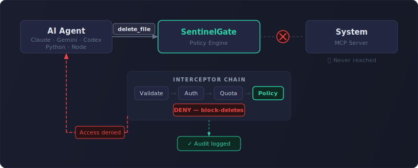
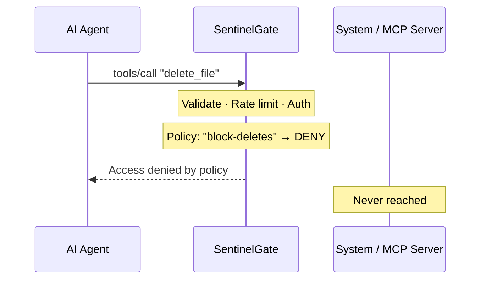
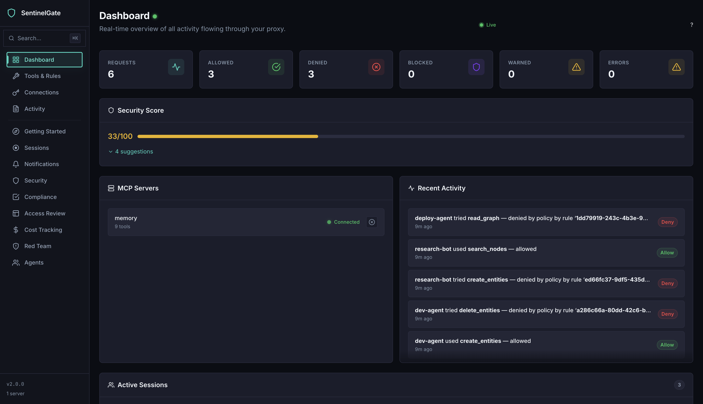
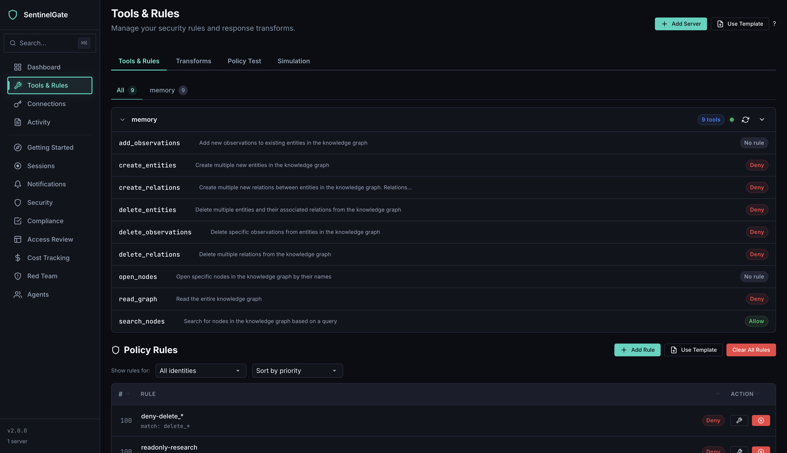
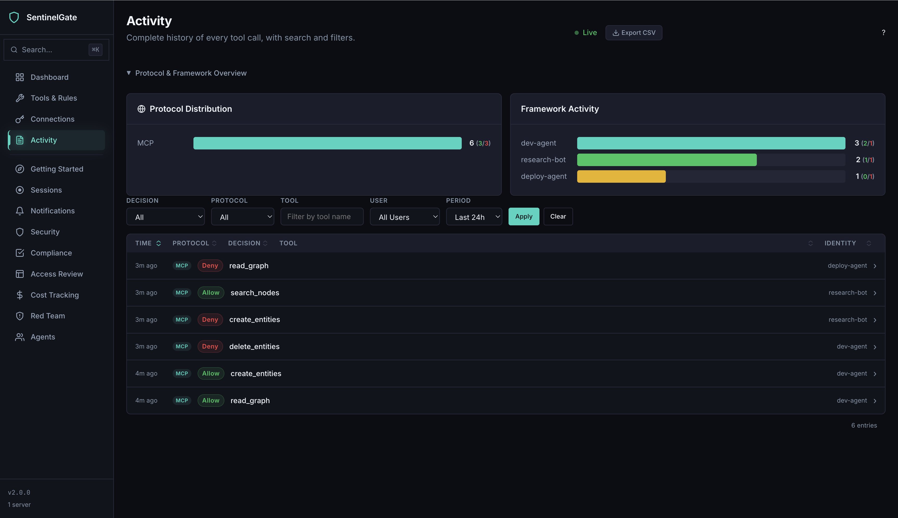
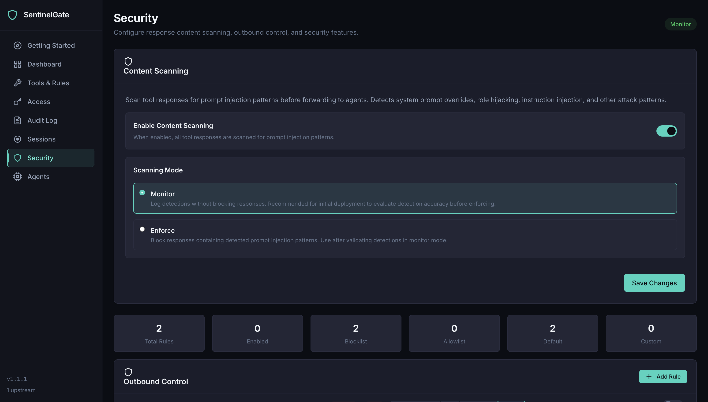
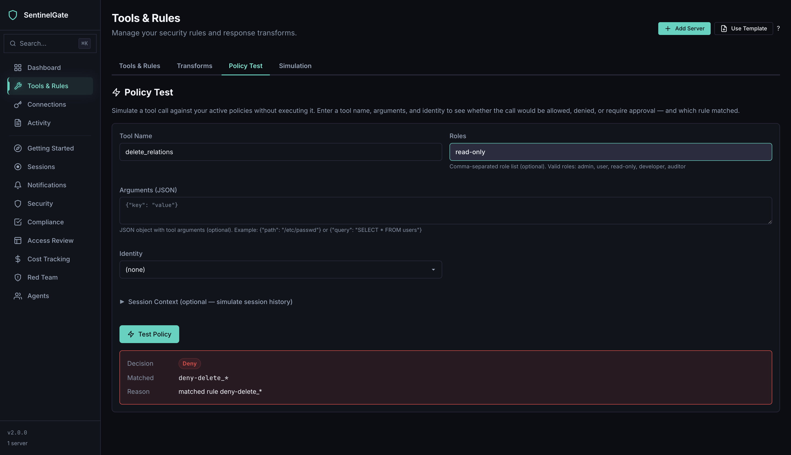

<h1 align="center">SentinelGate</h1>

<p align="center">
  <strong>Access control for AI agents.</strong><br>
  Every MCP tool call intercepted, evaluated, and logged — before it executes.<br>
  RBAC · CEL policies · Full audit trail
</p>

<p align="center">
  <a href="https://github.com/Sentinel-Gate/Sentinelgate/actions/workflows/ci.yml"></a>
  <a href="LICENSE"></a>
  <a href="https://go.dev"></a>
  <a href="https://github.com/Sentinel-Gate/Sentinelgate/releases"></a>
</p>

<p align="center">
  <a href="#quick-start">Get Started</a> · <a href="https://www.sentinelgate.co.uk">Website</a> · <a href="docs/Guide.md">Docs</a>
</p>

---

## The problem

AI agents have unrestricted access to your machine — every tool call, shell command, file read, and HTTP request runs with no policy, no authentication, and no audit trail. One prompt injection or one hallucination is all it takes.

## How SentinelGate works

SentinelGate sits between the AI agent and your system. Every action is intercepted, evaluated against your policies, and logged — before it reaches anything. Denied actions are blocked at the proxy.

<p align="center">
  
</p>


```mermaid
sequenceDiagram
    participant Agent as AI Agent
    participant SG as SentinelGate
    participant Upstream as System / MCP Server

    Agent->>SG: tools/call "delete_file"
    Note over SG: Validate · Rate limit · Auth
    Note over SG: Policy: "block-deletes" → DENY
    SG-->>Agent: Access denied by policy
    Note over Upstream: Never reached
```

No code changes. No agent modifications. Single binary, zero dependencies, sub-millisecond overhead.

<p align="center">
  
</p>

---

## Quick start

**Install** (macOS / Linux):

```bash
curl -sSfL https://raw.githubusercontent.com/Sentinel-Gate/Sentinelgate/main/install.sh | sh
```

**Install** (Windows PowerShell):

```powershell
irm https://raw.githubusercontent.com/Sentinel-Gate/Sentinelgate/main/install.ps1 | iex
```

<details>
<summary>Manual download or build from source</summary>

**Download** from [GitHub Releases](https://github.com/Sentinel-Gate/Sentinelgate/releases):

| Platform | Archive |
|----------|---------|
| macOS (Apple Silicon) | `sentinel-gate_darwin_arm64.tar.gz` |
| macOS (Intel) | `sentinel-gate_darwin_amd64.tar.gz` |
| Linux (x86_64) | `sentinel-gate_linux_amd64.tar.gz` |
| Linux (ARM64) | `sentinel-gate_linux_arm64.tar.gz` |
| Windows (x86_64) | `sentinel-gate_windows_amd64.zip` |
| Windows (ARM64) | `sentinel-gate_windows_arm64.zip` |

**macOS / Linux:**
```bash
tar xzf sentinel-gate_*.tar.gz
chmod +x sentinel-gate
sudo mv sentinel-gate /usr/local/bin/
```

**Windows:** extract the `.zip` and add `sentinel-gate.exe` to your `PATH`.

**Build from source** (Go 1.24+):

```bash
git clone https://github.com/Sentinel-Gate/Sentinelgate.git
cd Sentinelgate && go build -o sentinel-gate ./cmd/sentinel-gate
```

</details>

**Start:**

```bash
sentinel-gate start
```

Open **http://localhost:8080/admin** to manage policies, upstreams, and identities. The MCP endpoint is **http://localhost:8080/mcp** — configure your agent to connect there with an API key.

---

## Features

**Deterministic enforcement** — Explicit rules, not AI judgment. `deny delete_*` means denied. Always. No probabilistic filtering, no drift.

**MCP-native** — Built as an [MCP](https://modelcontextprotocol.io) proxy from the ground up. Aggregates multiple upstream MCP servers, applies per-tool policies, and exposes a single endpoint to your client.

**CEL-powered rules** — [Common Expression Language](https://github.com/google/cel-go), the same engine behind Kubernetes, Firebase, and Envoy:

```cel
action_arg_contains(arguments, "secret")                      // block by content
action_name == "bash" && !("admin" in identity_roles)             // role-based shell control
dest_domain_matches(dest_domain, "*.pastebin.com")             // outbound blocking
```

Simple tool patterns (`read_*`, `delete_*`) cover most cases. CEL handles the rest.

**Full audit trail** — Every action logged with identity, decision, timestamp, and arguments. Stream live via SSE, filter, or export to CSV.

**Admin UI** — Browser-based policy editor, test playground, security settings, audit viewer. No config files, no restarts.

**Identity and access control** — API keys, roles, per-identity policies. Each agent session gets isolated credentials.

**Policy templates** — Seven pre-built security profiles (Safe Coding, Read Only, Research Mode, Full Lockdown, Audit Only, Data Protection, Anti-Exfiltration). One click to apply, fully customizable after.

**Budget and quota** — Per-identity usage limits: max calls, writes, deletes per session, rate limiting per minute. Deny or warn when limits are reached. Live progress tracking on the dashboard.

**Response transformation** — Five transform types applied to tool responses before they reach the agent: redact (regex-based), truncate (size limits), inject (prepend/append warnings), dry-run (mock responses), mask (partial reveal). Test in the built-in sandbox.

**Session-aware policies** — CEL functions that use session history for context-dependent rules: `session_call_count`, `session_write_count`, `session_sequence`, `session_count_window`, and more. Detect patterns like read-then-exfiltrate across multiple tool calls.

**Session recording** — Record every tool call with full request/response payloads. Timeline replay in the UI, export to JSON or CSV, configurable retention, privacy mode (record metadata only).

---

## Admin UI

| Tools & Rules | Audit Log |
|:-:|:-:|
|  |  |

| Content Scanning | Policy Test |
|:-:|:-:|
|  |  |

Eight pages: Dashboard, Getting Started, Tools & Rules (with Transforms and Policy Test tabs), Access (with Quota management), Audit Log, Sessions (with Recording and Replay), Security, and Clients.

---

## Configuration

Works with **zero configuration**. Everything is managed from the Admin UI and persisted automatically. For infrastructure tuning, an optional YAML config is available:

```yaml
server:
  http_addr: ":8080"
rate_limit:
  enabled: true
  ip_rate: 100
```

Full reference: [Configuration](docs/Guide.md#7-configuration-reference) · [CLI](docs/Guide.md#8-cli-reference) · [API](docs/Guide.md#9-admin-api-reference)

---

## Limitations

SentinelGate is an MCP proxy — it controls what tools and data your agents can access through the MCP protocol. It is effective against mistakes, prompt injection, and overreach. For full OS-level isolation, combine with container or VM sandboxes. Full [threat model](docs/Guide.md#13-threat-model-and-limitations).

---

## SentinelGate Pro

SSO · SIEM integration · Human-in-the-loop approval · Multi-tenancy · Compliance reports — [sentinelgate.co.uk](https://www.sentinelgate.co.uk)

## Contributing

Bug fixes, features, docs, and feedback welcome. See [CONTRIBUTING.md](CONTRIBUTING.md). A CLA is required for code contributions — see [CLA.md](CLA.md).

## License

[AGPL-3.0](LICENSE) — free to use, modify, and self-host. For commercial licensing, [contact us](mailto:hello@sentinelgate.co.uk).

---
<p align="center">
  <a href="https://www.sentinelgate.co.uk">Website</a> &middot; <a href="docs/Guide.md">Docs</a> &middot; <a href="https://github.com/Sentinel-Gate/Sentinelgate/releases">Releases</a>
</p>
