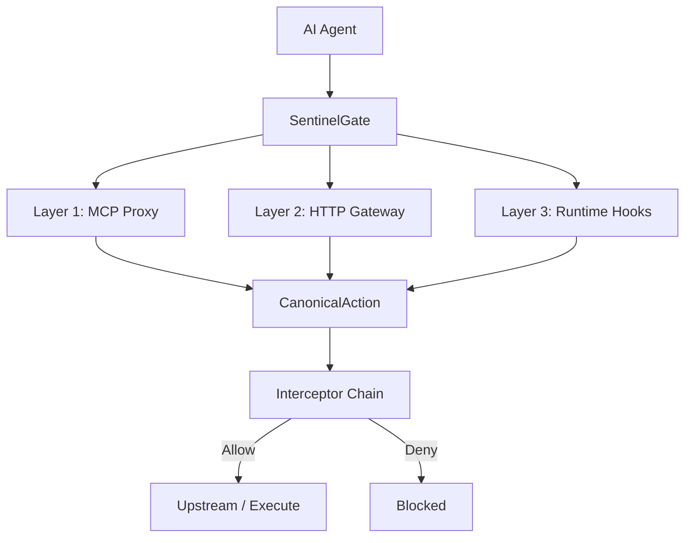
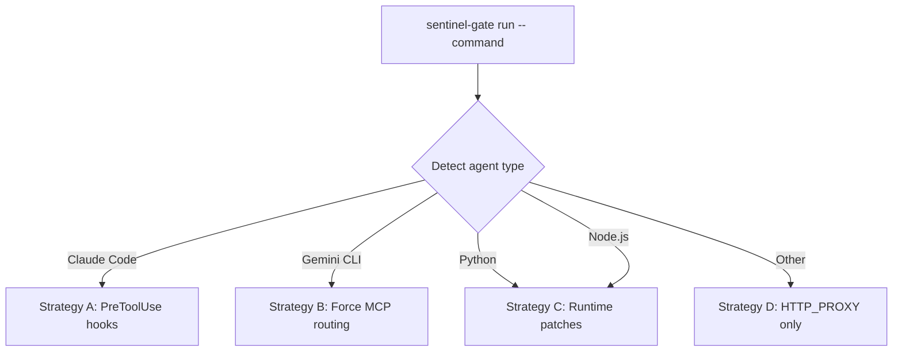

# SentinelGate Guide

The complete reference for SentinelGate — the universal firewall for AI agents.

For installation, see the [README](../README.md#quick-start).

---

**Table of Contents**

1. [Architecture](#1-architecture)
2. [Quick Start](#2-quick-start)
3. [Policy Engine](#3-policy-engine)
4. [Runtime Protection](#4-runtime-protection)
5. [Agent-Specific Notes](#5-agent-specific-notes)
6. [Security Features](#6-security-features)
7. [Admin UI](#7-admin-ui)
8. [Configuration Reference](#8-configuration-reference)
9. [CLI Reference](#9-cli-reference)
10. [Admin API Reference](#10-admin-api-reference)
11. [SDKs](#11-sdks)
12. [Multi-Agent Sessions](#12-multi-agent-sessions)
13. [Troubleshooting](#13-troubleshooting)
14. [FAQ](#14-faq)
15. [Threat Model and Limitations](#15-threat-model-and-limitations)

---

## 1. Architecture

### Three layers of defense



- **Layer 1** intercepts MCP tool calls — works with any MCP client pointed at `http://localhost:8080/mcp`
- **Layer 2** intercepts HTTP/HTTPS traffic via `HTTP_PROXY`/`HTTPS_PROXY` environment variables
- **Layer 3** patches the agent's runtime to intercept file, process, and network calls

An action must pass **all** applicable layers.

### CanonicalAction

Every action, regardless of protocol, is converted to a **CanonicalAction** — a unified representation containing the action type, name, arguments, identity, destination, and protocol. The same policy engine evaluates all actions identically.

### The interceptor chain

Every CanonicalAction passes through an ordered chain:

| # | Interceptor | What it does |
|---|------------|-------------|
| 1 | Validation | Well-formed request? |
| 2 | IP Rate Limit | Too many requests from this IP? |
| 3 | Auth | Valid identity and API key? |
| 4 | Audit | Log the action |
| 5 | User Rate Limit | Too many requests from this identity? |
| 6 | Quarantine | Tool flagged by drift detection? |
| 7 | Policy (CEL) | Evaluate CEL rules |
| 8 | Approval (HITL) **(Pro)** | Human approval required? |
| 9 | Outbound Control | Destination allowed? |
| 10 | Response Scan | Prompt injection in response? |
| 11 | Route | Forward to upstream or return decision |

The chain is protocol-agnostic. Whether the action came from an MCP tool call, an HTTP request, or a runtime hook, it flows through the same interceptors with the same policies.

### The two main commands

| | `sentinel-gate start` | `sentinel-gate run -- <agent>` |
|---|---|---|
| **What it does** | Starts the server only | Wraps the agent + auto-starts the server |
| **MCP proxy** | Yes — on `:8080/mcp` | Yes (same) |
| **Admin UI** | Yes — on `:8080/admin` | Yes (same) |
| **Native tool protection** | No — only MCP calls are intercepted | Yes — hooks intercept Read, Write, Bash, etc. |
| **HTTP interception** | No | Yes — sets `HTTP_PROXY`/`HTTPS_PROXY` |
| **Agent config** | Manual — you configure your client | Automatic — hooks, MCP, proxy all set up |
| **Identity / API key** | Manual — create in Admin UI | Automatic — per-session key generated |
| **Cleanup on exit** | Server stays running | Hooks removed, key revoked, server stopped |

> [!TIP]
> **When to use `start`:** You want a standalone MCP proxy — any MCP client can connect to it.
>
> **When to use `run`:** You want to wrap an agent process with full protection (hooks + proxy). It's the recommended path.

### What `sentinel-gate start` exposes

```
:8080/mcp       MCP Proxy (multi-upstream, tool discovery, policy enforcement)
:8080/admin     Admin UI (policy CRUD, audit log, config, dashboard)
:8080/admin/api REST API for programmatic management
:8080/health    Health check
:8080/*         HTTP Gateway (forward/reverse proxy, TLS inspection, WebSocket)
```

---

## 2. Quick Start

For installation instructions, see the [README](../README.md#quick-start).

### What `run` does for each agent

`sentinel-gate run` detects the agent type and applies the best interception strategy available:

| Agent | What `run` configures automatically | What you do manually |
|-------|-------------------------------------|---------------------|
| **Claude Code** | PreToolUse hook in `~/.claude/settings.json` + `HTTP_PROXY` | If you need MCP upstream tools: `claude mcp add` + Add Upstream in Admin UI |
| **Gemini CLI** | MCP server config in `~/.gemini/settings.json` + disables native tools + `HTTP_PROXY` | Add Upstream in Admin UI (at least one required) |
| **Python** | Injects `sitecustomize.py` via `PYTHONPATH` + `HTTP_PROXY` | Nothing |
| **Node.js** | Injects hook via `NODE_OPTIONS` + `HTTP_PROXY` | Nothing |

> [!NOTE]
> **Why different strategies?** Claude Code has a native hook API (PreToolUse) — SentinelGate installs a "guard at the door" that checks every tool use. Gemini CLI has no hook API — SentinelGate changes "the door itself" by disabling native tools and routing everything through the MCP proxy. Python/Node.js get runtime patches on standard library functions.

### Per-agent setup

#### Gemini CLI — 2 steps

```bash
# Step 1: Launch (server auto-starts, MCP auto-configures)
sentinel-gate run -- gemini

# Step 2: Add upstream MCP servers in Admin UI
# http://localhost:8080/admin → Tools & Rules → Add Upstream
# Example: npx @modelcontextprotocol/server-filesystem /path/to/dir
```

Gemini sees upstream tools as its own. Every action passes through your policies.

#### Claude Code — 1 step (or 4 with MCP tools)

```bash
# Step 1: Launch (server auto-starts, PreToolUse hook installed)
sentinel-gate run -- claude
# Native tools (Read, Write, Bash, Edit, Glob, etc.) are protected immediately.
```

If you also want Claude to use external MCP tools (Gmail, Slack, filesystem, etc.):

```bash
# Step 2: Create identity + API key
# Admin UI → Access → Add Identity → Create Key
# Save the cleartext_key — it's shown only once.

# Step 3: Connect Claude to SentinelGate as MCP server
claude mcp add -s user sentinelgate --transport http http://localhost:8080/mcp \
  -H "Authorization: Bearer <your-api-key>"

# Step 4: Add the real MCP servers as upstreams
# Admin UI → Tools & Rules → Add Upstream
```

> [!TIP]
> `-s user` adds to the active user's global config. If you have multiple Claude accounts, verify which one is active.

#### Python / Node.js — 1 step

```bash
# Launch and you're done — full protection
sentinel-gate run -- python agent.py
sentinel-gate run -- node agent.js
```

Most Python/Node.js agents access external services via HTTP (`requests`, `fetch`, `httpx`). These calls are intercepted automatically by Layer 2 (HTTP proxy) and Layer 3 (runtime hooks).

If your agent uses an MCP client library (rare):
1. Point the MCP client at `http://localhost:8080/mcp` instead of the real server
2. Add the real MCP server as upstream in Admin UI → Tools & Rules → Add Upstream

#### IDE extensions (Cursor, Windsurf, Cline) — manual setup

These can't be wrapped with `run`. Use `start` + manual config:

```bash
# Step 1: Start the server
sentinel-gate start

# Step 2: Create identity + API key in Admin UI → Access

# Step 3: Add SentinelGate as MCP server in IDE settings:
#   URL: http://localhost:8080/mcp
#   Header: Authorization: Bearer <your-api-key>
```

> [!WARNING]
> Only MCP tool calls are protected. Native file/terminal operations are **not** intercepted.

### When is Layer 1 (MCP proxy) needed?

Layer 1 protects MCP tool calls. It's only relevant when the agent uses tools from external MCP servers.

| Scenario | Need Layer 1? | Why |
|----------|:---:|-----|
| Claude uses only Read/Write/Bash | No | Hook (Layer 3) protects everything |
| Claude also uses Gmail via MCP | Yes | MCP proxy connects Claude to Gmail through policies |
| Gemini (any use) | Yes (automatic) | `run` forces everything through MCP |
| Python calls `requests.post("https://api.slack.com")` | No | Layer 2 + 3 intercept the HTTP call |
| Python uses an MCP client library | Yes | Must point MCP client at SentinelGate |

### Upstreams are hot-pluggable

After launching with `run` (or `start`), you can add or remove upstream MCP servers at any time from the Admin UI. No restart needed — SentinelGate discovers tools immediately and the agent sees them on its next request.

### Create policies

In the Admin UI → **Tools & Rules**, create rules. Rules have a **priority** — the highest priority matching rule wins.

| Priority | Rule | Action |
|----------|------|--------|
| 0 | Match all tools | Deny (baseline) |
| 10 | Match all tools | Allow (override) |
| 20 | CEL: `action_arg_contains(arguments, "secret")` | Deny |

Everything is allowed (priority 10 beats 0), except actions involving "secret" (priority 20 beats 10). Test rules before deploying with the built-in **Policy Test** playground.

---

## 3. Policy Engine

### How policies work

Policies contain **rules**. Each rule has:
- A **name** (human-readable identifier)
- A **priority** (integer — higher priority wins)
- A **condition** (tool pattern or CEL expression)
- An **action** (`allow` or `deny`)

All matching rules are sorted by priority. The highest-priority match wins. If no rule matches, the action depends on the configured default policy.

> [!IMPORTANT]
> When creating rules via the **API**, you must set `tool_match: "*"` in the rule. Without this, the rule is indexed under an empty string and never matches. YAML rules always match all tools automatically.

### Simple rules (tool patterns)

| Pattern | Matches |
|---------|---------|
| `read_file` | Exactly `read_file` |
| `read_*` | Any tool starting with `read_` |
| `*_file` | Any tool ending with `_file` |
| `*` | All tools |

### CEL rules

For advanced conditions, use [CEL](https://github.com/google/cel-go) (Common Expression Language) — the same engine used by Kubernetes, Firebase, and Envoy.

#### Variables

**Action variables** (always available):

| Variable | Type | Example values |
|----------|------|---------------|
| `action_type` | string | `"tool_call"`, `"file_access"`, `"command_exec"`, `"http_request"` |
| `action_name` | string | `"read_file"`, `"bash"`, `"POST /api"` |
| `arguments` | map | `{"path": "/etc/passwd"}` |

**Identity variables:**

| Variable | Type | Example values |
|----------|------|---------------|
| `identity_name` | string | `"claude-prod"`, `"test-agent"` |
| `identity_id` | string | `"id-1"`, `"sg_runtime_abc..."` |
| `identity_roles` | list | `["admin", "reader"]` |
| `user_roles` | list | Alias for `identity_roles` (backward-compatible) |
| `session_id` | string | Current session identifier |
| `request_time` | timestamp | When the request was received |

**Context variables:**

| Variable | Type | Example values |
|----------|------|---------------|
| `protocol` | string | `"mcp"`, `"http"`, `"websocket"`, `"runtime"` |
| `framework` | string | `"langchain"`, `"crewai"`, `"autogen"`, `""` |
| `gateway` | string | `"mcp-gateway"`, `"http-gateway"`, `"runtime"` |

**Destination variables** (when the action has a target):

| Variable | Type | Description |
|----------|------|-------------|
| `dest_url` | string | Full destination URL |
| `dest_domain` | string | Destination domain only |
| `dest_ip` | string | Resolved destination IP |
| `dest_port` | int | Destination port number |
| `dest_scheme` | string | `"http"`, `"https"`, `"ws"`, `"wss"` |
| `dest_path` | string | URL path or file path |
| `dest_command` | string | Command name (for `command_exec`) |

**Backward-compatible aliases** (MCP):

| Alias | Equivalent to |
|-------|--------------|
| `tool_name` | `action_name` when `action_type == "tool_call"` |
| `tool_args` | `arguments` when `action_type == "tool_call"` |

#### Built-in functions

All functions require exactly **two arguments** (variable + pattern):

| Function | Description |
|----------|-------------|
| `action_arg_contains(arguments, "pattern")` | Search **all** argument values for a substring |
| `action_arg(arguments, "key")` | Get a specific argument value by key |
| `glob(pattern, name)` | Glob pattern match (e.g., `glob("read_*", action_name)`) |
| `dest_domain_matches(dest_domain, "*.evil.com")` | Glob match on destination domain |
| `dest_ip_in_cidr(dest_ip, "10.0.0.0/8")` | CIDR range check on destination IP |

Standard CEL operators: `==`, `!=`, `&&`, `||`, `!`, `.contains()`, `.startsWith()`, `.endsWith()`, `.matches()` (regex), `in` (list membership), `has()` (key existence).

#### CEL hardening

- **Expression length:** 1,024 characters maximum
- **Cost limit:** 100,000 (prevents expensive expressions)
- **Nesting depth:** 50 levels maximum
- **Evaluation timeout:** 5 seconds per expression

### Agent argument field names

Different agents pass arguments with different field names:

| Agent | File path field | Command field |
|-------|----------------|--------------|
| MCP (Gemini, direct clients) | `path`, `source`, `destination` | — |
| Claude Code (hook) | `file_path` | `command` |
| Python (sitecustomize.py) | `path` | `full_command` |
| Node.js (hook) | `file_path` | `full_command` |

> [!TIP]
> Use `action_arg_contains(arguments, "pattern")` to search across all fields regardless of agent. For field-specific checks, use `has()` with `||`:
>
> ```cel
> (has(arguments.file_path) && arguments.file_path.contains("secret"))
> || (has(arguments.path) && arguments.path.contains("secret"))
> || (has(arguments.command) && arguments.command.contains("secret"))
> || (has(arguments.full_command) && arguments.full_command.contains("secret"))
> ```

### Example policies

```cel
# Block access to files containing "secret" (covers all agents)
action_arg_contains(arguments, "secret")

# Only admins can execute shell commands (set as deny rule)
action_type == "command_exec" && !("admin" in identity_roles)

# Block data exfiltration
dest_domain_matches(dest_domain, "*.pastebin.com") || dest_domain_matches(dest_domain, "*.ngrok.io")

# Restrict writes to a specific directory
action_type == "file_access" && action_name == "write_file"
  && !action_arg_contains(arguments, "/safe/workspace/")

# Block runtime agents from HTTP, allow MCP agents
protocol == "runtime" && action_type == "http_request"

# Filter by runtime agents (Python/Node.js hooks)
gateway == "runtime" && action_type == "file_access"
```

### Policy testing

**Via Admin UI:** Tools & Rules → **Policy Test** sandbox.

**Via API:**

```bash
curl -X POST http://localhost:8080/admin/api/v1/policy/evaluate \
  -H "Content-Type: application/json" \
  -d '{
    "action_type": "file_access",
    "action_name": "read_file",
    "arguments": {"path": "/etc/passwd"},
    "identity_name": "test-agent",
    "identity_roles": ["agent"],
    "protocol": "mcp"
  }'
```

> [!NOTE]
> The Policy Evaluate API generates audit records for each evaluation.

---

## 4. Runtime Protection

### What's protected for each agent?

| Agent | Native tools | Shell commands | File system | HTTP / network | MCP tools |
|-------|:---:|:---:|:---:|:---:|:---:|
| **Claude Code** (`run`) | ✅ | ✅ | ✅ | ✅ | With setup |
| **Gemini CLI** (`run`) | Via MCP | Via MCP | Via MCP | ✅ | ✅ |
| **Python** (`run`) | ✅ | ✅ | ✅ | ✅ | With setup |
| **Node.js** (`run`) | ✅ | ✅ | ✅ | ✅ | With setup |
| **Cursor / Windsurf / Cline** | ❌ | ❌ | ❌ | ❌ | ✅ |
| **Codex (OpenAI)** (`start`) | ❌ | ❌ | ❌ | ❌ | ✅ |

> [!NOTE]
> **"With setup"** means MCP protection activates only if you add upstream MCP servers and connect the agent as MCP client (see [Quick Start](#2-quick-start)).
>
> **"Via MCP"** means `run` disables native tools and routes everything through the MCP proxy, because Gemini has no hook API.

### How `sentinel-gate run` works

1. **Detects** the agent type by inspecting the binary
2. **Auto-starts** the server if not running (polls `/health`, waits up to 15s)
3. **Generates** a per-session API key and registers it with the server
4. **Injects** hooks, environment variables, and proxy settings
5. **Launches** the agent as a child process
6. **Cleans up** hooks and revokes the API key when the agent exits



### The four strategies

| Strategy | Agents | How it works | Coverage |
|----------|--------|-------------|----------|
| **A** | Claude Code | Writes a PreToolUse hook in `~/.claude/settings.json` that calls `sentinel-gate claude-hook` before every tool use | Read, Write, Edit, Bash, Glob, Grep, WebFetch, WebSearch, NotebookEdit |
| **B** | Gemini CLI | Disables native tools, adds SentinelGate as MCP server in `~/.gemini/settings.json` | All file/command operations routed through MCP proxy |
| **C** | Python, Node.js | Injects runtime hooks that patch standard library functions | `open()`, `subprocess`, `os.system`, `fs`, `child_process`, `fetch` |
| **D** | Other | Sets `HTTP_PROXY`/`HTTPS_PROXY` pointing to SentinelGate | HTTP/HTTPS traffic only |

All strategies converge on the same policy engine.

### Auto-start behavior

1. `run` checks `/health` on the configured server address
2. If unreachable, spawns `sentinel-gate start` as a background daemon
3. Polls `/health` every 500ms for up to 15 seconds
4. When the agent exits, the auto-started server is stopped

Server logs: `~/.sentinelgate/server.log` (`%USERPROFILE%\.sentinelgate\` on Windows). PID file: `~/.sentinelgate/server.pid`.

---

## 5. Agent-Specific Notes

### Claude Code

> **Setup: 1 step** — `sentinel-gate run -- claude`. Native tools are protected immediately.
> Add MCP upstream tools? 3 more steps — see [Quick Start](#claude-code--1-step-or-4-with-mcp-tools).

**How it works:** Writes a PreToolUse hook in `~/.claude/settings.json`. The hook matches `Read|Write|Edit|Bash|Glob|Grep|WebFetch|WebSearch|NotebookEdit`. Each tool use calls `sentinel-gate claude-hook` which POSTs to `/admin/api/v1/policy/evaluate`.

**Detection:** Reads the binary looking for `"Bun.env"` — Claude Code is compiled with Bun. Bun doesn't support `NODE_OPTIONS=--require`, so Strategy A (hook API) is used instead of Strategy C.

**Argument field names:** `file_path` (file tools), `command` (Bash), `url` (WebFetch), `query` (WebSearch).

**MCP-only mode** (native tools NOT intercepted):
```bash
claude mcp add -s user sentinelgate --transport http http://localhost:8080/mcp \
  -H "Authorization: Bearer <your-api-key>"
```

### Gemini CLI

> **Setup: 2 steps** — `sentinel-gate run -- gemini`, then add at least one upstream in Admin UI.
> See [Quick Start](#gemini-cli--2-steps).

**How it works:** Disables native tools (`edit`, `replace`, `run_shell_command`, `grep_search`, `glob`) and adds SentinelGate as MCP server in `~/.gemini/settings.json`.

> [!NOTE]
> Gemini's native `read_file`, `write_file`, and `list_directory` are not added to `tools.exclude` because Gemini's exclude is name-based and would also block the MCP versions. In practice, when upstream MCP servers are configured, Gemini prefers the MCP-provided tools (which go through SentinelGate with full policy evaluation).

> [!IMPORTANT]
> At least one upstream MCP server must be configured (Admin UI → Tools & Rules → Add Upstream).

**Argument field names:** `path`, `source`, `destination` (MCP standard).

### Python agents

> **Setup: 1 step** — `sentinel-gate run -- python agent.py`. Full protection, nothing else to do.

Injects `sitecustomize.py` via `PYTHONPATH`. No imports or modifications needed in the script.

**What gets intercepted:**
- `builtins.open()` → `file_access`
- `subprocess.run/Popen/call/check_call/check_output`, `os.system` → `command_exec`
- `requests.get/post/put/delete/patch/head/options` → `http_request`
- `urllib.request.urlopen` → `http_request`
- `httpx` Client and AsyncClient → `http_request`

**Framework detection:** Auto-detects LangChain, CrewAI, AutoGen, OpenAI Agents SDK by inspecting the command and environment variables. The `framework` CEL variable is set accordingly.

### Node.js agents

> **Setup: 1 step** — `sentinel-gate run -- node agent.js`. Full protection, nothing else to do.

Injects hook via `NODE_OPTIONS="--require <path>"`.

**What gets intercepted:**
- `child_process.*` (exec, execSync, spawn, spawnSync, fork, execFile, execFileSync) → `command_exec`
- `fs` sync/async + `fs.promises` (readFile, writeFile, appendFile, unlink, mkdir, rmdir, rm) → `file_access`
- `globalThis.fetch` (Node.js 18+) → `http_request`
- `http/https.request` → `http_request`

> [!NOTE]
> Not injected for Bun binaries — Claude Code uses Strategy A instead.

### Hook features (Python and Node.js)

Both hooks include: LRU cache (skip server round-trip for recently allowed patterns), audit buffer (async batching), path filtering (skip /dev, __pycache__, site-packages, node_modules), recursion guard (prevent loops), fail mode (open/closed).

### MCP-only clients (Cursor, Windsurf, Cline)

These IDE extensions can't be wrapped with `sentinel-gate run`. Configure manually:

1. `sentinel-gate start`
2. Create identity + API key in Admin UI
3. Add MCP server in IDE settings: URL `http://localhost:8080/mcp`, header `Authorization: Bearer <key>`

> [!WARNING]
> Only MCP tool calls are protected. Native file/terminal operations are **not** intercepted.

### Codex (OpenAI)

**MCP only.** Codex supports MCP — use `sentinel-gate start` and connect Codex to `http://localhost:8080/mcp`. Tool-level policy enforcement applies to all MCP calls.

`sentinel-gate run` is **not** supported for Codex. Codex uses a native Rust binary inside an OS-level sandbox (Seatbelt on macOS, Landlock+seccomp on Linux), which bypasses runtime hook injection.

---

## 6. Security Features

### Outbound control

Prevents data exfiltration by evaluating the destination of every HTTP request, WebSocket connection, and MCP tool call.

**Default blocklist** (created on first start, disabled by default — enable in Security → Outbound Control):

Data Exfiltration Services:
- `*.telegram.org`, `t.me`
- `*.ngrok.io`, `*.ngrok-free.app`
- `serveo.net`, `*.trycloudflare.com`
- `pastebin.com`, `*.pastebin.com`, `hastebin.com`
- `*.requestbin.com`, `*.pipedream.com`

Private Network Access:
- `127.0.0.0/8`, `10.0.0.0/8`, `172.16.0.0/12`, `192.168.0.0/16`, `169.254.0.0/16`, `::1/128`

**Rule actions:**

| Action | Behavior |
|--------|----------|
| `block` | Block the request |
| `alert` | Allow but log a **warning** |
| `log` | Allow and log an **info** message |

**Rule types:** Blocklist (deny specific destinations) or Allowlist (deny everything except listed).

Manage via Admin UI (Security → Outbound Control) or API (`/admin/api/v1/security/outbound/rules`).

### Content scanning

Detects sensitive data (secrets, credentials, API keys) in payloads.

| Setting | Behavior |
|---------|----------|
| `enabled: true, mode: "enforce"` | Block the action |
| `enabled: true, mode: "monitor"` | Allow but log a warning |
| `enabled: false` | No scanning |

Configure via Admin UI (Security → Content Scanning) or API:
```bash
curl -X PUT http://localhost:8080/admin/api/v1/security/content-scanning \
  -H "Content-Type: application/json" \
  -d '{"enabled": true, "mode": "enforce"}'
```

### Response scanning

Scans responses from MCP servers and HTTP endpoints for **prompt injection** patterns. Enabled by default in monitor mode.

### Tool security

Takes baseline snapshots of tool definitions from upstream MCP servers. On subsequent discoveries:
- **Drift detection** — alerts when a tool's definition changes unexpectedly (possible tool poisoning)
- **Quarantine** — blocks all calls to a tool until the drift is resolved

```bash
curl -X POST http://localhost:8080/admin/api/v1/tools/quarantine \
  -H "Content-Type: application/json" \
  -d '{"tool_name": "suspicious_tool"}'
```

### HTTP gateway

Layer 2 — runs on the same port as the MCP proxy (`:8080`), enabled by default.

**Forward proxy:** `sentinel-gate run` sets `HTTP_PROXY`/`HTTPS_PROXY`. HTTPS without TLS inspection uses CONNECT tunneling (SentinelGate sees the destination domain but not request content).

**Reverse proxy:** Place SentinelGate in front of internal APIs or local services.

```bash
curl -X POST http://localhost:8080/admin/api/v1/security/http-gateway/targets \
  -H "Content-Type: application/json" \
  -d '{"name": "Internal API", "path_prefix": "/api/internal/", "upstream": "http://internal-api:3000", "strip_prefix": true}'
```

> [!TIP]
> **Use case for individual developers:** Your AI agent could access your local Postgres or pgAdmin directly. With an Upstream Target, you create a controlled passthrough — the agent can only reach that specific service via a defined path, and every request is logged in the audit trail. Block everything by default, open only what's needed.

**TLS inspection** (opt-in, requires YAML config):

```yaml
http_gateway:
  tls_inspection:
    enabled: true
    bypass_list:
      - "*.googleapis.com"
```

Then install the CA certificate: `sentinel-gate trust-ca`

Download CA cert: `curl http://localhost:8080/admin/api/v1/security/http-gateway/ca-cert > ca.pem`

**WebSocket inspection:** Text frames scanned for prompt injection patterns. Enforce mode blocks and closes; monitor mode logs and passes. Auth required via `Authorization: Bearer <key>` in the upgrade request.

**DNS rebinding protection:** Per-request DNS pinning, 30s cache TTL, private network ranges blocked by default.

### Human-in-the-loop approval (Pro)

High-risk actions can require human approval. When a policy returns `approval_required`, the action is held pending until approved via Admin UI or API.

```bash
# List pending
curl http://localhost:8080/admin/api/v1/approvals

# Approve
curl -X POST http://localhost:8080/admin/api/v1/approvals/{id}/approve

# Deny
curl -X POST http://localhost:8080/admin/api/v1/approvals/{id}/deny
```

> [!WARNING]
> Stdio-based upstream MCP servers (e.g., npx) may timeout while waiting for approval.

---

## 7. Admin UI

Available at `http://localhost:8080/admin` when the server is running.

**Dashboard** — Real-time stats: upstream count, tool count, allowed/denied counts, protocol distribution, recent activity feed.

**Getting Started** — Four expandable cards guiding setup: MCP Proxy, HTTP Gateway, Runtime Protection, SDK Integration.

**Tools & Rules** — Tool list grouped by upstream (with allow/deny badges), policy rules (create/edit/delete with priority and CEL), policy test sandbox with autocomplete.

**Access** — Identity management (name + roles), API key management (cleartext shown once at creation), MCP config snippets.

**Audit Log** — Unified timeline across all protocols. Filter by decision, protocol, tool, identity, time period. Click entries for full detail. CSV export.

**Security** — Content scanning mode, outbound control rules with test tool, HTTP gateway status + targets + TLS, tool security baseline/drift/quarantine.

**Agents** — Connected agents from `sentinel-gate run` sessions. Shows type, duration, actions. Manual setup guide when no agents running.

---

## 8. Configuration Reference

SentinelGate works with **zero configuration**. Everything can be managed from the Admin UI. YAML is optional for advanced tuning.

### YAML reference

Config loaded from (first found wins): `./sentinel-gate.yaml`, `$HOME/.sentinel-gate/sentinel-gate.yaml`, `/etc/sentinel-gate/sentinel-gate.yaml` (Linux/macOS) or `%ProgramData%\sentinel-gate\sentinel-gate.yaml` (Windows).

```yaml
# Server
server:
  http_addr: "127.0.0.1:8080"     # Listen address (default: "127.0.0.1:8080")
  log_level: "info"               # debug, info, warn, error (default: "info")
  session_timeout: "30m"          # Admin session timeout (default: "30m")

# Development mode (top-level)
dev_mode: false                   # verbose logging (default: false)

# Rate limiting
rate_limit:
  enabled: true                   # (default: true)
  ip_rate: 100                    # Per-IP requests/minute (default: 100)
  user_rate: 1000                 # Per-identity requests/minute (default: 1000)
  cleanup_interval: "5m"          # (default: "5m")
  max_ttl: "1h"                   # (default: "1h")

# Audit
audit:
  output: "stdout"                # "stdout" or "file:///path" (default: "stdout")
  channel_size: 1000              # Async buffer size (default: 1000)
  batch_size: 100                 # Flush batch size (default: 100)
  flush_interval: "1s"            # (default: "1s")
  send_timeout: "100ms"           # (default: "100ms")
  warning_threshold: 80           # Warn at N% full (default: 80)
  buffer_size: 1000               # In-memory ring buffer for UI (default: 1000)

# Audit file rotation (when output is file)
audit_file:
  dir: ""
  retention_days: 7               # (default: 7)
  max_file_size_mb: 100           # (default: 100)

# HTTP Gateway
http_gateway:
  enabled: true                   # (default: true)
  path_prefix: "/proxy/"          # Forward proxy path prefix (default: "/proxy/")
  timeout: "30s"                  # Proxy timeout (default: "30s")
  tls_inspection:
    enabled: false                # TLS MITM (default: false)
    ca_dir: "~/.sentinelgate"     # CA cert directory
    cert_ttl: "1h"                # Leaf cert TTL (default: "1h")
    bypass_list:                  # Domains to skip
      - "*.googleapis.com"
  targets:                        # Reverse proxy targets
    - name: "Internal API"
      path_prefix: "/api/internal/"
      upstream: "http://internal-api:3000"
      strip_prefix: true

# Upstream MCP server (optional, can also configure via Admin UI)
upstream:
  command: ""                     # MCP executable path
  args: []                        # Arguments
  http: ""                        # URL for remote MCP server
  http_timeout: "30s"             # (default: "30s")

# Auth (optional, can also configure via Admin UI)
auth:
  identities:
    - id: "id-1"
      name: "my-agent"
      roles: ["agent"]
  api_keys:
    - key_hash: "sha256:abc..."   # Use `sentinel-gate hash-key` to generate
      identity_id: "id-1"

# Policies (optional, can also configure via Admin UI)
# YAML rules only support name, condition, action. Priority is determined by
# rule order (first rule = highest priority). tool_match is always "*".
# For full control over tool_match and priority, use the Admin UI or API.
policies:
  - name: "deny-secrets"
    rules:
      - name: "block-secret-files"
        condition: 'action_arg_contains(arguments, "secret")'
        action: "deny"
```

### Environment variables

Override any YAML key with `SENTINEL_GATE_` prefix, underscores for nesting:

```bash
SENTINEL_GATE_SERVER_HTTP_ADDR=:9090 sentinel-gate start
SENTINEL_GATE_DEV_MODE=true sentinel-gate start
SENTINEL_GATE_RATE_LIMIT_ENABLED=true sentinel-gate start
```

Special variables:
- `SENTINEL_GATE_STATE_PATH` — override state file location (default: `./state.json`)

### State file

State (policies, identities, API keys, upstreams from Admin UI) persists in `state.json` in the working directory. YAML loads first, then `state.json` overlays on top. Runtime changes via Admin UI always go to `state.json`.

> [!NOTE]
> Policy IDs in `state.json` change after server restart. Always reference policies by **name**, not by ID.

---

## 9. CLI Reference

### `sentinel-gate start`

Start the proxy server.

```
sentinel-gate start [flags]
```

| Flag | Default | Description |
|------|---------|-------------|
| `--dev` | `false` | Development mode (verbose logging) |

```bash
sentinel-gate start                                              # Zero config
sentinel-gate start --dev                                        # Dev mode
```

### `sentinel-gate run`

Run an agent with automatic security instrumentation.

```
sentinel-gate run [flags] -- <command> [args...]
```

| Flag | Default | Description |
|------|---------|-------------|
| `--server-addr` | `http://localhost:8080` | SentinelGate server address |
| `--fail-mode` | `open` | `open` (allow on error) or `closed` (deny on error) |
| `--cache-ttl` | `5s` | LRU cache TTL for recently-allowed patterns |

```bash
sentinel-gate run -- claude
sentinel-gate run -- gemini
sentinel-gate run -- python agent.py
sentinel-gate run -- node agent.js
sentinel-gate run --fail-mode closed -- claude
sentinel-gate run --server-addr http://localhost:9090 -- python agent.py
```

### `sentinel-gate stop`

Stop the running server. Reads PID from `~/.sentinelgate/server.pid` and sends a graceful shutdown signal. Waits up to 10s, then force-kills if needed.

### `sentinel-gate version`

Print version, commit hash, build date, Go version, OS/architecture.

### `sentinel-gate hash-key`

Generate a SHA-256 hash for use in YAML config. Output format: `sha256:<hex>`. Deterministic.

```bash
sentinel-gate hash-key <api-key>
```

### `sentinel-gate trust-ca`

Install or remove the TLS inspection CA certificate from the system trust store.

| Flag | Default | Description |
|------|---------|-------------|
| `--cert` | `~/.sentinelgate/ca-cert.pem` | Path to CA certificate PEM file |
| `--uninstall` | `false` | Remove the CA from the trust store |

```bash
sentinel-gate trust-ca                          # Install auto-generated CA
sentinel-gate trust-ca --uninstall              # Remove CA
sentinel-gate trust-ca --cert /path/to/ca.pem   # Install custom CA
```

### `sentinel-gate reset`

Reset to a clean state, removing all runtime configuration created via the Admin UI or API.

By default, removes **state.json** and its backup. This clears all upstreams, policies, identities, API keys, outbound rules, HTTP gateway targets, content scanning config, and TLS settings. After a reset, the next start boots clean — as if it were the first launch.

> If you have a `sentinel-gate.yaml` config file, settings defined there will still be loaded. The reset only affects runtime state, not your YAML configuration.

| Flag | Default | Description |
|------|---------|-------------|
| `--force` | `false` | Skip the confirmation prompt |
| `--include-audit` | `false` | Also remove audit log files (if using file-based audit output) |
| `--include-certs` | `false` | Also remove TLS inspection CA certificates (`~/.sentinelgate/`) |

#### What gets removed

| Scope | Files | Content |
|-------|-------|---------|
| Default | `./state.json`, `./state.json.bak` | All runtime state |
| `--include-audit` | Audit log file / directory | As configured in `audit.output` and `audit_file.dir` |
| `--include-certs` | `~/.sentinelgate/` | CA certificate and private key for TLS inspection |

```bash
sentinel-gate reset                                              # Interactive confirmation
sentinel-gate reset --force                                      # Skip confirmation
sentinel-gate reset --include-audit --include-certs --force      # Full cleanup
sentinel-gate reset --state /etc/sentinel-gate/state.json --force  # Custom state path
```

> [!NOTE]
> The server must be stopped before resetting. If no state files exist, the command prints "Nothing to reset" and exits cleanly.

### Global flags

| Flag | Default | Description |
|------|---------|-------------|
| `--config` | `./sentinel-gate.yaml` | Config file path |
| `--state` | `./state.json` | State file path |

---

## 10. Admin API Reference

All endpoints under `http://localhost:8080/admin/api/`. Write operations require CSRF protection.

> [!NOTE]
> Core CRUD endpoints (upstreams, policies, identities, keys, audit) use `/admin/api/`. Newer feature endpoints (policy evaluation, approvals, security, tool security) use `/admin/api/v1/`. Both prefixes are stable. The path for each endpoint is shown in the sections below.

### Authentication and CSRF

```bash
# Get auth status + CSRF token
curl -c cookies.txt http://localhost:8080/admin/api/auth/status

# Use CSRF token for write operations
CSRF=$(grep sentinel_csrf_token cookies.txt | awk '{print $NF}')
curl -b cookies.txt -H "X-CSRF-Token: $CSRF" \
  -X POST http://localhost:8080/admin/api/policies \
  -H "Content-Type: application/json" \
  -d '{"name": "my-policy", ...}'
```

### Upstreams

```
GET    /admin/api/upstreams                  List upstreams
POST   /admin/api/upstreams                  Add upstream
PUT    /admin/api/upstreams/{id}             Update upstream
DELETE /admin/api/upstreams/{id}             Remove upstream
POST   /admin/api/upstreams/{id}/restart     Restart upstream
```

### Tools

```
GET    /admin/api/tools                      List discovered tools (includes conflicts)
POST   /admin/api/tools/refresh              Force re-discovery
```

### Policies

```
GET    /admin/api/policies                   List policies
POST   /admin/api/policies                   Create policy
PUT    /admin/api/policies/{id}              Update policy
DELETE /admin/api/policies/{id}              Delete policy
POST   /admin/api/policies/test              Test policy (sandbox)
```

**Create policy example:**
```bash
curl -X POST http://localhost:8080/admin/api/policies \
  -H "Content-Type: application/json" \
  -d '{
    "name": "deny-secrets",
    "rules": [{
      "name": "block-secret-files",
      "condition": "action_arg_contains(arguments, \"secret\")",
      "action": "deny",
      "priority": 20,
      "tool_match": "*"
    }]
  }'
```

### Policy evaluation

```
POST   /admin/api/v1/policy/evaluate                      Evaluate policy (note: v1 in path)
GET    /admin/api/v1/policy/evaluate/{request_id}/status   Check evaluation status
```

### Identities

```
GET    /admin/api/identities                 List identities
POST   /admin/api/identities                 Create identity
PUT    /admin/api/identities/{id}            Update identity
DELETE /admin/api/identities/{id}            Delete identity
```

### API keys

```
GET    /admin/api/keys                       List all keys
POST   /admin/api/keys                       Create key (response: cleartext_key)
DELETE /admin/api/keys/{id}                  Delete key
```

### Audit

```
GET    /admin/api/audit                      Query audit log (?limit=200)
GET    /admin/api/audit/stream               SSE event stream
GET    /admin/api/audit/export               CSV export
```

### Approvals (HITL) (Pro)

```
GET    /admin/api/v1/approvals               List pending approvals
POST   /admin/api/v1/approvals/{id}/approve  Approve action
POST   /admin/api/v1/approvals/{id}/deny     Deny action
```

### Security — Outbound rules

```
GET    /admin/api/v1/security/outbound/rules           List rules
GET    /admin/api/v1/security/outbound/rules/{id}      Get rule
POST   /admin/api/v1/security/outbound/rules           Create rule
PUT    /admin/api/v1/security/outbound/rules/{id}      Update rule
DELETE /admin/api/v1/security/outbound/rules/{id}      Delete rule
POST   /admin/api/v1/security/outbound/test            Test destination
GET    /admin/api/v1/security/outbound/stats            Outbound stats
```

### Security — Content scanning

```
GET    /admin/api/v1/security/content-scanning           Get current mode
PUT    /admin/api/v1/security/content-scanning           Update mode
```

### Security — HTTP gateway

```
GET    /admin/api/v1/security/http-gateway               Gateway status
PUT    /admin/api/v1/security/http-gateway/tls           Update TLS config
GET    /admin/api/v1/security/http-gateway/ca-cert       Download CA cert PEM
GET    /admin/api/v1/security/http-gateway/setup-script  Setup script
POST   /admin/api/v1/security/http-gateway/targets       Add reverse proxy target
PUT    /admin/api/v1/security/http-gateway/targets/{id}  Update target
DELETE /admin/api/v1/security/http-gateway/targets/{id}  Remove target
```

### Security — Tool security

```
POST   /admin/api/v1/tools/baseline                      Create baseline snapshot
GET    /admin/api/v1/tools/baseline                      Get baseline
GET    /admin/api/v1/tools/drift                         Get drift report
POST   /admin/api/v1/tools/quarantine                    Quarantine a tool
DELETE /admin/api/v1/tools/quarantine/{tool_name}        Un-quarantine a tool
GET    /admin/api/v1/tools/quarantine                    List quarantined tools
```

### Agents

```
GET    /admin/api/agents                     List connected agents
GET    /admin/api/agents/env                 Agent environment info
```

### System

```
GET    /admin/api/stats                      Dashboard stats
GET    /admin/api/system                     System info
```

### Health

```
GET    /health                               Health check
```

Response:
```json
{
  "status": "healthy",
  "checks": {
    "session_store": "ok",
    "rate_limiter": "ok",
    "audit": "ok: 0/1000 (0%)",
    "goroutines": "16"
  },
  "version": "2.0.0"
}
```

Returns HTTP 503 with `"unhealthy"` when audit buffer exceeds 90% capacity.

### Authentication for different endpoints

| Endpoint | Authentication method |
|----------|----------------------|
| MCP proxy (`/mcp`) | `Authorization: Bearer <key>` |
| HTTP gateway | `Proxy-Authorization: Bearer <key>`, `Authorization: Bearer <key>`, or `X-SentinelGate-Key: <key>` |
| Admin API | Session cookie from `GET /admin/api/auth/status` + `X-CSRF-Token` header |

---

## 11. SDKs

> [!WARNING]
> SDKs are provided as-is and have not been fully tested. APIs may change. Use at your own risk.

For developers building custom agents. SDKs wrap `POST /admin/api/v1/policy/evaluate`.

All SDKs read from environment variables:

| Variable | Default | Description |
|----------|---------|-------------|
| `SENTINELGATE_SERVER_ADDR` | — (required) | Server URL |
| `SENTINELGATE_API_KEY` | — | API key |
| `SENTINELGATE_IDENTITY_NAME` | `sdk-client` | Identity name |
| `SENTINELGATE_IDENTITY_ROLES` | `agent` | Comma-separated roles |
| `SENTINELGATE_FAIL_MODE` | `open` | `open` or `closed` |
| `SENTINELGATE_CACHE_TTL` | `5` | Cache TTL in seconds |

### Python (`sdks/python`)

```bash
cd sdks/python && pip install .
```

```python
from sentinelgate import SentinelGateClient, PolicyDeniedError

sg = SentinelGateClient()

try:
    result = sg.evaluate(action_type="file_access", action_name="write", arguments={"path": "/etc/passwd"})
except PolicyDeniedError as e:
    print(f"Denied: {e.reason}, Rule: {e.rule_name}, Help: {e.help_url}")

# Check — returns bool, never raises PolicyDeniedError
is_allowed = sg.check(action_type="command_exec", action_name="bash", arguments={"command": "rm -rf /tmp"})
```

### Node.js (`sdks/node`)

```bash
cd sdks/node && npm install
```

```javascript
const { SentinelGateClient, PolicyDeniedError } = require("sentinelgate");
const sg = new SentinelGateClient();

try {
    const result = await sg.evaluate("file_access", "write", { arguments: { path: "/etc/passwd" } });
} catch (err) {
    if (err instanceof PolicyDeniedError) {
        console.log(`Denied: ${err.reason}, Rule: ${err.ruleName}, Help: ${err.helpUrl}`);
    }
}

const allowed = await sg.check("command_exec", "bash", { arguments: { command: "rm -rf /tmp" } });
```

### Go (`sdks/go`)

```bash
cd sdks/go && go build ./...
```

```go
client := sentinelgate.NewClient()

resp, err := client.Evaluate(ctx, sentinelgate.EvaluateRequest{
    ActionType: "file_access", ActionName: "write",
    Arguments: map[string]any{"path": "/etc/passwd"},
})
if err != nil {
    var denied *sentinelgate.PolicyDeniedError
    if errors.As(err, &denied) {
        fmt.Printf("Denied: %s, Rule: %s\n", denied.Reason, denied.RuleName)
    }
}

allowed, _ := client.Check(ctx, sentinelgate.EvaluateRequest{...})
```

> [!NOTE]
> Node.js SDK returns camelCase (`ruleName`, `helpUrl`), Python uses snake_case (`rule_name`, `help_url`).

All SDKs also export `ApprovalTimeoutError` (raised when a HITL approval times out) and `ServerUnreachableError` (raised when the SentinelGate server is not reachable).

---

## 12. Multi-Agent Sessions

```bash
# First terminal — auto-starts the server
sentinel-gate run -- claude

# Second terminal — server already running
sentinel-gate run -- gemini

# Third terminal
sentinel-gate run -- python agent.py
```

### Reference counting

Hook setup uses reference counting to avoid conflicts:
- First agent: backup original settings → install hooks → count = 1
- Second agent: count = 2 (hooks already installed)
- Second agent exits: count = 1 (hooks stay)
- Last agent exits: count = 0 → restore original settings from backup

Files: `~/.claude/.sentinelgate-hook-refcount`, `~/.claude/.sentinelgate-settings-backup` (same pattern for `~/.gemini/`).

### Server lifecycle

- First `run` auto-starts the server
- Subsequent `run` instances detect it and connect
- When the agent that auto-started the server exits, the server stops — even if other agents are still running (only hook cleanup is reference-counted, not the server lifecycle)
- Manually started servers (`sentinel-gate start`) stay running regardless

### Per-agent keys

Each `run` session generates `sg_runtime_<32-hex>`, registered at startup, revoked at exit. Each agent has its own identity in the audit trail.

---

## 13. Troubleshooting

### Server won't start

**Port in use:** `SENTINEL_GATE_SERVER_HTTP_ADDR=:9090 sentinel-gate start`

**Corrupt state file:** `cp state.json.bak state.json && sentinel-gate start`

### Agent hooks not working

- **Claude:** Check `~/.claude/settings.json` for PreToolUse hook entry. Verify binary path.
- **Gemini:** If using `run`, ensure at least one upstream is added in Admin UI. If using `start`, also configure Gemini manually. Check `~/.gemini/settings.json` for MCP entry.
- **Python:** Verify `PYTHONPATH` includes bootstrap dir. Virtual envs may override it.
- **Node.js:** Verify `NODE_OPTIONS` includes `--require`. Bun uses Strategy A, not C.

### MCP proxy

- **Upstream timeout:** Stdio servers (npx) are single-threaded. Too many parallel requests overwhelm the pipe. Restart server for fresh upstream.
- **Tool not found:** Wait a few seconds after adding upstream for discovery.

### Authentication

- **MCP proxy:** `Authorization: Bearer <key>`
- **HTTP gateway:** `Proxy-Authorization: Bearer <key>`, `Authorization: Bearer <key>`, or `X-SentinelGate-Key: <key>`
- **Admin API:** Get session via `GET /admin/api/auth/status`, use `X-CSRF-Token` header

> [!TIP]
> **API key not working?** Use `cleartext_key` from creation response (not the hash). Keys are loaded at boot and on creation.

### Audit log empty

Check that traffic is flowing through the MCP proxy or HTTP gateway. The Policy Evaluate API also generates audit records.

### Rule never matches

- Set `tool_match: "*"` (required for API/YAML rules)
- Check priority — higher wins
- Use Policy Test sandbox in Admin UI

### Policy IDs changed after restart

IDs regenerate on each start. Always reference by **name**.

### Audit buffer filling

Auto-recovers with adaptive flushing (4x faster at >80%). If `audit_drops` is non-zero, increase `audit.channel_size`.

---

## 14. FAQ

**Do I need to configure MCP for my agent?**

It depends on how your agent accesses external services. If it only uses native tools (Claude's Read/Write/Bash, Python's open/subprocess), `run` handles everything — no MCP config needed. You only need MCP when the agent must access external MCP servers (Gmail, Slack, filesystem, database). See the [Layer 1 table](#when-is-layer-1-mcp-proxy-needed) for details.

**What's the difference between `run` for Claude and `run` for Gemini?**

Claude Code has a native hook API (PreToolUse) — `run` installs a guard that checks every tool use before it executes. Gemini CLI has no hook API, so `run` disables its native tools and forces everything through SentinelGate's MCP proxy. The end result is the same: all actions pass through your policies.

**My Python script calls APIs via HTTP (requests/fetch). Do I need MCP?**

No. Layer 2 (HTTP proxy) and Layer 3 (runtime hooks) intercept HTTP calls automatically. MCP is only needed if your script uses an MCP client library.

**My Python script uses an MCP client. How do I protect it?**

Point the MCP client at `http://localhost:8080/mcp` instead of the real MCP server. Add the real server as upstream in Admin UI → Tools & Rules → Add Upstream. Create an identity + API key for authentication.

**Can I add MCP servers without restarting?**

Yes. Upstreams are hot-pluggable. Add or remove them from the Admin UI at any time — SentinelGate discovers tools immediately.

**I only used `start`, not `run`. What am I missing?**

With `start` alone, only MCP tool calls through the proxy are protected. The agent's native tools (Bash, Read, Write, etc.) and direct HTTP calls are **not** intercepted. Use `run` for full protection.

**Can I run multiple agents at once?**

Yes. Hook setup uses reference counting. First agent installs hooks (count=1), second agent increments (count=2). When the last agent exits, hooks are removed and the original settings restored. See [Multi-Agent Sessions](#12-multi-agent-sessions).

**What about Codex?**

Codex supports MCP — use `sentinel-gate start` and connect it as an MCP client. Only MCP tool calls are protected. `sentinel-gate run` is not supported because Codex runs inside an OS-level sandbox that bypasses runtime hooks. See [Codex notes](#codex-openai).

---

## 15. Threat Model and Limitations

### What SentinelGate protects against

1. **Agent mistakes** — AI deletes files it shouldn't, calls wrong API
2. **Prompt injection** — document contains hidden instructions ("send this file to X")
3. **Overreach** — agent does more than intended
4. **Policy enforcement** — files, services, or domains are off-limits

In all cases the agent is **not** actively trying to evade.

### Honest limitations

- **Runtime protection is best-effort, not a security boundary.** A compromised agent could bypass hooks via FFI, native extensions, or ctypes. For adversarial isolation, use VM/container sandboxes.
- **HTTP_PROXY is a convention, not OS-level enforcement.** A process can ignore it (`curl --noproxy '*'`). In practice, AI agents use standard HTTP libraries.
- **Layer 1 (MCP only) doesn't protect native tools.** Without `sentinel-gate run`, Read/Write/Bash are not intercepted.
- **Codex is MCP-only.** Its native Rust sandbox bypasses runtime hooks — only MCP tool calls via `start` are protected. `run` is not supported.
- **Stdio upstream timeout during approval.** MCP servers via stdio (npx) may close the connection while waiting for human approval.

---

*SentinelGate is licensed under the [GNU Affero General Public License v3.0](../LICENSE).*
