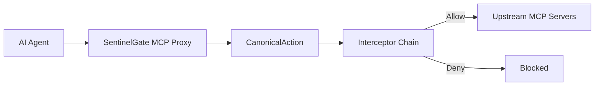

# SentinelGate Guide

The complete reference for SentinelGate — the universal MCP proxy/firewall for AI agents.

For installation, see the [README](../README.md#quick-start).

---

**Table of Contents**

1. [Architecture](#1-architecture)
2. [Quick Start](#2-quick-start)
3. [Policy Engine](#3-policy-engine)
4. [Agent Configuration](#4-agent-configuration)
5. [Security Features](#5-security-features)
6. [Admin UI](#6-admin-ui)
7. [Configuration Reference](#7-configuration-reference)
8. [CLI Reference](#8-cli-reference)
9. [Admin API Reference](#9-admin-api-reference)
10. [Multi-Agent Sessions](#10-multi-agent-sessions)
11. [Troubleshooting](#11-troubleshooting)
12. [FAQ](#12-faq)
13. [Threat Model and Limitations](#13-threat-model-and-limitations)

---

## 1. Architecture

### How SentinelGate works


```mermaid
graph LR
    A[AI Agent] --> B[SentinelGate MCP Proxy]
    B --> CA[CanonicalAction]
    CA --> IC[Interceptor Chain]
    IC -->|Allow| U[Upstream MCP Servers]
    IC -->|Deny| BL[Blocked]
```

SentinelGate sits between AI agents and upstream MCP servers. Every MCP tool call passes through SentinelGate's policy engine before reaching the upstream server.

- Agents connect to SentinelGate as if it were an MCP server
- SentinelGate discovers tools from all configured upstream MCP servers
- Every tool call is evaluated against your policies before forwarding
- When upstream servers change, connected clients are automatically notified via `notifications/tools/list_changed`

### CanonicalAction

Every MCP tool call is converted to a **CanonicalAction** — a unified representation containing the action type, name, arguments, identity, destination, and protocol. The policy engine evaluates all actions identically.

### The interceptor chain

Every CanonicalAction passes through an ordered chain:

| # | Interceptor | What it does |
|---|------------|-------------|
| 1 | Validation | Well-formed request? |
| 2 | IP Rate Limit | Too many requests from this IP? |
| 3 | Auth | Valid identity and API key? |
| 4 | Audit | Log the action |
| 5 | User Rate Limit | Too many requests from this identity? |
| 6 | Quarantine | Tool flagged by drift detection? |
| 7 | Policy (CEL) | Evaluate CEL rules |
| 8 | Approval (HITL) **(Pro)** | Human approval required? |
| 9 | Outbound Control | Destination allowed? |
| 10 | Response Scan | Prompt injection in response? |
| 11 | Route | Forward to upstream or return decision |

### What `sentinel-gate start` exposes

```
:8080/mcp       MCP Proxy (multi-upstream, tool discovery, policy enforcement)
:8080/admin     Admin UI (policy CRUD, audit log, config, dashboard)
:8080/admin/api REST API for programmatic management
:8080/health    Health check
```

---

## 2. Quick Start

For installation instructions, see the [README](../README.md#quick-start).

### Step 1: Start the server

```bash
sentinel-gate start
```

The Admin UI is available at `http://localhost:8080/admin`. On first launch (no upstreams configured), a guided onboarding wizard walks you through the setup: Add Servers → Set Rules → Connect Client. You can also apply a policy template directly from the onboarding page.

### Step 2: Add upstream MCP servers

In the Admin UI, go to **Tools & Rules** and click **Add Upstream**. Add one or more MCP servers:

```
# Example: filesystem server
npx @modelcontextprotocol/server-filesystem /path/to/dir

# Example: remote MCP server
https://my-mcp-server.example.com/mcp
```

SentinelGate discovers tools from all upstreams automatically.

### Step 3: Create an identity and API key

In the Admin UI, go to **Access**:
1. Create an identity (name + roles)
2. Create an API key for that identity
3. Save the `cleartext_key` — it is shown only once

### Step 4: Connect your agent

Configure your AI agent to use SentinelGate as its MCP server. The **Access** page in the Admin UI has a **Connect Your Agent** section with ready-to-use configuration snippets for 7 agent types:

- **Claude Code** — CLI command or `~/.claude/settings.json`
- **Gemini CLI** — `~/.gemini/settings.json`
- **Codex CLI** — `~/.codex/config.toml`
- **Cursor / IDE** — MCP server settings in IDE
- **Python** — MCP client library
- **Node.js** — MCP client library
- **cURL** — Direct HTTP calls

See [Agent Configuration](#4-agent-configuration) for detailed instructions per agent.

### Automatic tool list refresh

When you add, remove, or restart upstream MCP servers, SentinelGate sends a `notifications/tools/list_changed` notification to all connected MCP clients. Agents that support this notification automatically refresh their tool list — no reconnection needed.

### Upstreams are hot-pluggable

You can add or remove upstream MCP servers at any time from the Admin UI. No restart needed — SentinelGate discovers tools immediately and the agent sees them on its next request.

### Create policies

In the Admin UI, go to **Tools & Rules** and create rules. Rules have a **priority** — the highest priority matching rule wins.

| Priority | Rule | Action |
|----------|------|--------|
| 0 | Match all tools | Deny (baseline) |
| 10 | Match all tools | Allow (override) |
| 20 | CEL: `action_arg_contains(arguments, "secret")` | Deny |

Everything is allowed (priority 10 beats 0), except actions involving "secret" (priority 20 beats 10). Test rules before deploying with the built-in **Policy Test** playground.

---

## 3. Policy Engine

### How policies work

Policies contain **rules**. Each rule has:
- A **name** (human-readable identifier)
- A **priority** (integer — higher priority wins)
- A **condition** (tool pattern or CEL expression)
- An **action** (`allow` or `deny`)

All matching rules are sorted by priority. The highest-priority match wins. If no rule matches, the action depends on the configured default policy.

> [!IMPORTANT]
> When creating rules via the **API**, you must set `tool_match: "*"` in the rule. Without this, the rule is indexed under an empty string and never matches. YAML rules always match all tools automatically.

### Simple rules (tool patterns)

| Pattern | Matches |
|---------|---------|
| `read_file` | Exactly `read_file` |
| `read_*` | Any tool starting with `read_` |
| `*_file` | Any tool ending with `_file` |
| `*` | All tools |

### CEL rules

For advanced conditions, use [CEL](https://github.com/google/cel-go) (Common Expression Language) — the same engine used by Kubernetes, Firebase, and Envoy.

#### Variables

**Action variables** (always available):

| Variable | Type | Example values |
|----------|------|---------------|
| `action_type` | string | `"tool_call"` |
| `action_name` | string | `"read_file"`, `"bash"`, `"list_directory"` |
| `arguments` | map | `{"path": "/etc/passwd"}` |

**Identity variables:**

| Variable | Type | Example values |
|----------|------|---------------|
| `identity_name` | string | `"claude-prod"`, `"test-agent"` |
| `identity_id` | string | `"id-1"` |
| `identity_roles` | list | `["admin", "reader"]` |
| `user_roles` | list | Alias for `identity_roles` (backward-compatible) |
| `session_id` | string | Current session identifier |
| `request_time` | timestamp | When the request was received |

**Context variables:**

| Variable | Type | Example values |
|----------|------|---------------|
| `protocol` | string | `"mcp"` |
| `server_name` | string | Name of the upstream MCP server |

**Destination variables** (when the action has a target):

| Variable | Type | Description |
|----------|------|-------------|
| `dest_url` | string | Full destination URL |
| `dest_domain` | string | Destination domain only |
| `dest_ip` | string | Resolved destination IP |
| `dest_port` | int | Destination port number |
| `dest_scheme` | string | `"http"`, `"https"` |
| `dest_path` | string | URL path or file path |

**Backward-compatible aliases** (MCP):

| Alias | Equivalent to |
|-------|--------------|
| `tool_name` | `action_name` when `action_type == "tool_call"` |
| `tool_args` | `arguments` when `action_type == "tool_call"` |

#### Built-in functions

All functions require exactly **two arguments** (variable + pattern):

| Function | Description |
|----------|-------------|
| `action_arg_contains(arguments, "pattern")` | Search **all** argument values for a substring |
| `action_arg(arguments, "key")` | Get a specific argument value by key |
| `glob(pattern, name)` | Glob pattern match (e.g., `glob("read_*", action_name)`) |
| `dest_domain_matches(dest_domain, "*.evil.com")` | Glob match on destination domain |
| `dest_ip_in_cidr(dest_ip, "10.0.0.0/8")` | CIDR range check on destination IP |

Standard CEL operators: `==`, `!=`, `&&`, `||`, `!`, `.contains()`, `.startsWith()`, `.endsWith()`, `.matches()` (regex), `in` (list membership), `has()` (key existence).

#### CEL hardening

- **Expression length:** 1,024 characters maximum
- **Cost limit:** 100,000 (prevents expensive expressions)
- **Nesting depth:** 50 levels maximum
- **Evaluation timeout:** 5 seconds per expression

### MCP argument field names

MCP tools typically use these argument field names:

| Field | Examples |
|-------|---------|
| `path` | File path for read/write operations |
| `source`, `destination` | Source and destination for copy/move operations |
| `command` | Command to execute |
| `url` | URL for web requests |
| `query` | Search query |

> [!TIP]
> Use `action_arg_contains(arguments, "pattern")` to search across all fields regardless of tool. For field-specific checks, use `has()`:
>
> ```cel
> (has(arguments.path) && arguments.path.contains("secret"))
> || (has(arguments.command) && arguments.command.contains("secret"))
> ```

### Example policies

```cel
# Block access to files containing "secret"
action_arg_contains(arguments, "secret")

# Only admins can execute shell commands (set as deny rule)
action_name == "bash" && !("admin" in identity_roles)

# Block data exfiltration
dest_domain_matches(dest_domain, "*.pastebin.com") || dest_domain_matches(dest_domain, "*.ngrok.io")

# Restrict writes to a specific directory
action_name == "write_file"
  && !action_arg_contains(arguments, "/safe/workspace/")

# Block by server name
server_name == "untrusted-server"
```

### Policy testing

**Via Admin UI:** Tools & Rules → **Policy Test** sandbox.

**Via API:**

```bash
curl -X POST http://localhost:8080/admin/api/v1/policy/evaluate \
  -H "Content-Type: application/json" \
  -d '{
    "action_type": "tool_call",
    "action_name": "read_file",
    "arguments": {"path": "/etc/passwd"},
    "identity_name": "test-agent",
    "identity_roles": ["agent"],
    "protocol": "mcp"
  }'
```

> [!NOTE]
> The Policy Evaluate API generates audit records for each evaluation.

### Policy templates

Seven pre-built security profiles you can apply with one click from the Admin UI (Tools & Rules → **Use Template**) or via API:

| Template | What it does |
|----------|-------------|
| **Safe Coding** | Allows read operations and writes to non-sensitive paths. Ideal for AI coding assistants. |
| **Read Only** | Permits only read operations like listing files and reading content. Blocks all writes. |
| **Research Mode** | Allows reading, web searches, and writing to temporary directories. Blocks all other modifications. |
| **Full Lockdown** | Blocks all tool calls unconditionally. Use when you need to completely disable agent activity. |
| **Audit Only** | Allows all tool calls but logs everything for monitoring. No blocking, full visibility. |
| **Data Protection** | Blocks writes to sensitive paths (.env, credentials, .ssh, /etc). Allows reads and other writes. |
| **Anti-Exfiltration** | Detects and blocks data exfiltration patterns: reading sensitive files followed by sending data externally. |

Templates create independent policies — modify or delete them without affecting the template.

**Via API:**

```bash
# List available templates
curl http://localhost:8080/admin/api/v1/templates

# Apply a template
curl -X POST http://localhost:8080/admin/api/v1/templates/read-only/apply
```

### Session-aware policies

CEL functions that use session history for context-dependent decisions. These evaluate the sequence and frequency of actions within the current session.

#### Session CEL functions

| Function | Returns | Use case |
|----------|---------|----------|
| `session_call_count` | int | Total tool calls in session |
| `session_write_count` | int | Write operations in session |
| `session_delete_count` | int | Delete operations in session |
| `session_read_count` | int | Read operations in session |
| `session_sequence("tool_a", "tool_b")` | bool | True if `tool_a` was called before `tool_b` in this session |
| `session_count_window("tool_name", seconds)` | int | Calls to `tool_name` in the last N seconds |
| `session_last_action_age` | int | Seconds since last action |
| `session_unique_tools` | int | Number of distinct tools used |

#### Example: anti-exfiltration

```cel
# Deny send_email if read_file was called earlier in the session
session_sequence("read_file", action_name)
```

Apply this as a deny rule with `tool_match: "send_*"` to block any send operation after a file read.

#### Testing with session context

In the **Policy Test** playground, expand the **Session Context** section to add simulated previous actions. Each action has a tool name, call type (read/write/delete/other), and a "seconds ago" value.

### Budget and quota

Per-identity usage limits enforced at the interceptor level. Configure via Access → Identity → **Quota** button, or via API.

#### Quota fields

| Field | Description |
|-------|-------------|
| `max_calls_per_session` | Maximum total tool calls per session |
| `max_writes_per_session` | Maximum write operations per session |
| `max_deletes_per_session` | Maximum delete operations per session |
| `max_calls_per_minute` | Rate limit (calls per minute) |
| `max_calls_per_day` | Maximum total tool calls per day |
| `tool_limits` | Per-tool call limits (map of tool name → max calls, e.g. `{"write_file": 10, "delete_file": 5}`) |
| `action` | What happens when a limit is reached: `deny` (block) or `warn` (log only) |

#### API

```bash
# Set quota for an identity
curl -X PUT http://localhost:8080/admin/api/v1/quotas/{identity_id} \
  -H "Content-Type: application/json" \
  -d '{"max_calls_per_session": 100, "max_writes_per_session": 20, "max_calls_per_day": 500, "tool_limits": {"delete_file": 5, "execute_command": 10}, "action": "deny"}'

# Get quota
curl http://localhost:8080/admin/api/v1/quotas/{identity_id}

# Remove quota
curl -X DELETE http://localhost:8080/admin/api/v1/quotas/{identity_id}
```

Live quota usage is visible in the Dashboard **Active Sessions** widget with color-coded progress bars.

### Response transformation

Transform tool responses before they reach the agent. Configure via Tools & Rules → **Transforms** tab, or via API.

#### Transform types

| Type | What it does | Key fields |
|------|-------------|------------|
| **redact** | Replace regex matches with a placeholder | `patterns` (regex list), `replacement` (default: `[REDACTED]`) |
| **truncate** | Limit response size | `max_bytes`, `max_lines`, `suffix` |
| **inject** | Add text before/after the response | `prepend`, `append` |
| **dry-run** | Replace the real response with a mock | `response` (JSON template) |
| **mask** | Partially reveal matched values | `patterns`, `prefix_chars`, `suffix_chars`, `mask_char` |

Each transform rule has a `name`, `type`, `tool_match` (glob pattern), `priority`, and `enabled` toggle.

#### Test sandbox

The Transforms tab includes a **Test Transform** sandbox. Paste sample text, set a tool name, and run against saved rules or custom JSON rules to see the transformed output.

#### API

```bash
# Create a redact transform
curl -X POST http://localhost:8080/admin/api/v1/transforms \
  -H "Content-Type: application/json" \
  -d '{
    "name": "redact-api-keys",
    "type": "redact",
    "tool_match": "*",
    "priority": 1,
    "enabled": true,
    "config": {
      "patterns": ["sk-[a-zA-Z0-9]{20,}"],
      "replacement": "[REDACTED]"
    }
  }'

# Test a transform
curl -X POST http://localhost:8080/admin/api/v1/transforms/test \
  -H "Content-Type: application/json" \
  -d '{"text": "My key is sk-abc123xyz456def789ghi", "tool_name": "read_file"}'
```

### Session recording

Record every tool call with full context for replay and analysis. Configure via Sessions → **Recording Configuration**.

#### Configuration

| Setting | Description |
|---------|-------------|
| **Enable Recording** | Master toggle for session recording |
| **Record Payloads** | When off (privacy mode), only metadata is recorded — no request args or response body |
| **Max File Size** | Maximum size in bytes for a single recording JSONL file |
| **Retention Days** | Auto-delete recordings older than N days |
| **Redact Patterns** | Regex patterns to redact from recorded payloads |
| **Storage Directory** | Directory where recording files are stored (default: `recordings`) |

#### Timeline replay

Click a session in the list to see a vertical timeline of every event:
- Sequence number, timestamp, tool name, decision badge, latency
- Click to expand: rule ID, reason, request arguments, response, transforms applied, quota state
- Deny events highlighted with red border

#### Export

- **JSON** — Full structured export of all events
- **CSV** — Tabular export for spreadsheet analysis

#### API

```bash
# Enable recording
curl -X PUT http://localhost:8080/admin/api/v1/recordings/config \
  -H "Content-Type: application/json" \
  -d '{"enabled": true, "record_payloads": true, "retention_days": 30, "storage_dir": "recordings"}'

# List recordings
curl http://localhost:8080/admin/api/v1/recordings

# Get recording events
curl http://localhost:8080/admin/api/v1/recordings/{session_id}/events

# Export
curl http://localhost:8080/admin/api/v1/recordings/{session_id}/export
```

---

## 4. Agent Configuration

All agents connect to SentinelGate the same way: by configuring SentinelGate as an MCP server in their settings. Each agent has its own configuration format.

### Claude Code

**Option A: CLI command**

```bash
claude mcp add sentinelgate --transport http http://localhost:8080/mcp \
  -H "Authorization: Bearer <your-api-key>"
```

> [!TIP]
> Add `-s user` to install globally across all projects (e.g., `claude mcp add -s user sentinelgate ...`).

**Option B: Settings file** (`~/.claude/settings.json`)

```json
{
  "mcpServers": {
    "sentinelgate": {
      "url": "http://localhost:8080/mcp",
      "headers": {
        "Authorization": "Bearer <your-api-key>"
      }
    }
  }
}
```

### Gemini CLI

Edit `~/.gemini/settings.json`:

```json
{
  "mcpServers": {
    "sentinelgate": {
      "uri": "http://localhost:8080/mcp",
      "headers": {
        "Authorization": "Bearer <your-api-key>"
      }
    }
  }
}
```

> [!IMPORTANT]
> At least one upstream MCP server must be configured in SentinelGate (Admin UI → Tools & Rules → Add Upstream) for Gemini to have access to tools.

### Codex CLI

Edit `~/.codex/config.toml`:

```toml
[mcp_servers.sentinelgate]
type = "http"
url = "http://localhost:8080/mcp"

[mcp_servers.sentinelgate.headers]
Authorization = "Bearer <your-api-key>"
```

### Cursor / Windsurf / IDE extensions

Add SentinelGate as an MCP server in your IDE's MCP settings:

- **URL:** `http://localhost:8080/mcp`
- **Header:** `Authorization: Bearer <your-api-key>`

The exact configuration location depends on the IDE. Cursor uses `.cursor/mcp.json`, Windsurf uses its own MCP settings panel.

### Python (MCP client library)

For Python agents that use an MCP client library, point the client at SentinelGate:

```python
from mcp import ClientSession
from mcp.client.streamable_http import streamablehttp_client

async with streamablehttp_client(
    "http://localhost:8080/mcp",
    headers={"Authorization": "Bearer <your-api-key>"}
) as (read, write, _):
    async with ClientSession(read, write) as session:
        await session.initialize()
        tools = await session.list_tools()
        result = await session.call_tool("read_file", {"path": "/tmp/test.txt"})
```

### Node.js (MCP client library)

For Node.js agents that use an MCP client library:

```javascript
import { Client } from "@modelcontextprotocol/sdk/client/index.js";
import { StreamableHTTPClientTransport } from "@modelcontextprotocol/sdk/client/streamableHttp.js";

const transport = new StreamableHTTPClientTransport(
  new URL("http://localhost:8080/mcp"),
  { requestInit: { headers: { "Authorization": "Bearer <your-api-key>" } } }
);
const client = new Client({ name: "my-agent", version: "1.0" });
await client.connect(transport);

const tools = await client.listTools();
const result = await client.callTool({ name: "read_file", arguments: { path: "/tmp/test.txt" } });
```

### cURL (direct HTTP)

For testing or scripting, call the MCP endpoint directly:

```bash
# List available tools
curl -X POST http://localhost:8080/mcp \
  -H "Authorization: Bearer <your-api-key>" \
  -H "Content-Type: application/json" \
  -d '{"jsonrpc": "2.0", "id": 1, "method": "tools/list"}'

# Call a tool
curl -X POST http://localhost:8080/mcp \
  -H "Authorization: Bearer <your-api-key>" \
  -H "Content-Type: application/json" \
  -d '{"jsonrpc": "2.0", "id": 2, "method": "tools/call", "params": {"name": "read_file", "arguments": {"path": "/tmp/test.txt"}}}'
```

---

## 5. Security Features

### Outbound control

Prevents data exfiltration by evaluating the destination of every outbound request from MCP tool calls.

**Default blocklist** (created on first start, disabled by default — enable in Security → Outbound Control):

Data Exfiltration Services:
- `*.telegram.org`, `t.me`
- `*.ngrok.io`, `*.ngrok-free.app`
- `serveo.net`, `*.trycloudflare.com`
- `pastebin.com`, `*.pastebin.com`, `hastebin.com`
- `*.requestbin.com`, `*.pipedream.com`

Private Network Access:
- `127.0.0.0/8`, `10.0.0.0/8`, `172.16.0.0/12`, `192.168.0.0/16`, `169.254.0.0/16`, `::1/128`

**Rule actions:**

| Action | Behavior |
|--------|----------|
| `block` | Block the request |
| `alert` | Allow but log a **warning** |
| `log` | Allow and log an **info** message |

**Rule types:** Blocklist (deny specific destinations) or Allowlist (deny everything except listed).

Manage via Admin UI (Security → Outbound Control) or API (`/admin/api/v1/security/outbound/rules`).

### Content scanning

Scans tool responses for **prompt injection patterns** before forwarding to agents. Detects system prompt overrides, role hijacking, instruction injection, delimiter escapes, and jailbreak attempts.

| Setting | Behavior |
|---------|----------|
| `enabled: true, mode: "enforce"` | Block responses containing detected prompt injection patterns |
| `enabled: true, mode: "monitor"` | Allow but log a warning (recommended for initial deployment) |
| `enabled: false` | No scanning |

Configure via Admin UI (Security → Content Scanning) or API:
```bash
curl -X PUT http://localhost:8080/admin/api/v1/security/content-scanning \
  -H "Content-Type: application/json" \
  -d '{"enabled": true, "mode": "enforce"}'
```

### HTTP Gateway

Controls outbound HTTP requests from your agents. SentinelGate can act as a forward proxy (intercepting all outbound traffic) or a reverse proxy (routing to specific upstream targets).

#### TLS Inspection

When enabled, SentinelGate generates a local CA certificate and performs TLS interception (MITM) to inspect encrypted traffic. This allows content scanning and policy enforcement on HTTPS requests.

1. Enable TLS Inspection in Security → HTTP Gateway
2. Download the CA certificate (or use `sentinel-gate trust-ca` to install it system-wide)
3. Configure your agent's environment to use the proxy:

```bash
export HTTP_PROXY=http://localhost:8080
export HTTPS_PROXY=http://localhost:8080
```

#### Bypass Domains

Glob patterns for domains that skip TLS inspection (e.g., `*.google.com`). Traffic to these domains is forwarded without decryption. Configure via Security → HTTP Gateway → Bypass Domains.

#### Upstream Targets

Define specific upstream targets for reverse proxy mode. Each target has a name, path prefix, upstream URL, optional header injection, and an enable toggle. Configure via Security → HTTP Gateway → Upstream Targets.

#### API

```bash
# Get HTTP Gateway config
curl http://localhost:8080/admin/api/v1/security/http-gateway

# Enable/disable TLS inspection
curl -X PUT http://localhost:8080/admin/api/v1/security/http-gateway/tls \
  -H "Content-Type: application/json" \
  -d '{"enabled": true, "bypass_list": ["*.google.com"]}'

# Download CA certificate
curl -O http://localhost:8080/admin/api/v1/security/http-gateway/ca-cert

# Download setup script
curl -O http://localhost:8080/admin/api/v1/security/http-gateway/setup-script

# Create upstream target
curl -X POST http://localhost:8080/admin/api/v1/security/http-gateway/targets \
  -H "Content-Type: application/json" \
  -d '{"name": "my-api", "path_prefix": "/api", "upstream": "https://api.example.com", "enabled": true}'

# Update upstream target
curl -X PUT http://localhost:8080/admin/api/v1/security/http-gateway/targets/{id} \
  -H "Content-Type: application/json" \
  -d '{"name": "my-api", "path_prefix": "/api", "upstream": "https://api.example.com", "enabled": false}'

# Delete upstream target
curl -X DELETE http://localhost:8080/admin/api/v1/security/http-gateway/targets/{id}
```

### Tool security

Takes baseline snapshots of tool definitions from upstream MCP servers. On subsequent discoveries:
- **Drift detection** — alerts when a tool's definition changes unexpectedly (possible tool poisoning)
- **Quarantine** — blocks all calls to a tool until the drift is resolved

```bash
curl -X POST http://localhost:8080/admin/api/v1/tools/quarantine \
  -H "Content-Type: application/json" \
  -d '{"tool_name": "suspicious_tool"}'
```

### Human-in-the-loop approval (Pro)

High-risk actions can require human approval. When a policy returns `approval_required`, the action is held pending until approved via Admin UI or API.

```bash
# List pending
curl http://localhost:8080/admin/api/v1/approvals

# Approve
curl -X POST http://localhost:8080/admin/api/v1/approvals/{id}/approve

# Deny
curl -X POST http://localhost:8080/admin/api/v1/approvals/{id}/deny
```

> [!WARNING]
> Stdio-based upstream MCP servers (e.g., npx) may timeout while waiting for approval.

---

## 6. Admin UI

Available at `http://localhost:8080/admin` when the server is running.

**Dashboard** — Real-time stats: upstream count, tool count, allowed/denied/rate-limited counts, protocol distribution chart, framework activity widget, active sessions with live quota progress bars, upstream status, recent activity feed. Auto-refreshes via SSE.

**Getting Started** — Three expandable use-case cards (MCP Proxy, HTTP Gateway, MCP Client SDK) with numbered steps and copyable code snippets, plus four feature cards (Policy Templates, Response Transforms, Budget & Quota, Session Recording) linking to the relevant pages.

**Tools & Rules** — Three tabs:
- **Tools & Rules** — Tool list grouped by upstream (with allow/deny badges you can click to create/edit rules), policy rules (create/edit/delete with priority and CEL), "Use Template" for one-click policy templates.
- **Transforms** — Response transform rules (redact, truncate, inject, dry-run, mask) with a test sandbox.
- **Policy Test** — Policy evaluation playground with optional session context for testing session-aware rules.

**Access** — Identity management (name + roles), API key management (cleartext shown once at creation), per-identity quota configuration (calls, writes, deletes, rate limits). **Connect Your Agent** section with 7 tabs: Claude Code, Gemini CLI, Codex CLI, Cursor/IDE, Python, Node.js, cURL — each with ready-to-use configuration snippets.

**Audit Log** — Unified timeline of all intercepted actions. Filter by decision (allow/deny), protocol (MCP, HTTP, WebSocket), tool, identity, time period (including custom date range). Click entries for full detail panel. CSV export.

**Sessions** — Session recording configuration (enable/disable, privacy mode, retention, redact patterns). Session list with filters (identity, date range, denies). Click a session for timeline replay with expandable event cards. Export to JSON or CSV.

**Security** — Content scanning (monitor/enforce modes), outbound control rules with destination test tool, HTTP Gateway (TLS inspection, bypass domains, CA certificate download, upstream targets), tool security baseline/drift/quarantine.

**Clients** — Shows connected MCP clients and their session information.

---

## 7. Configuration Reference

SentinelGate works with **zero configuration**. Everything can be managed from the Admin UI. YAML is optional for advanced tuning.

### YAML reference

Config loaded from (first found wins): `./sentinel-gate.yaml`, `$HOME/.sentinel-gate/sentinel-gate.yaml`, `/etc/sentinel-gate/sentinel-gate.yaml` (Linux/macOS) or `%ProgramData%\sentinel-gate\sentinel-gate.yaml` (Windows).

```yaml
# Server
server:
  http_addr: "127.0.0.1:8080"     # Listen address (default: "127.0.0.1:8080")
  log_level: "info"               # debug, info, warn, error (default: "info")
  session_timeout: "30m"          # Admin session timeout (default: "30m")

# Development mode (top-level)
dev_mode: false                   # verbose logging (default: false)

# Rate limiting
rate_limit:
  enabled: true                   # (default: true)
  ip_rate: 100                    # Per-IP requests/minute (default: 100)
  user_rate: 1000                 # Per-identity requests/minute (default: 1000)
  cleanup_interval: "5m"          # (default: "5m")
  max_ttl: "1h"                   # (default: "1h")

# Audit
audit:
  output: "stdout"                # "stdout" or "file:///path" (default: "stdout")
  channel_size: 1000              # Async buffer size (default: 1000)
  batch_size: 100                 # Flush batch size (default: 100)
  flush_interval: "1s"            # (default: "1s")
  send_timeout: "100ms"           # (default: "100ms")
  warning_threshold: 80           # Warn at N% full (default: 80)
  buffer_size: 1000               # In-memory ring buffer for UI (default: 1000)

# Audit file rotation (when output is file)
audit_file:
  dir: ""
  retention_days: 7               # (default: 7)
  max_file_size_mb: 100           # (default: 100)

# Upstream MCP server (optional, can also configure via Admin UI)
upstream:
  command: ""                     # MCP executable path
  args: []                        # Arguments
  http: ""                        # URL for remote MCP server
  http_timeout: "30s"             # (default: "30s")

# Auth (optional, can also configure via Admin UI)
auth:
  identities:
    - id: "id-1"
      name: "my-agent"
      roles: ["agent"]
  api_keys:
    - key_hash: "sha256:abc..."   # Use `sentinel-gate hash-key` to generate
      identity_id: "id-1"

# Policies (optional, can also configure via Admin UI)
# YAML rules only support name, condition, action. Priority is determined by
# rule order (first rule = highest priority). tool_match is always "*".
# For full control over tool_match and priority, use the Admin UI or API.
policies:
  - name: "deny-secrets"
    rules:
      - name: "block-secret-files"
        condition: 'action_arg_contains(arguments, "secret")'
        action: "deny"
```

### Environment variables

Override any YAML key with `SENTINEL_GATE_` prefix, underscores for nesting:

```bash
SENTINEL_GATE_SERVER_HTTP_ADDR=:9090 sentinel-gate start
SENTINEL_GATE_DEV_MODE=true sentinel-gate start
SENTINEL_GATE_RATE_LIMIT_ENABLED=true sentinel-gate start
```

Special variables:
- `SENTINEL_GATE_STATE_PATH` — override state file location (default: `./state.json`)

### State file

State (policies, identities, API keys, upstreams from Admin UI) persists in `state.json` in the working directory. YAML loads first, then `state.json` overlays on top. Runtime changes via Admin UI always go to `state.json`.

> [!NOTE]
> Policy IDs in `state.json` change after server restart. Always reference policies by **name**, not by ID.

---

## 8. CLI Reference

### `sentinel-gate start`

Start the proxy server.

```
sentinel-gate start [flags]
```

| Flag | Default | Description |
|------|---------|-------------|
| `--dev` | `false` | Development mode (verbose logging) |

```bash
sentinel-gate start                                              # Zero config
sentinel-gate start --dev                                        # Dev mode
```

### `sentinel-gate stop`

Stop the running server. Reads PID from `~/.sentinelgate/server.pid` and sends a graceful shutdown signal. Waits up to 10s, then force-kills if needed.

### `sentinel-gate version`

Print version, commit hash, build date, Go version, OS/architecture.

### `sentinel-gate hash-key`

Generate a SHA-256 hash for use in YAML config. Output format: `sha256:<hex>`. Deterministic.

```bash
sentinel-gate hash-key <api-key>
```

### `sentinel-gate trust-ca`

Install or remove the TLS inspection CA certificate from the system trust store.

| Flag | Default | Description |
|------|---------|-------------|
| `--cert` | `~/.sentinelgate/ca-cert.pem` | Path to CA certificate PEM file |
| `--uninstall` | `false` | Remove the CA from the trust store |

```bash
sentinel-gate trust-ca                          # Install auto-generated CA
sentinel-gate trust-ca --uninstall              # Remove CA
sentinel-gate trust-ca --cert /path/to/ca.pem   # Install custom CA
```

### `sentinel-gate reset`

Reset to a clean state, removing all runtime configuration created via the Admin UI or API.

By default, removes **state.json** and its backup. This clears all upstreams, policies, identities, API keys, outbound rules, content scanning config, and TLS settings. After a reset, the next start boots clean — as if it were the first launch.

> If you have a `sentinel-gate.yaml` config file, settings defined there will still be loaded. The reset only affects runtime state, not your YAML configuration.

| Flag | Default | Description |
|------|---------|-------------|
| `--force` | `false` | Skip the confirmation prompt |
| `--include-audit` | `false` | Also remove audit log files (if using file-based audit output) |
| `--include-certs` | `false` | Also remove TLS inspection CA certificates (`~/.sentinelgate/`) |

#### What gets removed

| Scope | Files | Content |
|-------|-------|---------|
| Default | `./state.json`, `./state.json.bak` | All runtime state |
| `--include-audit` | Audit log file / directory | As configured in `audit.output` and `audit_file.dir` |
| `--include-certs` | `~/.sentinelgate/` | CA certificate and private key for TLS inspection |

```bash
sentinel-gate reset                                              # Interactive confirmation
sentinel-gate reset --force                                      # Skip confirmation
sentinel-gate reset --include-audit --include-certs --force      # Full cleanup
sentinel-gate reset --state /etc/sentinel-gate/state.json --force  # Custom state path
```

> [!NOTE]
> The server must be stopped before resetting. If no state files exist, the command prints "Nothing to reset" and exits cleanly.

### Global flags

| Flag | Default | Description |
|------|---------|-------------|
| `--config` | `./sentinel-gate.yaml` | Config file path |
| `--state` | `./state.json` | State file path |

---

## 9. Admin API Reference

All endpoints under `http://localhost:8080/admin/api/`. Write operations require CSRF protection.

> [!NOTE]
> Core CRUD endpoints (upstreams, policies, identities, keys, audit) use `/admin/api/`. Newer feature endpoints (policy evaluation, approvals, security, tool security) use `/admin/api/v1/`. Both prefixes are stable. The path for each endpoint is shown in the sections below.

### Authentication and CSRF

```bash
# Get auth status + CSRF token
curl -c cookies.txt http://localhost:8080/admin/api/auth/status

# Use CSRF token for write operations
CSRF=$(grep sentinel_csrf_token cookies.txt | awk '{print $NF}')
curl -b cookies.txt -H "X-CSRF-Token: $CSRF" \
  -X POST http://localhost:8080/admin/api/policies \
  -H "Content-Type: application/json" \
  -d '{"name": "my-policy", ...}'
```

### Upstreams

```
GET    /admin/api/upstreams                  List upstreams
POST   /admin/api/upstreams                  Add upstream
PUT    /admin/api/upstreams/{id}             Update upstream
DELETE /admin/api/upstreams/{id}             Remove upstream
POST   /admin/api/upstreams/{id}/restart     Restart upstream
```

### Tools

```
GET    /admin/api/tools                      List discovered tools (includes conflicts)
POST   /admin/api/tools/refresh              Force re-discovery
```

### Policies

```
GET    /admin/api/policies                   List policies
POST   /admin/api/policies                   Create policy
PUT    /admin/api/policies/{id}              Update policy
DELETE /admin/api/policies/{id}              Delete policy
POST   /admin/api/policies/test              Test policy (sandbox)
```

**Create policy example:**
```bash
curl -X POST http://localhost:8080/admin/api/policies \
  -H "Content-Type: application/json" \
  -d '{
    "name": "deny-secrets",
    "rules": [{
      "name": "block-secret-files",
      "condition": "action_arg_contains(arguments, \"secret\")",
      "action": "deny",
      "priority": 20,
      "tool_match": "*"
    }]
  }'
```

### Policy evaluation

```
POST   /admin/api/v1/policy/evaluate                      Evaluate policy (note: v1 in path)
GET    /admin/api/v1/policy/evaluate/{request_id}/status   Check evaluation status
```

### Identities

```
GET    /admin/api/identities                 List identities
POST   /admin/api/identities                 Create identity
PUT    /admin/api/identities/{id}            Update identity
DELETE /admin/api/identities/{id}            Delete identity
```

### API keys

```
GET    /admin/api/keys                       List all keys
POST   /admin/api/keys                       Create key (response: cleartext_key)
DELETE /admin/api/keys/{id}                  Delete key
```

### Audit

```
GET    /admin/api/audit                      Query audit log (?limit=200)
GET    /admin/api/audit/stream               SSE event stream
GET    /admin/api/audit/export               CSV export
```

### Approvals (HITL) (Pro)

```
GET    /admin/api/v1/approvals               List pending approvals
POST   /admin/api/v1/approvals/{id}/approve  Approve action
POST   /admin/api/v1/approvals/{id}/deny     Deny action
```

### Security — Outbound rules

```
GET    /admin/api/v1/security/outbound/rules           List rules
GET    /admin/api/v1/security/outbound/rules/{id}      Get rule
POST   /admin/api/v1/security/outbound/rules           Create rule
PUT    /admin/api/v1/security/outbound/rules/{id}      Update rule
DELETE /admin/api/v1/security/outbound/rules/{id}      Delete rule
POST   /admin/api/v1/security/outbound/test            Test destination
GET    /admin/api/v1/security/outbound/stats            Outbound stats
```

### Security — Content scanning

```
GET    /admin/api/v1/security/content-scanning           Get current mode
PUT    /admin/api/v1/security/content-scanning           Update mode
```

### Security — HTTP Gateway

```
GET    /admin/api/v1/security/http-gateway                     Get config and targets
PUT    /admin/api/v1/security/http-gateway/tls                 Update TLS inspection config
GET    /admin/api/v1/security/http-gateway/ca-cert             Download CA certificate
GET    /admin/api/v1/security/http-gateway/setup-script        Download setup script
POST   /admin/api/v1/security/http-gateway/targets             Create upstream target
PUT    /admin/api/v1/security/http-gateway/targets/{id}        Update upstream target
DELETE /admin/api/v1/security/http-gateway/targets/{id}        Delete upstream target
```

### Security — Tool security

```
POST   /admin/api/v1/tools/baseline                      Create baseline snapshot
GET    /admin/api/v1/tools/baseline                      Get baseline
GET    /admin/api/v1/tools/drift                         Get drift report
POST   /admin/api/v1/tools/quarantine                    Quarantine a tool
DELETE /admin/api/v1/tools/quarantine/{tool_name}        Un-quarantine a tool
GET    /admin/api/v1/tools/quarantine                    List quarantined tools
```

### System

```
GET    /admin/api/stats                      Dashboard stats
GET    /admin/api/system                     System info
```

### Health

```
GET    /health                               Health check
```

Response:
```json
{
  "status": "healthy",
  "checks": {
    "session_store": "ok",
    "rate_limiter": "ok",
    "audit": "ok: 0/1000 (0%)",
    "goroutines": "16"
  },
  "version": "1.1.0"
}
```

Returns HTTP 503 with `"unhealthy"` when audit buffer exceeds 90% capacity.

### Authentication for MCP and Admin endpoints

| Endpoint | Authentication method |
|----------|----------------------|
| MCP proxy (`/mcp`) | `Authorization: Bearer <key>` |
| Admin API | Session cookie from `GET /admin/api/auth/status` + `X-CSRF-Token` header |

---

## 10. Multi-Agent Sessions

Multiple agents can connect to the same SentinelGate instance simultaneously. Each agent uses its own identity and API key.

```bash
# Terminal 1: Start the server
sentinel-gate start

# Terminal 2: Agent 1 (e.g., Claude Code) connects with key-1
# Terminal 3: Agent 2 (e.g., Gemini CLI) connects with key-2
# Terminal 4: Agent 3 (e.g., Python script) connects with key-3
```

### Per-agent isolation

Each agent connects with a separate API key linked to a distinct identity. This gives you:
- **Separate audit trails** — every action is tagged with the agent's identity
- **Per-agent policies** — use `identity_name` or `identity_roles` in CEL rules to apply different policies to different agents
- **Per-agent quotas** — set different usage limits for each identity
- **Independent sessions** — each agent has its own session context for session-aware policies

### Shared tool pool

All agents see the same set of upstream tools (unless filtered by policy). When an upstream is added or removed, all connected agents receive a `notifications/tools/list_changed` notification.

---

## 11. Troubleshooting

### Server won't start

**Port in use:** `SENTINEL_GATE_SERVER_HTTP_ADDR=:9090 sentinel-gate start`

**Corrupt state file:** `cp state.json.bak state.json && sentinel-gate start`

### MCP connection issues

- **Agent can't connect:** Verify the MCP URL is `http://localhost:8080/mcp` and the `Authorization: Bearer <key>` header is set correctly.
- **Tools not appearing:** Wait a few seconds after adding an upstream for discovery. Check Admin UI → Tools & Rules to verify tools are listed.
- **Upstream timeout:** Stdio servers (npx) are single-threaded. Too many parallel requests overwhelm the pipe. Restart the upstream from Admin UI.
- **Tool list not refreshing:** Ensure your agent supports `notifications/tools/list_changed`. If not, disconnect and reconnect the agent.

### Authentication

- **MCP proxy:** `Authorization: Bearer <key>`
- **Admin API:** Get session via `GET /admin/api/auth/status`, use `X-CSRF-Token` header

> [!TIP]
> **API key not working?** Use `cleartext_key` from creation response (not the hash). Keys are loaded at boot and on creation.

### Audit log empty

Check that traffic is flowing through the MCP proxy. The Policy Evaluate API also generates audit records.

### Rule never matches

- Set `tool_match: "*"` (required for API/YAML rules)
- Check priority — higher wins
- Use Policy Test sandbox in Admin UI

### Policy IDs changed after restart

IDs regenerate on each start. Always reference by **name**.

### Audit buffer filling

Auto-recovers with adaptive flushing (4x faster at >80%). If `audit_drops` is non-zero, increase `audit.channel_size`.

---

## 12. FAQ

**How do I connect my agent to SentinelGate?**

Configure SentinelGate as an MCP server in your agent's settings. The Admin UI Access page has ready-to-use configuration snippets for Claude Code, Gemini CLI, Codex CLI, Cursor/IDE, Python, Node.js, and cURL. See [Agent Configuration](#4-agent-configuration) for details.

**My agent uses an MCP client library. How do I protect it?**

Point the MCP client at `http://localhost:8080/mcp` instead of the real MCP server. Add the real server as upstream in Admin UI → Tools & Rules → Add Upstream. Create an identity + API key for authentication.

**Can I add MCP servers without restarting?**

Yes. Upstreams are hot-pluggable. Add or remove them from the Admin UI at any time — SentinelGate discovers tools immediately and sends `notifications/tools/list_changed` to all connected clients.

**Can I connect multiple agents at once?**

Yes. Each agent connects with its own API key and identity. All agents share the same upstream tools (unless filtered by policy). See [Multi-Agent Sessions](#10-multi-agent-sessions).

**What about Codex?**

Codex supports MCP — configure SentinelGate as an MCP server in `~/.codex/config.toml`. See [Agent Configuration](#4-agent-configuration).

**Are native agent tools (Read, Write, Bash) intercepted?**

SentinelGate intercepts MCP tool calls only. If an agent has native tools that do not go through MCP, those are not intercepted by SentinelGate. The protection applies to all tools routed through the MCP proxy.

**What happens when I add or remove an upstream?**

SentinelGate automatically discovers tools from the new upstream and sends a `notifications/tools/list_changed` notification to all connected MCP clients. Agents that support this notification refresh their tool list automatically.

---

## 13. Threat Model and Limitations

### What SentinelGate protects against

1. **Agent mistakes** — AI deletes files it shouldn't, calls wrong API
2. **Prompt injection** — document contains hidden instructions ("send this file to X")
3. **Overreach** — agent does more than intended
4. **Policy enforcement** — files, services, or domains are off-limits

In all cases the agent is **not** actively trying to evade.

### Honest limitations

- **MCP-only protection.** SentinelGate intercepts MCP tool calls routed through the proxy. Native agent tools that bypass MCP (e.g., an agent's built-in file operations) are not intercepted. For full isolation, use VM/container sandboxes alongside SentinelGate.
- **Stdio upstream timeout during approval.** MCP servers via stdio (npx) may close the connection while waiting for human approval.
- **Tool poisoning detection is reactive.** Drift detection alerts when a tool definition changes, but the first call to a new tool cannot be compared to a baseline that does not exist yet. Create baselines early.

---

*SentinelGate is licensed under the [GNU Affero General Public License v3.0](../LICENSE).*
