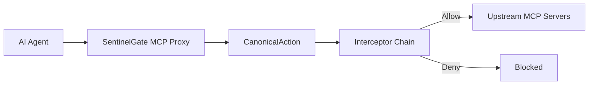

# SentinelGate Guide

The complete reference for SentinelGate — the universal MCP proxy/firewall for AI agents.

For installation, see the [README](../README.md#quick-start).

---

**Table of Contents**

1. [Architecture](#1-architecture)
2. [Quick Start](#2-quick-start)
3. [Policy Engine](#3-policy-engine)
4. [Agent Configuration](#4-agent-configuration)
5. [Security Features](#5-security-features)
6. [Admin UI](#6-admin-ui)
7. [Configuration Reference](#7-configuration-reference)
8. [CLI Reference](#8-cli-reference)
9. [Admin API Reference](#9-admin-api-reference)
10. [Multi-Agent Sessions](#10-multi-agent-sessions)
11. [Troubleshooting](#11-troubleshooting)
12. [FAQ](#12-faq)
13. [Threat Model and Limitations](#13-threat-model-and-limitations)

---

## 1. Architecture

### How SentinelGate works


```mermaid
graph LR
    A[AI Agent] --> B[SentinelGate MCP Proxy]
    B --> CA[CanonicalAction]
    CA --> IC[Interceptor Chain]
    IC -->|Allow| U[Upstream MCP Servers]
    IC -->|Deny| BL[Blocked]
```

SentinelGate sits between AI agents and upstream MCP servers. Every MCP tool call passes through SentinelGate's policy engine before reaching the upstream server.

- Agents connect to SentinelGate as if it were an MCP server
- SentinelGate discovers tools from all configured upstream MCP servers
- Every tool call is evaluated against your policies before forwarding
- When upstream servers change, connected clients are automatically notified via `notifications/tools/list_changed`

### CanonicalAction

Every MCP tool call is converted to a **CanonicalAction** — a unified representation containing the action type, name, arguments, identity, destination, and protocol. The policy engine evaluates all actions identically.

### The interceptor chain

Every CanonicalAction passes through an ordered chain:

| # | Interceptor | What it does |
|---|------------|-------------|
| 1 | Validation | Well-formed JSON-RPC? Confused deputy protection |
| 2 | IP Rate Limit | Too many requests from this IP? |
| 3 | Auth | Valid identity and API key? Session management |
| 4 | Audit | Log the action with latency, scan results, evidence |
| 5 | Quota | Session/tool quotas exceeded? (calls, writes, deletes, daily) |
| 6 | User Rate Limit | Too many requests from this identity? |
| 7 | Quarantine | Tool flagged by integrity drift detection? |
| 8 | Policy (CEL) | Evaluate CEL rules (stores decision in context) |
| 9 | Approval (HITL) | Human approval required? Blocking wait with timeout |
| 10 | Transform | Response transforms (redact, truncate, inject, mask, dry_run) |
| 11 | Content Scan (Input) | PII/secret scanning in tool arguments |
| 12 | Response Scan (Output) | Prompt injection detection in upstream responses |
| 13 | Route | Forward to correct upstream via tool cache |

### What `sentinel-gate start` exposes

```
:8080/mcp       MCP Proxy (multi-upstream, tool discovery, policy enforcement)
:8080/admin     Admin UI (policy CRUD, audit log, config, dashboard)
:8080/admin/api REST API for programmatic management
:8080/health    Health check
:8080/metrics   Prometheus metrics
```

---

## 2. Quick Start

For installation instructions, see the [README](../README.md#quick-start).

### Step 1: Start the server

```bash
sentinel-gate start
```

The Admin UI is available at `http://localhost:8080/admin`. On first launch (no upstreams configured), a guided onboarding wizard walks you through the setup: Add Server → Connect Agent → Set Rules. You can also apply a policy template directly from the onboarding page.

### Step 2: Add upstream MCP servers

In the Admin UI, go to **Tools & Rules** and click **Add Upstream**. Add one or more MCP servers:

```
# Example: filesystem server
npx @modelcontextprotocol/server-filesystem /path/to/dir

# Example: remote MCP server
https://my-mcp-server.example.com/mcp
```

SentinelGate discovers tools from all upstreams automatically.

### Step 3: Create an identity and API key

In the Admin UI, go to **Connections**:
1. Create an identity (name + roles)
2. Create an API key for that identity
3. Save the `cleartext_key` — it is shown only once

### Step 4: Connect your agent

Configure your AI agent to use SentinelGate as its MCP server. The **Connections** page in the Admin UI has a **Connect Your Agent** section with ready-to-use configuration snippets for 7 agent types:

- **Claude Code** — CLI command or `~/.claude/settings.json`
- **Gemini CLI** — `~/.gemini/settings.json`
- **Codex CLI** — `~/.codex/config.toml`
- **Cursor / IDE** — MCP server settings in IDE
- **Python** — MCP client library
- **Node.js** — MCP client library
- **cURL** — Direct HTTP calls

See [Agent Configuration](#4-agent-configuration) for detailed instructions per agent.

### Automatic tool list refresh

When you add, remove, or restart upstream MCP servers, SentinelGate sends a `notifications/tools/list_changed` notification to all connected MCP clients. Agents that support this notification automatically refresh their tool list — no reconnection needed.

### Upstreams are hot-pluggable

You can add or remove upstream MCP servers at any time from the Admin UI. No restart needed — SentinelGate discovers tools immediately and the agent sees them on its next request.

### Create policies

In the Admin UI, go to **Tools & Rules** and create rules. Rules have a **priority** — the highest priority matching rule wins.

| Priority | Rule | Action |
|----------|------|--------|
| 0 | Match all tools | Deny (baseline) |
| 10 | Match all tools | Allow (override) |
| 20 | CEL: `action_arg_contains(arguments, "secret")` | Deny |

Everything is allowed (priority 10 beats 0), except actions involving "secret" (priority 20 beats 10). Test rules before deploying with the built-in **Policy Test** playground.

### Production Deployment

SentinelGate listens on HTTP by design. In production, terminate TLS at a reverse proxy in front of SentinelGate. This is the standard pattern for Go services — it keeps the application simple and lets you manage certificates in one place.

#### Caddy (recommended — automatic HTTPS)

```Caddyfile
sentinelgate.example.com {
    reverse_proxy localhost:8080
}
```

Caddy automatically provisions and renews TLS certificates via Let's Encrypt. No manual certificate management required.

#### nginx

```nginx
server {
    listen 443 ssl;
    server_name sentinelgate.example.com;
    ssl_certificate     /etc/ssl/certs/sentinelgate.crt;
    ssl_certificate_key /etc/ssl/private/sentinelgate.key;

    location / {
        proxy_pass http://127.0.0.1:8080;
        proxy_http_version 1.1;
        proxy_set_header Host $host;
        proxy_set_header X-Real-IP $remote_addr;
        proxy_set_header X-Forwarded-For $proxy_add_x_forwarded_for;
        proxy_set_header X-Forwarded-Proto $scheme;
        proxy_buffering off;
        proxy_cache off;
        proxy_read_timeout 86400s;
    }
}
```

#### Docker with Caddy sidecar

```yaml
services:
  sentinelgate:
    image: ghcr.io/sentinel-gate/sentinel-gate:latest
    expose:
      - "8080"
  caddy:
    image: caddy:2-alpine
    ports:
      - "443:443"
      - "80:80"
    volumes:
      - ./Caddyfile:/etc/caddy/Caddyfile
    depends_on:
      - sentinelgate
```

With the Caddyfile:

```Caddyfile
sentinelgate.example.com {
    reverse_proxy sentinelgate:8080
}
```

> **Why no built-in TLS?** SentinelGate is a security proxy for AI agents, not a web server. Delegating TLS to a reverse proxy follows the principle of separation of concerns: the reverse proxy handles transport security, SentinelGate handles tool-call security. This also lets you share TLS termination across multiple services.

---

## 3. Policy Engine

### How policies work

Policies contain **rules**. Each rule has:
- A **name** (human-readable identifier)
- A **priority** (integer — higher priority wins)
- A **condition** (tool pattern or CEL expression)
- An **action** (`allow`, `deny`, or `approval_required`)

All matching rules are sorted by priority. The highest-priority match wins. If no rule matches, the default action is **allow**.

> [!IMPORTANT]
> When creating rules via the **API**, you must set `tool_match: "*"` in the rule. Without this, the rule is indexed under an empty string and never matches. YAML rules always match all tools automatically.

### Simple rules (tool patterns)

| Pattern | Matches |
|---------|---------|
| `read_file` | Exactly `read_file` |
| `read_*` | Any tool starting with `read_` |
| `*_file` | Any tool ending with `_file` |
| `*` | All tools |

### CEL rules

For advanced conditions, use [CEL](https://github.com/google/cel-go) (Common Expression Language) — the same engine used by Kubernetes, Firebase, and Envoy.

#### Variables

**Action variables** (always available):

| Variable | Type | Example values |
|----------|------|---------------|
| `action_type` | string | `"tool_call"` |
| `action_name` | string | `"read_file"`, `"bash"`, `"list_directory"` |
| `arguments` | map | `{"path": "/etc/passwd"}` |

**Identity variables:**

| Variable | Type | Example values |
|----------|------|---------------|
| `identity_name` | string | `"claude-prod"`, `"test-agent"` |
| `identity_id` | string | `"id-1"` |
| `identity_roles` | list | `["admin", "reader"]` |
| `user_roles` | list | Alias for `identity_roles` (backward-compatible) |
| `session_id` | string | Current session identifier |
| `request_time` | timestamp | When the request was received |

**Context variables:**

| Variable | Type | Example values |
|----------|------|---------------|
| `protocol` | string | `"mcp"` |
| `framework` | string | `"crewai"`, `"langchain"`, `"autogen"` |
| `gateway` | string | `"mcp-gateway"` |
| `framework_attrs` | map | Additional framework-specific attributes (reserved — not yet available in CEL expressions) |

**Destination variables** (when the action has a target):

| Variable | Type | Description |
|----------|------|-------------|
| `dest_url` | string | Full destination URL |
| `dest_domain` | string | Destination domain only |
| `dest_ip` | string | Resolved destination IP |
| `dest_port` | int | Destination port number |
| `dest_scheme` | string | `"http"`, `"https"` |
| `dest_path` | string | URL path or file path |
| `dest_command` | string | Command being executed |

**Backward-compatible aliases** (MCP):

| Alias | Equivalent to |
|-------|--------------|
| `tool_name` | `action_name` when `action_type == "tool_call"` |
| `tool_args` | `arguments` when `action_type == "tool_call"` |

#### Built-in functions

**Argument & pattern functions:**

| Function | Description |
|----------|-------------|
| `action_arg_contains(arguments, "pattern")` | Search all argument values for a substring |
| `action_arg(arguments, "key")` | Get a specific argument value by key |
| `glob(pattern, name)` | Glob pattern match (e.g., `glob("read_*", action_name)`) |
| `dest_domain_matches(dest_domain, "*.evil.com")` | Glob match on destination domain |
| `dest_ip_in_cidr(dest_ip, "10.0.0.0/8")` | CIDR range check on destination IP |

**Session history functions** (require `session_action_history`, `session_action_set`, or `session_arg_key_set`):

| Function | Description |
|----------|-------------|
| `session_count(history, "read")` | Count actions by call type |
| `session_count_for(history, "tool_name")` | Count actions by tool name |
| `session_count_window(history, "tool", 60)` | Count actions in last N seconds |
| `session_has_action(action_set, "tool")` | Tool used in session? |
| `session_has_arg(arg_key_set, "key")` | Arg key used in session? |
| `session_has_arg_in(history, "key", "tool")` | Arg key used with specific tool? |
| `session_sequence(history, "a", "b")` | Check A occurred before B |
| `session_time_since_action(history, "tool")` | Seconds since last call (-1 if never) |

Standard CEL operators: `==`, `!=`, `&&`, `||`, `!`, `.contains()`, `.startsWith()`, `.endsWith()`, `.matches()` (regex), `in` (list membership), `has()` (key existence).

#### CEL hardening

- **Expression length:** 1,024 characters maximum
- **Cost limit:** 100,000 (prevents expensive expressions)
- **Nesting depth:** 50 levels maximum
- **Evaluation timeout:** 5 seconds per expression

### MCP argument field names

MCP tools typically use these argument field names:

| Field | Examples |
|-------|---------|
| `path` | File path for read/write operations |
| `source`, `destination` | Source and destination for copy/move operations |
| `command` | Command to execute |
| `url` | URL for web requests |
| `query` | Search query |

> [!TIP]
> Use `action_arg_contains(arguments, "pattern")` to search across all fields regardless of tool. For field-specific checks, use `has()`:
>
> ```cel
> (has(arguments.path) && arguments.path.contains("secret"))
> || (has(arguments.command) && arguments.command.contains("secret"))
> ```

### Example policies

```cel
# Block access to files containing "secret"
action_arg_contains(arguments, "secret")

# Only admins can execute shell commands (set as deny rule)
action_name == "bash" && !("admin" in identity_roles)

# Block data exfiltration
dest_domain_matches(dest_domain, "*.pastebin.com") || dest_domain_matches(dest_domain, "*.ngrok.io")

# Restrict writes to a specific directory
action_name == "write_file"
  && !action_arg_contains(arguments, "/safe/workspace/")

# Block untrusted domains
dest_domain_matches(dest_domain, "*.untrusted.com")
```

### Policy testing

**Via Admin UI:** Tools & Rules → **Policy Test** sandbox.

**Via API:**

```bash
curl -X POST http://localhost:8080/admin/api/v1/policy/evaluate \
  -H "Content-Type: application/json" \
  -d '{
    "action_type": "tool_call",
    "action_name": "read_file",
    "arguments": {"path": "/etc/passwd"},
    "identity_name": "test-agent",
    "identity_roles": ["agent"],
    "protocol": "mcp"
  }'
```

> [!NOTE]
> The Policy Evaluate API generates audit records for each evaluation.

### Policy templates

Seven pre-built security profiles you can apply with one click from the Admin UI (Tools & Rules → **Use Template**) or via API:

| Template | What it does |
|----------|-------------|
| **Safe Coding** | Allows read operations and writes to non-sensitive paths. Ideal for AI coding assistants. |
| **Read Only** | Permits only file-system read operations (`read_file`, `read_text_file`, `read_multiple_files`, `read_media_file`, `list_directory`, `list_directory_with_sizes`, `list_allowed_directories`, `search_files`, `list_files`, `get_file_info`). Blocks all other tools including those from other servers. |
| **Research Mode** | Allows reading, web searches, and writing to temporary directories. Blocks all other modifications. |
| **Full Lockdown** | Blocks all tool calls unconditionally. Use when you need to completely disable agent activity. |
| **Audit Only** | Allows all tool calls but logs everything for monitoring. No blocking, full visibility. |
| **Data Protection** | Blocks writes to sensitive paths (.env, credentials, .ssh, /etc). Allows reads and other writes. |
| **Anti-Exfiltration** | Detects and blocks data exfiltration patterns: reading sensitive files followed by sending data externally. |

Templates create independent policies — modify or delete them without affecting the template.

**Via API:**

```bash
# List available templates
curl http://localhost:8080/admin/api/v1/templates

# Apply a template
curl -X POST http://localhost:8080/admin/api/v1/templates/read-only/apply
```

### Session-aware policies

CEL functions that use session history for context-dependent decisions. These evaluate the sequence and frequency of actions within the current session.

#### Session CEL functions

| Variable / Function | Returns | Use case |
|---------------------|---------|----------|
| `session_call_count` | int | Total tool calls in session |
| `session_write_count` | int | Write operations in session |
| `session_delete_count` | int | Delete operations in session |
| `session_duration_seconds` | int | Session duration in seconds |
| `session_cumulative_cost` | double | Cumulative cost of all actions in session |
| `session_sequence(session_action_history, "tool_a", "tool_b")` | bool | True if `tool_a` was called before `tool_b` in this session |
| `session_count_window(session_action_history, "tool_name", seconds)` | int | Calls to `tool_name` in the last N seconds |
| `session_count_for(session_action_history, "tool_name")` | int | Total calls to a specific tool in session |
| `session_time_since_action(session_action_history, "tool_name")` | int | Seconds since last call to a specific tool |
| `session_has_action(session_action_set, "tool_name")` | bool | True if tool was called in this session |
| `session_has_arg(session_arg_key_set, "key")` | bool | True if any call in session had this argument key |

#### Example: anti-exfiltration

```cel
# Deny send_email if read_file was called earlier in the session
session_sequence(session_action_history, "read_file", action_name)
```

Apply this as a deny rule with `tool_match: "send_*"` to block any send operation after a file read.

#### Agent health variables

These variables reflect the calling agent's behavioral health metrics, enabling adaptive policies that respond to anomalous behavior.

| Variable | Type | Description |
|----------|------|-------------|
| `user_deny_rate` | double | Agent's deny rate (0.0–1.0) over recent history |
| `user_drift_score` | double | Behavioral drift score (0.0 = stable, 1.0 = highly anomalous) |
| `user_violation_count` | int | Total policy violations by this agent |
| `user_total_calls` | int | Total lifetime tool calls by this agent |
| `user_error_rate` | double | Agent's error rate (0.0–1.0) |

#### Example: adaptive security

```cel
# Block writes for agents with high deny rate
user_deny_rate > 0.15 && tool_name.contains("write")
```

```cel
# Require approval for drifting agents
user_drift_score > 0.3 && tool_name.contains("delete")
```

```cel
# Rate-limit agents with many violations
user_violation_count > 50 && session_call_count > 10
```

#### Testing with session context

In the **Policy Test** playground, expand the **Session Context** section to add simulated previous actions. Each action has a tool name, call type (read/write/delete/other), and a "seconds ago" value.

### Budget and quota

Per-identity usage limits enforced at the interceptor level. Configure via Connections → Identity → **Quota** button, or via API.

#### Quota fields

| Field | Description |
|-------|-------------|
| `max_calls_per_session` | Maximum total tool calls per session |
| `max_writes_per_session` | Maximum write operations per session |
| `max_deletes_per_session` | Maximum delete operations per session |
| `max_calls_per_minute` | Rate limit (calls per minute) |
| `max_calls_per_day` | Maximum total tool calls per day (not yet implemented — setting a non-zero value will be rejected) |
| `tool_limits` | Per-tool call limits (map of tool name → max calls, e.g. `{"write_file": 10, "delete_file": 5}`) |
| `action` | What happens when a limit is reached: `deny` (block) or `warn` (log only) |

#### API

```bash
# Set quota for an identity
curl -X PUT http://localhost:8080/admin/api/v1/quotas/{identity_id} \
  -H "Content-Type: application/json" \
  -d '{"max_calls_per_session": 100, "max_writes_per_session": 20, "tool_limits": {"delete_file": 5, "execute_command": 10}, "action": "deny"}'

# Get quota
curl http://localhost:8080/admin/api/v1/quotas/{identity_id}

# Remove quota
curl -X DELETE http://localhost:8080/admin/api/v1/quotas/{identity_id}
```

Live quota usage is visible in the Dashboard **Active Sessions** widget with color-coded progress bars.

### Response transformation

Transform tool responses before they reach the agent. Configure via Tools & Rules → **Transforms** tab, or via API.

#### Transform types

| Type | What it does | Key fields |
|------|-------------|------------|
| **redact** | Replace regex matches with a placeholder | `patterns` (regex list), `replacement` (default: `[REDACTED]`) |
| **truncate** | Limit response size | `max_bytes`, `max_lines`, `suffix` |
| **inject** | Add text before/after the response | `prepend`, `append` |
| **dry_run** | Replace the real response with a mock | `response` (JSON template) |
| **mask** | Partially reveal matched values | `mask_patterns`, `visible_prefix`, `visible_suffix`, `mask_char` |

Each transform rule has a `name`, `type`, `tool_match` (glob pattern), `priority`, and `enabled` toggle.

#### Test sandbox

The Transforms tab includes a **Test Transform** sandbox. Paste sample text, set a tool name, and run against saved rules or custom JSON rules to see the transformed output.

#### API

```bash
# Create a redact transform
curl -X POST http://localhost:8080/admin/api/v1/transforms \
  -H "Content-Type: application/json" \
  -d '{
    "name": "redact-api-keys",
    "type": "redact",
    "tool_match": "*",
    "priority": 1,
    "enabled": true,
    "config": {
      "patterns": ["sk-[a-zA-Z0-9]{20,}"],
      "replacement": "[REDACTED]"
    }
  }'

# Test a transform
curl -X POST http://localhost:8080/admin/api/v1/transforms/test \
  -H "Content-Type: application/json" \
  -d '{"text": "My key is sk-abc123xyz456def789ghi", "tool_name": "read_file"}'
```

### Session recording

Record every tool call with full context for replay and analysis. Configure via Sessions → **Recording Configuration**.

#### Configuration

| Setting | Description |
|---------|-------------|
| **Enable Recording** | Master toggle for session recording |
| **Record Payloads** | When off (privacy mode), only metadata is recorded — no request args or response body |
| **Max File Size** | Maximum size in bytes for a single recording JSONL file |
| **Retention Days** | Auto-delete recordings older than N days |
| **Redact Patterns** | Regex patterns to redact from recorded payloads |
| **Storage Directory** | Directory where recording files are stored (default: `recordings`) |

#### Timeline replay

Click a session in the list to see a vertical timeline of every event:
- Sequence number, timestamp, tool name, decision badge, latency
- Click to expand: rule ID, reason, request arguments, response, transforms applied, quota state
- Deny events highlighted with red border

#### Export

- **JSON** — Full structured export of all events
- **CSV** — Tabular export for spreadsheet analysis

#### API

```bash
# Enable recording
curl -X PUT http://localhost:8080/admin/api/v1/recordings/config \
  -H "Content-Type: application/json" \
  -d '{"enabled": true, "record_payloads": true, "retention_days": 30, "storage_dir": "recordings"}'

# List recordings
curl http://localhost:8080/admin/api/v1/recordings

# Get recording events
curl http://localhost:8080/admin/api/v1/recordings/{session_id}/events

# Export
curl http://localhost:8080/admin/api/v1/recordings/{session_id}/export
```

---

## 4. Agent Configuration

All agents connect to SentinelGate the same way: by configuring SentinelGate as an MCP server in their settings. Each agent has its own configuration format.

### Claude Code

**Option A: CLI command**

```bash
claude mcp add --transport http sentinelgate http://localhost:8080/mcp \
  --header "Authorization: Bearer <your-api-key>"
```

> [!TIP]
> Add `-s user` to install globally across all projects (e.g., `claude mcp add -s user sentinelgate ...`).

**Option B: Settings file** (`~/.claude/settings.json`)

```json
{
  "mcpServers": {
    "sentinelgate": {
      "type": "http",
      "url": "http://localhost:8080/mcp",
      "headers": {
        "Authorization": "Bearer <your-api-key>"
      }
    }
  }
}
```

### Gemini CLI

**Option A: CLI command**

```bash
gemini mcp add --transport http -s user \
  --header "Authorization: Bearer <your-api-key>" \
  sentinelgate http://localhost:8080/mcp
```

**Option B: Settings file** (`~/.gemini/settings.json`)

```json
{
  "mcpServers": {
    "sentinelgate": {
      "url": "http://localhost:8080/mcp",
      "type": "http",
      "headers": {
        "Authorization": "Bearer <your-api-key>"
      }
    }
  }
}
```

> [!IMPORTANT]
> At least one upstream MCP server must be configured in SentinelGate (Admin UI → Tools & Rules → Add Upstream) for Gemini to have access to tools.

### Codex CLI

**Option A: CLI command**

```bash
export SG_KEY="<your-api-key>"
codex mcp add sentinelgate --url http://localhost:8080/mcp \
  --bearer-token-env-var SG_KEY
```

**Option B: Settings file** (`~/.codex/config.toml`)

```toml
[mcp_servers.sentinelgate]
url = "http://localhost:8080/mcp"
bearer_token_env_var = "SG_KEY"
```

Then launch with: `SG_KEY="<your-api-key>" codex`

> [!NOTE]
> **Codex does not persist the API key.** Unlike Claude Code and Gemini CLI (which save the key in their settings files), Codex only stores the *name* of an environment variable. The variable must be set in your terminal each time. To make it permanent, add it to your shell profile:
> ```bash
> echo 'export SG_KEY="<your-api-key>"' >> ~/.zshrc   # macOS/Linux (zsh)
> echo 'export SG_KEY="<your-api-key>"' >> ~/.bashrc   # Linux (bash)
> ```

> **Alternative:** You can also use direct headers instead of environment variables: `[mcp_servers.sentinelgate.headers]` with `Authorization = "Bearer <your-key>"`. This avoids the env var requirement but embeds the key in the config file.

### Cursor / Windsurf / IDE extensions

Add SentinelGate as an MCP server in your IDE's MCP settings (e.g. `.cursor/mcp.json`):

```json
{
  "mcpServers": {
    "sentinelgate": {
      "type": "http",
      "url": "http://localhost:8080/mcp",
      "headers": {
        "Authorization": "Bearer <your-api-key>"
      }
    }
  }
}
```

The exact configuration location depends on the IDE. Cursor uses `.cursor/mcp.json`, Windsurf uses its own MCP settings panel.

### Python (MCP client library)

For Python agents that use an MCP client library, point the client at SentinelGate:

```python
import httpx
from mcp import ClientSession
from mcp.client.streamable_http import streamable_http_client

http_client = httpx.AsyncClient(
    headers={"Authorization": "Bearer <your-api-key>"}
)
async with streamable_http_client(
    "http://localhost:8080/mcp", http_client=http_client
) as (read, write, _):
    async with ClientSession(read, write) as session:
        await session.initialize()
        tools = await session.list_tools()
        result = await session.call_tool("read_file", {"path": "/tmp/test.txt"})
```

### Node.js (MCP client library)

For Node.js agents that use an MCP client library:

```javascript
import { Client } from "@modelcontextprotocol/sdk/client/index.js";
import { StreamableHTTPClientTransport } from "@modelcontextprotocol/sdk/client/streamableHttp.js";

const transport = new StreamableHTTPClientTransport(
  new URL("http://localhost:8080/mcp"),
  { requestInit: { headers: { "Authorization": "Bearer <your-api-key>" } } }
);
const client = new Client({ name: "my-client", version: "1.0.0" });
await client.connect(transport);

const { tools } = await client.listTools();
const result = await client.callTool({ name: "read_file", arguments: { path: "/tmp/test.txt" } });
```

### cURL (direct HTTP)

For testing or scripting, call the MCP endpoint directly:

```bash
# List available tools
curl -X POST http://localhost:8080/mcp \
  -H "Authorization: Bearer <your-api-key>" \
  -H "Content-Type: application/json" \
  -d '{"jsonrpc": "2.0", "id": 1, "method": "tools/list"}'

# Call a tool
curl -X POST http://localhost:8080/mcp \
  -H "Authorization: Bearer <your-api-key>" \
  -H "Content-Type: application/json" \
  -d '{"jsonrpc": "2.0", "id": 2, "method": "tools/call", "params": {"name": "read_file", "arguments": {"path": "/tmp/test.txt"}}}'
```

> **Note:** These examples skip the MCP `initialize` handshake for brevity. A compliant MCP client should first send `initialize`, receive the session ID, then send `initialized` before making tool calls.

---

## 5. Security Features

### Content scanning

Two scanning engines protect against different threats:

**Response scanning (IPI defense)** — Scans tool responses for prompt injection patterns before forwarding to agents. Detects system prompt overrides, role hijacking, instruction injection, delimiter escapes, model delimiter escapes, hidden instructions, context switches, and tool poisoning directives.

| Setting | Behavior |
|---------|----------|
| `enabled: true, mode: "enforce"` | Block responses containing detected prompt injection patterns |
| `enabled: true, mode: "monitor"` | Allow but log a warning (recommended for initial deployment) |
| `enabled: false` | No scanning |

```bash
curl -X PUT http://localhost:8080/admin/api/v1/security/content-scanning \
  -H "Content-Type: application/json" \
  -d '{"enabled": true, "mode": "enforce"}'
```

**Input scanning (PII/secrets)** — Scans tool call arguments for sensitive data before forwarding to upstream servers:

| Pattern Type | Action | Examples |
|-------------|--------|---------|
| Email, Credit Card, SSN, UK NI | `mask` | Replaced with type-specific labels: `[REDACTED-EMAIL]`, `[REDACTED-CC]`, `[REDACTED-SSN]`, `[REDACTED-NINO]` |
| Phone numbers | `mask` | Replaced with `[REDACTED-PHONE]` |
| AWS/GCP/Azure/Stripe/GitHub keys, generic secrets | `block` | Request rejected |

Configure via Admin UI (Security → Input Scanning) or API:
```bash
# Toggle input scanning
curl -X PUT http://localhost:8080/admin/api/v1/security/input-scanning \
  -H "Content-Type: application/json" \
  -d '{"enabled": true}'

# Add whitelist exception (skip email detection for a specific tool)
curl -X POST http://localhost:8080/admin/api/v1/security/input-scanning/whitelist \
  -H "Content-Type: application/json" \
  -d '{"pattern_type": "email", "scope": "tool", "value": "send_email"}'

# Whitelist scopes:
#   "tool"  — skip for a specific tool (any agent)
#   "agent" — skip for a specific agent identity (any tool)
#   "path"  — skip for files matching a path pattern
```

**Configurable pattern actions** — Each pattern type can be individually configured to `off`, `alert`, `mask`, or `block` via the Admin UI (Security → Input Scanning → Pattern Types dropdown) or API:

```bash
# Change email detection from mask to block
curl -X PUT http://localhost:8080/admin/api/v1/security/input-scanning \
  -H "Content-Type: application/json" \
  -d '{"pattern_actions": {"email": "block"}}'

# Disable phone number detection entirely
curl -X PUT http://localhost:8080/admin/api/v1/security/input-scanning \
  -H "Content-Type: application/json" \
  -d '{"pattern_actions": {"phone_number": "off"}}'
```

| Action | Behavior |
|--------|----------|
| `off` | Pattern is not scanned |
| `alert` | Detect and log, but allow the request through |
| `mask` | Replace matched content with `[REDACTED-xxx]` placeholder |
| `block` | Reject the entire tool call |

Pattern action overrides are persisted in `state.json` and survive restarts.

Input scanning events (`content.pii_detected`, `content.secret_detected`) appear in the Notification Center.

### Cryptographic evidence

Every tool call decision can be recorded as a tamper-proof cryptographic evidence chain. Each record is ECDSA P-256 signed with a hash chain linking it to the previous record.

Enable in YAML:
```yaml
evidence:
  enabled: true
  key_path: "evidence-key.pem"      # Auto-generated if missing
  output_path: "evidence.jsonl"
  signer_id: "my-server"
```

Verify the evidence chain:
```bash
# Verify with private key
sentinel-gate verify --evidence-file evidence.jsonl --key-file evidence-key.pem

# Verify with public key (preferred for external auditors)
sentinel-gate verify --evidence-file evidence.jsonl --pub-key evidence-key.pub.pem
```

Evidence records include: identity, tool name, decision, policy matched, latency, timestamp, chain hash, and ECDSA signature. Used by the Compliance module for EU AI Act Art. 13-14 evidence requirements.

### Tool security

Continuously monitors upstream MCP server tools for unauthorized changes (tool poisoning). Fully automatic — no manual setup required.

**How it works:**

1. **Auto-baseline at first boot** — When SentinelGate starts and discovers tools for the first time, the baseline is captured automatically. No admin action needed.
2. **Auto-baseline on upstream changes** — When you add or remove an MCP server via the Admin UI or API, the baseline is updated automatically. You can also click Capture Baseline to refresh it manually at any time.
3. **Periodic re-discovery (every 5 minutes)** — SentinelGate re-calls `tools/list` on ALL active upstreams periodically. If a tool's definition has changed since the baseline, drift is detected immediately.
4. **Drift check on restart** — When an upstream is restarted, its tools are re-discovered and checked against the baseline.
5. **Auto-quarantine on schema change** — If a tool's definition (description or input schema) has changed, the tool is **automatically quarantined** and blocked from execution until an admin reviews and accepts the change.

**Drift types:**

| Type | Severity | Auto-quarantine | Action required |
|------|----------|-----------------|-----------------|
| `added` | Warning | **Yes** | Review and un-quarantine if trusted |
| `removed` | Warning | No | Investigate removal |
| `changed` | Warning | **Yes** | Accept change or keep quarantined |

**Notifications** — drift events (`tool.changed`, `tool.new`, `tool.removed`) appear in the Notification Center with upstream name and tool details.

**Admin workflow for quarantined tools:**

```bash
# Check current drift
curl http://localhost:8080/admin/api/v1/tools/drift

# Accept a legitimate change (updates baseline, does NOT remove quarantine)
curl -X POST http://localhost:8080/admin/api/v1/tools/accept-change \
  -H "Content-Type: application/json" \
  -d '{"tool_name": "updated_tool"}'

# Remove quarantine after accepting the change
curl -X DELETE http://localhost:8080/admin/api/v1/tools/quarantine/updated_tool

# Or quarantine manually if you spot something suspicious
curl -X POST http://localhost:8080/admin/api/v1/tools/quarantine \
  -H "Content-Type: application/json" \
  -d '{"tool_name": "suspicious_tool"}'

# List all quarantined tools
curl http://localhost:8080/admin/api/v1/tools/quarantine

# Re-capture baseline manually (rarely needed — baseline updates automatically)
curl -X POST http://localhost:8080/admin/api/v1/tools/baseline
```

### Human-in-the-loop approval

High-risk actions can require human approval. When a policy returns `approval_required`, the action is held pending until approved via Admin UI or API.

```yaml
policies:
  - condition: 'tool_name.contains("delete") && !("admin" in user_roles)'
    action: approval_required
    approval_timeout: 300   # 5 minutes
    timeout_action: deny    # default deny on timeout (or "allow")
```

> **Note:** The `approval_required` action is configured via the Admin UI or API. The YAML config file supports only `allow` and `deny`.

```bash
# List pending
curl http://localhost:8080/admin/api/v1/approvals

# Get decision context (session trail, agent history, assessment)
curl http://localhost:8080/admin/api/v1/approvals/{id}/context

# Approve with audit note
curl -X POST http://localhost:8080/admin/api/v1/approvals/{id}/approve \
  -d '{"note":"approved per cleanup procedure"}'

# Deny with reason and audit note
curl -X POST http://localhost:8080/admin/api/v1/approvals/{id}/deny \
  -d '{"reason":"suspicious activity","note":"blocked per policy"}'
```

When an approval is pending, the Admin UI Notification Center shows a notification with Review/Approve/Deny buttons. Clicking "Review" opens the **Decision Context** panel with:
- **Request Detail** — tool, arguments, which policy triggered the hold, the CEL condition
- **Session Trail** — the agent's recent actions in chronological order
- **Agent History** — how many times this agent has used this tool (last 30 days)
- **Contextual Assessment** — deterministic notes (target is staging, agent consulted docs, etc.)
- **Audit Note** — free-text field included in the cryptographic evidence (EU AI Act Art. 14)

Events emitted: `approval.hold`, `approval.approved`, `approval.rejected`, `approval.timeout`.

> [!WARNING]
> Stdio-based upstream MCP servers (e.g., npx) may timeout while waiting for approval.

### Behavioral drift detection

SentinelGate analyzes agent behavior over time and detects when an agent deviates from its baseline. No ML — purely statistical (KL divergence, z-score, distribution comparison).

```bash
# Get drift reports for all agents
curl http://localhost:8080/admin/api/v1/drift/reports

# Get drift profile for a specific agent
curl http://localhost:8080/admin/api/v1/drift/profiles/{identity_id}

# Reset baseline
curl -X POST http://localhost:8080/admin/api/v1/drift/profiles/{identity_id}/reset

# Get drift config
curl http://localhost:8080/admin/api/v1/drift/config
```

**Anomaly types detected:**
- **tool_shift** — Tool usage distribution changed significantly (e.g., bash went from 8% to 41%)
- **deny_rate** — Denial rate increased beyond threshold
- **error_rate** — Error rate increased beyond threshold
- **latency** — Average latency changed significantly
- **temporal** — Activity pattern shifted (e.g., nighttime activity where baseline shows none)
- **arg_shift** — Argument keys changed (e.g., tool started receiving different parameters)

**Drift score**: 0.0 (no drift) to 1.0 (severe drift). Visible in Agent View KPI strip. The detail view shows a **Score Components** breakdown (deny rate, error rate, total calls, avg latency, temporal pattern, argument shift) comparing historical (14-day) vs current values, plus a tool distribution comparison.

**Default thresholds** (configurable): 14-day baseline window, 1-day current window, 20% tool shift, 10% deny/error rate change, 50% latency change, 0.30 KL divergence.

Events emitted: `drift.anomaly` (with anomaly details), `drift.baseline_reset`.

### Access Review / Shadow Mode

SentinelGate observes actual tool usage and compares it against policy-granted permissions to identify over-privileged agents. Four modes:

- **disabled** — No analysis
- **shadow** — Report only (no notifications)
- **suggest** — Report + notify admin of permission gaps
- **auto** — Apply auto-tighten suggestions after grace period

**Permission Gap Types:**
- **never_used** — Tool permitted but zero calls in observation window (default 14 days)
- **rarely_used** — Tool used 1-2 times in window
- **temporal_excess** — Tool active only in narrow time window (consider time-based restriction)

**Least Privilege Score**: `(used tools / permitted tools) × 100`. Higher = better. Agents with score < 50% are flagged with warning severity.

**Auto-Tighten Suggestions**: Generated CEL deny rules for over-privileged tools, scoped to the specific identity. Can be applied individually or in batch. Whitelisted tools (configurable) are never suggested for removal.

**Configuration** (runtime via API):
```json
{
  "mode": "suggest",
  "learning_days": 14,
  "grace_period_days": 7,
  "whitelist_tools": ["health_check", "auth_verify"]
}
```

Events emitted: `permissions.gap_detected` (with score, gap count), `permissions.auto_tighten_applied` (with tool list).

**API endpoints:**
- `GET /admin/api/v1/permissions/health` — All agents health reports
- `GET /admin/api/v1/permissions/health/{identity_id}` — Single agent health
- `GET /admin/api/v1/permissions/suggestions/{identity_id}` — Auto-tighten suggestions
- `POST /admin/api/v1/permissions/apply` — Apply suggestions (body: `{identity_id, suggestion_ids}`)
- `GET /admin/api/v1/permissions/config` — Shadow mode config
- `PUT /admin/api/v1/permissions/config` — Update shadow mode config

### Namespace Isolation

Filter the `tools/list` response based on the caller's roles. An agent with the "marketing" role sees only marketing tools — finance tools don't exist in their universe. This is stronger than policy deny (which blocks but reveals the tool exists).

Configure from the admin UI via API — no YAML config needed. Default: disabled (all tools visible to all roles).

**Modes per role:**
- **Whitelist** (`visible_tools`): only listed tools are visible. Supports glob patterns (`read_*`).
- **Blacklist** (`hidden_tools`): listed tools are hidden, everything else visible.
- **No rule**: role has no restrictions (all tools visible).

When an identity has multiple roles, visibility is the **union** — if any role grants visibility, the tool is shown.

**API endpoints:**
- `GET /admin/api/v1/namespaces/config` — Current namespace configuration
- `PUT /admin/api/v1/namespaces/config` — Update config (body: `{enabled, rules}`)

**Example config:**
```json
{
  "enabled": true,
  "rules": {
    "marketing": {"visible_tools": ["search", "read_file", "analytics_*"]},
    "intern": {"hidden_tools": ["delete_*", "exec_command"]},
    "admin": {}
  }
}
```

### OpenTelemetry Export

Export traces and metrics to stdout in OpenTelemetry format. Enable/disable from the admin UI — no YAML config needed.

**Traces**: One span per tool call with attributes: `sg.identity_id`, `sg.tool_name`, `sg.decision`, `sg.drift_score`.

**Metrics**:
- `sg.tool_calls.total` — Counter by tool, decision, identity
- `sg.tool_calls.duration` — Histogram in milliseconds
- `sg.tool_calls.denied` — Counter of denied calls
- `sg.approvals.total` — Counter by identity, tool, outcome

Traces and metrics are written to stdout in OTel JSON format when enabled. Use log collection (Fluentd, Vector, etc.) to forward to your observability stack.

**API endpoints:**
- `GET /admin/api/v1/telemetry/config` — Current telemetry configuration
- `PUT /admin/api/v1/telemetry/config` — Update config (body: `{enabled, service_name}`)

### Webhook notifications

Configure a webhook URL to receive event notifications via HTTP POST:

```yaml
webhook:
  url: "https://hooks.slack.com/services/..."
  secret: "my-hmac-secret"          # optional, HMAC-SHA256 signing
  events: ["approval.hold", "drift.anomaly"]  # optional, empty = all events
```

The webhook receives JSON payloads with `type`, `source`, `severity`, `timestamp`, `requires_action`, and `payload` fields. When `secret` is set, payloads are signed with HMAC-SHA256 in the `X-Signature-256` header.

### Red Team Testing

Built-in attack simulation that tests your policies against 30 MCP-specific attack patterns across 6 categories:

| Category | Patterns | Tests |
|----------|:--------:|-------|
| Tool Misuse | 7 | Unauthorized access, path traversal in names, role violations |
| Argument Manipulation | 7 | Command injection, SQL injection, SSRF, template injection |
| Prompt Injection (Direct) | 5 | Instruction override, system prompt, base64 encoding |
| Prompt Injection (Indirect) | 5 | Model delimiters, hidden instructions, context switching |
| Permission Escalation | 4 | Role claiming, impersonation, config modification |
| Multi-Step Attack | 2 | Recon-then-exploit, data exfiltration chains |

Each vulnerability includes a suggested CEL remediation policy that can be applied with one click.

**API endpoints:**
- `POST /admin/api/v1/redteam/run` — Run full suite or by category (body: `{target_identity, roles, category}`)
- `POST /admin/api/v1/redteam/run/single` — Run single pattern (body: `{pattern_id, target_identity, roles}`)
- `GET /admin/api/v1/redteam/corpus` — List available attack patterns
- `GET /admin/api/v1/redteam/reports` — Recent scan reports
- `GET /admin/api/v1/redteam/reports/{id}` — Specific report

### Cost Tracking

Cost estimation and budget guardrails for tool calls. Estimates cost per call based on configurable per-tool rates, tracks cumulative costs by identity and tool, and enforces budgets when approached or exceeded.

> **Retroactive tracking:** Costs include all calls made during the current month, even before enabling Cost Tracking. Historical data is calculated from audit logs when the feature is activated.

**Features:**
- Per-tool cost configuration (default $0.01/call, customizable)
- Per-identity monthly budgets with configurable action: **Notify** (alert only) or **Block** (deny all tool calls when exceeded)
- Threshold alerts at 70%, 85%, and 100% of budget
- Cost drill-down: by identity → by tool
- Linear projection to end of period

**API endpoints:**
- `GET /admin/api/v1/finops/costs` — Cost report for period (query: `start`, `end`)
- `GET /admin/api/v1/finops/costs/{identity_id}` — Identity cost detail
- `GET /admin/api/v1/finops/budgets` — Budget statuses (triggers alert check)
- `GET /admin/api/v1/finops/config` — Current Cost Tracking configuration
- `PUT /admin/api/v1/finops/config` — Update config (body: `{enabled, default_cost_per_call, tool_costs, budgets, alert_thresholds}`). Budget entries accept `action: "notify"` (default) or `action: "block"` (deny calls when exceeded).

### Agent Health Dashboard

Per-agent health metrics with trend analysis and baseline comparison. The health dashboard fuses into the Agent View (no separate page), providing deny rate, drift score, error rate, and violation tracking with 30-day sparklines and baseline comparison.

**Health Metrics:**
- **deny_rate** — Percentage of denied calls (0.0 to 1.0)
- **drift_score** — Behavioral drift score from Drift Detection (0.0 to 1.0)
- **error_rate** — Percentage of error calls (0.0 to 1.0)
- **violation_count** — Total policy violations (denials + scan blocks)

**Health Status Classification:**
- **healthy** — All metrics below warning thresholds
- **attention** — At least one metric above warning but below critical
- **critical** — At least one metric above critical threshold

**Default Thresholds** (configurable via API):
- Deny rate: warning 10%, critical 25%
- Drift score: warning 0.30, critical 0.60
- Error rate: warning 5%, critical 15%

**CEL Variables** for policy rules:
```yaml
# Block writes for agents with high deny rate
- condition: 'user_deny_rate > 0.15 && tool_name.contains("write")'
  action: deny

# Restrict new agents (low call count) to read-only
- condition: 'user_total_calls < 100 && !tool_name.startsWith("read_")'
  action: deny
```

**Health Trend:** 30-day sparklines for deny rate, error rate, violations, and call volume visible in the Agent View detail.

**Cross-Agent Health Overview:** Standalone table comparing all agents sorted by health status severity, accessible via "Health Overview" button on the agent list page.

**API endpoints:**
- `GET /admin/api/v1/agents/{id}/health` — Agent health trend + baseline comparison
- `GET /admin/api/v1/health/overview` — Cross-agent health overview
- `GET /admin/api/v1/health/config` — Current health thresholds
- `PUT /admin/api/v1/health/config` — Update thresholds (body: `{deny_rate_warning, deny_rate_critical, ...}`)

Events emitted: `health.alert` (when status is attention or critical).

---

## 6. Admin UI

Available at `http://localhost:8080/admin` when the server is running.

**Dashboard** — Real-time stats: upstream count, tool count, allowed/denied/rate-limited counts, protocol distribution chart, framework activity widget, active sessions with live quota progress bars, upstream status, recent activity feed. Auto-refreshes via SSE.

**Getting Started** — Expandable use-case cards (MCP Proxy, MCP Client SDK) with numbered steps and copyable code snippets, plus feature cards (Policy Templates, Response Transforms, Budget & Quota, Session Recording) linking to the relevant pages.

**Tools & Rules** — Four tabs:
- **Tools & Rules** — Tool list grouped by upstream (with allow/deny badges you can click to create/edit rules), policy rules (create/edit/delete with priority and CEL), "Use Template" for one-click policy templates. The **Visual Policy Builder** modal offers a condition builder with typed operators, a variable catalog (35+ variables across 8 categories), smart suggestions, real-time policy linter, and bidirectional CEL ↔ Builder sync.
- **Transforms** — Response transform rules (redact, truncate, inject, dry_run, mask) with a test sandbox.
- **Policy Test** — Policy evaluation playground with optional session context for testing session-aware rules.
- **Simulation** — Run "what-if" analysis on policy changes: simulates candidate rules against recent audit records and shows allow→deny / deny→allow impact, impacted agents, and impacted tools.

**Connections** — Identity management (name + roles), API key management (cleartext shown once at creation), per-identity quota configuration (calls, writes, deletes, rate limits). **Connect Your Agent** section with 7 tabs: Claude Code, Gemini CLI, Codex CLI, Cursor/IDE, Python, Node.js, cURL — each with ready-to-use configuration snippets.

**Activity** — Unified timeline of all intercepted actions. Filter by decision (allow/deny), protocol (MCP, HTTP, WebSocket), tool, identity, time period (including custom date range). Click entries for full detail panel. CSV export.

**Sessions** — Session recording configuration (enable/disable, privacy mode, retention, redact patterns). Session list with filters (identity, date range, denies). Click a session for timeline replay with expandable event cards. Export to JSON or CSV.

**Security** — Content scanning (response: monitor/enforce modes; input: PII/secret detection with configurable pattern actions and whitelist), tool security baseline/drift/quarantine with diff viewer.

**Access Review** — Shadow mode analysis of agent permissions vs actual usage. Heat matrix with least privilege scores per agent, gap analysis (never used, rarely used, temporal excess), auto-tighten suggestions with one-click apply or edit in Policy Builder. Shadow mode config (disabled/shadow/suggest/auto) with configurable learning window.

**Red Team** — Interactive red team report with scorecard per attack category, vulnerability cards with expand/collapse, attack explanation, suggested CEL remediation policy, one-click apply or edit in Policy Builder, and re-test button for immediate verification. Configurable target identity and roles.

**Cost Tracking** — Cost explorer with budget progress bars, cost drill-down by identity and tool, budget status tracking, and linear projection. Configurable per-tool costs and per-identity budgets with Notify or Block actions. Retroactive: includes all calls from the current month even before enabling.

**Agents** — Unified agent view with drill-down per identity. Header card (name, roles, session, health status badge), KPI strip (calls, denied, deny%, drift, violations), 30-day health trend sparklines (deny rate, error rate, violations, call volume), tool usage breakdown with proportional bars, drift score components breakdown (deny rate, error rate, calls, latency, temporal, arg shift), and chronological activity timeline. "Health Overview" button shows cross-agent comparison table sorted by health severity.

**Notifications** — Action queue for events requiring attention (tool drift, content scan detections, permission gaps, red team vulnerabilities, budget alerts) and informational events. Real-time SSE updates, badge counter in sidebar. Actions: accept change, quarantine, view diff, navigate, apply suggestions.

**Compliance** — Coverage map for regulatory framework packs (EU AI Act Art. 13-15). Overall score bar, per-requirement cards with pass/fail evidence checks, and evidence bundle generator (JSON download). Disclaimer always visible.

---

## 7. Configuration Reference

SentinelGate works with **zero configuration**. Everything can be managed from the Admin UI. YAML is optional for advanced tuning.

### YAML reference

Config loaded from (first found wins): `./sentinel-gate.yaml`, `$HOME/.sentinel-gate/sentinel-gate.yaml`, `/etc/sentinel-gate/sentinel-gate.yaml` (Linux/macOS) or `%ProgramData%\sentinel-gate\sentinel-gate.yaml` (Windows). Both `.yaml` and `.yml` extensions are accepted at each path.

```yaml
# Server
server:
  http_addr: "127.0.0.1:8080"     # Listen address (default: "127.0.0.1:8080")
  log_level: "info"               # debug, info, warn, error (default: "info")
  session_timeout: "30m"          # Admin session timeout (default: "30m")

# Rate limiting
rate_limit:
  enabled: true                   # (default: true)
  ip_rate: 100                    # Per-IP requests/minute (default: 100)
  ip_burst: 100                   # Per-IP burst size (default: same as ip_rate)
  user_rate: 1000                 # Per-identity requests/minute (default: 1000)
  user_burst: 1000                # Per-identity burst size (default: same as user_rate)
  cleanup_interval: "5m"          # (default: "5m")
  max_ttl: "1h"                   # (default: "1h")

# Audit
audit:
  output: "stdout"                # "stdout" or "file:///path" (default: "stdout")
  channel_size: 1000              # Async buffer size (default: 1000)
  batch_size: 100                 # Flush batch size (default: 100)
  flush_interval: "1s"            # (default: "1s")
  send_timeout: "100ms"           # (default: "100ms")
  warning_threshold: 80           # Warn at N% full (default: 80)
  buffer_size: 1000               # In-memory ring buffer for UI (default: 1000)

# Audit file rotation (when output is file)
audit_file:
  dir: ""
  retention_days: 7               # (default: 7)
  max_file_size_mb: 100           # (default: 100)
  cache_size: 1000                # (default: 1000)

# Cryptographic evidence (optional)
evidence:
  enabled: true                   # Enable signed evidence chain (default: true)
  key_path: "evidence-key.pem"    # ECDSA P-256 key (auto-generated if missing)
  output_path: "evidence.jsonl"   # Append-only evidence file
  signer_id: ""                   # Signer identifier (default: hostname)

# Webhook notifications (optional)
webhook:
  url: ""                         # HTTP endpoint to POST events to
  secret: ""                      # HMAC-SHA256 secret for signing payloads
  events: []                      # Event types to send (empty = all)

# Upstream MCP server (optional, can also configure via Admin UI)
upstream:
  command: ""                     # MCP executable path
  args: []                        # Arguments
  http: ""                        # URL for remote MCP server
  http_timeout: "30s"             # (default: "30s")

# Auth (optional, can also configure via Admin UI)
auth:
  identities:
    - id: "id-1"
      name: "my-agent"
      roles: ["agent"]
  api_keys:
    - key_hash: "sha256:abc..."   # Use `sentinel-gate hash-key` to generate
      identity_id: "id-1"

# Policies (optional, can also configure via Admin UI)
# YAML rules only support name, condition, action. Priority is determined by
# rule order (first rule = highest priority). tool_match is always "*".
# For full control over tool_match and priority, use the Admin UI or API.
policies:
  - name: "deny-secrets"
    rules:
      - name: "block-secret-files"
        condition: 'action_arg_contains(arguments, "secret")'
        action: "deny"
```

### Environment variables

Override any YAML key with `SENTINEL_GATE_` prefix, underscores for nesting:

```bash
SENTINEL_GATE_SERVER_HTTP_ADDR=:9090 sentinel-gate start
SENTINEL_GATE_RATE_LIMIT_ENABLED=true sentinel-gate start
```

Special variables:
- `SENTINEL_GATE_STATE_PATH` — override state file location (default: `./state.json`)

### State file

State (policies, identities, API keys, upstreams from Admin UI) persists in `state.json` in the working directory. YAML loads first, then `state.json` overlays on top. Runtime changes via Admin UI always go to `state.json`.

> [!NOTE]
> Policy IDs in `state.json` change after server restart. Always reference policies by **name**, not by ID.

---

## 8. CLI Reference

### `sentinel-gate start`

Start the proxy server.

```bash
sentinel-gate start
```

### `sentinel-gate stop`

Stop the running server. Reads PID from `~/.sentinelgate/server.pid` and sends a graceful shutdown signal. Waits up to 10s, then force-kills if needed.

### `sentinel-gate version`

Print version, commit hash, build date, Go version, OS/architecture.

### `sentinel-gate hash-key`

Generate a SHA-256 hash for use in YAML config. Output format: `sha256:<hex>`. Deterministic.

```bash
sentinel-gate hash-key <api-key>
```

### `sentinel-gate reset`

Reset to a clean state, removing all runtime configuration created via the Admin UI or API.

By default, removes **state.json** and its backup. This clears all upstreams, policies, identities, API keys, content scanning config, and quotas. After a reset, the next start boots clean — as if it were the first launch.

> If you have a `sentinel-gate.yaml` config file, settings defined there will still be loaded. The reset only affects runtime state, not your YAML configuration.

| Flag | Default | Description |
|------|---------|-------------|
| `--force` | `false` | Skip the confirmation prompt |
| `--include-audit` | `false` | Also remove audit log files (if using file-based audit output) |
| `--include-certs` | `false` | Also remove TLS inspection CA certificates (`~/.sentinelgate/`) |

#### What gets removed

| Scope | Files | Content |
|-------|-------|---------|
| Default | `./state.json`, `./state.json.bak` | All runtime state |
| `--include-audit` | Audit log file / directory | As configured in `audit.output` and `audit_file.dir` |
| `--include-certs` | `~/.sentinelgate/` | CA certificate and private key for TLS inspection |

```bash
sentinel-gate reset                                              # Interactive confirmation
sentinel-gate reset --force                                      # Skip confirmation
sentinel-gate reset --include-audit --include-certs --force      # Full cleanup
sentinel-gate reset --state /etc/sentinel-gate/state.json --force  # Custom state path
```

> [!NOTE]
> The server must be stopped before resetting. If no state files exist, the command prints "Nothing to reset" and exits cleanly.

### Live Factory Reset (API)

If the server is **running** and you want to reset without stopping it, use the Admin API:

```bash
curl -X POST http://localhost:8080/admin/api/system/factory-reset \
  -H "Content-Type: application/json" \
  -d '{"confirm": true}'
```

This is also accessible from the Admin UI via the Command Palette (`Cmd+K` → type "reset").

The live factory reset removes all runtime state while the server keeps running:

| Cleared | Preserved |
|---------|-----------|
| MCP servers (upstream connections stopped) | Audit logs (compliance) |
| Policies and rules | YAML config defaults |
| Identities and API keys | Read-only resources from YAML |
| Quotas and transforms | |
| Active sessions | |
| Pending HITL approvals | |
| Tool baseline and quarantine | |
| All feature configs (scanning, recording, drift, telemetry, namespaces, Cost Tracking, health, permissions, evidence) | |
| Policy evaluation history | |
| Stats and notifications | |

After the reset, the system is in the same state as a fresh start — ready to be configured from the Admin UI or API.

> [!NOTE]
> Connected agents are immediately disconnected. Concurrent resets are prevented (returns HTTP 409).

### `sentinel-gate verify`

Verify the integrity of a cryptographic evidence chain file.

| Flag | Default | Description |
|------|---------|-------------|
| `--evidence-file` | (required) | Path to the JSONL evidence file |
| `--key-file` | — | Path to the private key PEM file (mutually exclusive with `--pub-key`) |
| `--pub-key` | — | Path to PEM public key file (preferred for external verification) |

One of `--key-file` or `--pub-key` is required.

```bash
sentinel-gate verify --evidence-file evidence.jsonl --key-file evidence-key.pem
sentinel-gate verify --evidence-file evidence.jsonl --pub-key public-key.pem
```

Checks: hash chain integrity (each record links to the previous), ECDSA signature verification for every record. Exits 0 if valid, 1 if tampered.

### Global flags

| Flag | Default | Description |
|------|---------|-------------|
| `--config` | `./sentinel-gate.yaml` | Config file path |
| `--state` | `./state.json` | State file path |

---

## 9. Admin API Reference

All endpoints under `http://localhost:8080/admin/api/`. Write operations require CSRF protection.

> [!NOTE]
> Core CRUD endpoints (upstreams, policies, identities, keys, audit) use `/admin/api/`. Newer feature endpoints (policy evaluation, approvals, security, tool security) use `/admin/api/v1/`. Both prefixes are stable. The path for each endpoint is shown in the sections below.

### Authentication and CSRF

```bash
# Get auth status + CSRF token
curl -c cookies.txt http://localhost:8080/admin/api/auth/status

# Use CSRF token for write operations
CSRF=$(grep sentinel_csrf_token cookies.txt | awk '{print $NF}')
curl -b cookies.txt -H "X-CSRF-Token: $CSRF" \
  -X POST http://localhost:8080/admin/api/policies \
  -H "Content-Type: application/json" \
  -d '{"name": "my-policy", ...}'
```

### Upstreams

```
GET    /admin/api/upstreams                  List upstreams
POST   /admin/api/upstreams                  Add upstream
PUT    /admin/api/upstreams/{id}             Update upstream
DELETE /admin/api/upstreams/{id}             Remove upstream
POST   /admin/api/upstreams/{id}/restart     Restart upstream
```

### Tools

```
GET    /admin/api/tools                      List discovered tools (includes conflicts)
POST   /admin/api/tools/refresh              Force re-discovery
```

### Policies

```
GET    /admin/api/policies                   List policies
POST   /admin/api/policies                   Create policy
PUT    /admin/api/policies/{id}              Update policy
DELETE /admin/api/policies/{id}              Delete policy
DELETE /admin/api/policies/{id}/rules/{ruleId}  Delete a single rule from a policy
POST   /admin/api/policies/test              Test policy (sandbox)
```

**Create policy example:**
```bash
curl -X POST http://localhost:8080/admin/api/policies \
  -H "Content-Type: application/json" \
  -d '{
    "name": "deny-secrets",
    "rules": [{
      "name": "block-secret-files",
      "condition": "action_arg_contains(arguments, \"secret\")",
      "action": "deny",
      "priority": 20,
      "tool_match": "*"
    }]
  }'
```

### Policy evaluation

```
POST   /admin/api/v1/policy/evaluate                      Evaluate policy (note: v1 in path)
GET    /admin/api/v1/policy/evaluate/{request_id}/status   Check evaluation status
```

### Identities

```
GET    /admin/api/identities                 List identities
POST   /admin/api/identities                 Create identity
PUT    /admin/api/identities/{id}            Update identity
DELETE /admin/api/identities/{id}            Delete identity
```

### API keys

```
GET    /admin/api/keys                       List all keys
POST   /admin/api/keys                       Create key (response: cleartext_key)
DELETE /admin/api/keys/{id}                  Delete key
```

### Audit

```
GET    /admin/api/audit                      Query audit log (?limit=200)
GET    /admin/api/audit/stream               SSE event stream
GET    /admin/api/audit/export               CSV export
```

### Approvals (HITL)

```
GET    /admin/api/v1/approvals               List pending approvals
GET    /admin/api/v1/approvals/{id}/context   Decision context (session trail, history, assessment)
POST   /admin/api/v1/approvals/{id}/approve  Approve (body: {"note":"..."})
POST   /admin/api/v1/approvals/{id}/deny     Deny (body: {"reason":"...","note":"..."})
```

### Behavioral drift detection

```
GET    /admin/api/v1/drift/reports                          All drift reports
GET    /admin/api/v1/drift/profiles/{identity_id}           Drift profile for identity
POST   /admin/api/v1/drift/profiles/{identity_id}/reset     Reset baseline
GET    /admin/api/v1/drift/config                           Current thresholds
PUT    /admin/api/v1/drift/config                           Update drift detection configuration
```

### Security — Content scanning

```
GET    /admin/api/v1/security/content-scanning              Get response scan mode
PUT    /admin/api/v1/security/content-scanning              Update response scan mode
GET    /admin/api/v1/security/input-scanning                Get input scan config
PUT    /admin/api/v1/security/input-scanning                Toggle input scanning
POST   /admin/api/v1/security/input-scanning/whitelist      Add whitelist exception
DELETE /admin/api/v1/security/input-scanning/whitelist/{id}  Remove whitelist exception
```

### Security — Tool security

```
POST   /admin/api/v1/tools/baseline                      Create baseline snapshot
GET    /admin/api/v1/tools/baseline                      Get baseline
GET    /admin/api/v1/tools/drift                         Get drift report
POST   /admin/api/v1/tools/accept-change                 Accept a drift change
POST   /admin/api/v1/tools/quarantine                    Quarantine a tool
DELETE /admin/api/v1/tools/quarantine/{tool_name}        Un-quarantine a tool
GET    /admin/api/v1/tools/quarantine                    List quarantined tools
```

### Policy lint

```
POST   /admin/api/policies/lint                          Lint a CEL expression
```

### Notifications

```
GET    /admin/api/v1/notifications                       List active notifications
GET    /admin/api/v1/notifications/count                 Pending count (badge)
GET    /admin/api/v1/notifications/stream                SSE real-time stream
POST   /admin/api/v1/notifications/{id}/dismiss          Dismiss notification
POST   /admin/api/v1/notifications/dismiss-all           Dismiss all
```

### Agents

```
GET    /admin/api/v1/agents/{identity_id}/summary        Agent detail summary
GET    /admin/api/v1/agents/{identity_id}/health          Agent health trend + baseline
POST   /admin/api/v1/agents/{identity_id}/acknowledge    Acknowledge agent health alert
```

### Agent Health

```
GET    /admin/api/v1/health/overview                     Cross-agent health overview
GET    /admin/api/v1/health/config                       Health alert thresholds
PUT    /admin/api/v1/health/config                       Update health thresholds
```

### Compliance

```
GET    /admin/api/v1/compliance/packs                    List compliance packs
GET    /admin/api/v1/compliance/packs/{id}               Get pack details
POST   /admin/api/v1/compliance/packs/{id}/coverage      Analyze coverage
POST   /admin/api/v1/compliance/bundles                  Generate evidence bundle
GET    /admin/api/v1/compliance/evidence                Get evidence configuration
PUT    /admin/api/v1/compliance/evidence                Update evidence configuration
```

### Simulation

```
POST   /admin/api/v1/simulation/run                      Run policy simulation
```

### Red Team Testing

```
POST   /admin/api/v1/redteam/run                         Run attack suite (full or by category)
POST   /admin/api/v1/redteam/run/single                  Run single attack pattern
GET    /admin/api/v1/redteam/corpus                      List available attack patterns
GET    /admin/api/v1/redteam/reports                     Recent scan reports
GET    /admin/api/v1/redteam/reports/{id}                Specific scan report
```

### Cost Tracking

```
GET    /admin/api/v1/finops/costs                        Cost report for period
GET    /admin/api/v1/finops/costs/{identity_id}          Identity cost detail
GET    /admin/api/v1/finops/budgets                      Budget statuses
GET    /admin/api/v1/finops/config                       Cost Tracking configuration
PUT    /admin/api/v1/finops/config                       Update Cost Tracking configuration
```

### Quotas

```
GET    /admin/api/v1/quotas                           List all quotas
GET    /admin/api/v1/quotas/{identity_id}             Get quota for identity
PUT    /admin/api/v1/quotas/{identity_id}             Set/update quota
DELETE /admin/api/v1/quotas/{identity_id}             Remove quota
```

### Sessions

```
GET    /admin/api/v1/sessions/active                  List active sessions
DELETE /admin/api/v1/sessions/{id}                   Terminate an active session
```

### Recordings

```
GET    /admin/api/v1/recordings                       List recordings
GET    /admin/api/v1/recordings/{id}                  Get recording detail
GET    /admin/api/v1/recordings/{id}/events           Get recording events
GET    /admin/api/v1/recordings/{id}/export           Export recording (CSV/JSON)
DELETE /admin/api/v1/recordings/{id}                  Delete recording
GET    /admin/api/v1/recordings/config                Get recording config
PUT    /admin/api/v1/recordings/config                Update recording config
```

### Templates

```
GET    /admin/api/v1/templates                        List policy templates
GET    /admin/api/v1/templates/{id}                   Get template detail
POST   /admin/api/v1/templates/{id}/apply             Apply template (creates policies)
```

### Transforms

```
GET    /admin/api/v1/transforms                       List transform rules
POST   /admin/api/v1/transforms                       Create transform rule
PUT    /admin/api/v1/transforms/{id}                  Update transform rule
GET    /admin/api/v1/transforms/{id}                  Get a single transform rule
DELETE /admin/api/v1/transforms/{id}                  Delete transform rule
POST   /admin/api/v1/transforms/test                  Test transform in sandbox
```

### Namespace Isolation

```
GET    /admin/api/v1/namespaces/config                Get namespace config
PUT    /admin/api/v1/namespaces/config                Update namespace config
```

### Access Review (Shadow Mode)

```
GET    /admin/api/v1/permissions/health                        All agents permission gap analysis
GET    /admin/api/v1/permissions/health/{identity_id}          Single agent permission gaps
GET    /admin/api/v1/permissions/suggestions/{identity_id}     Least privilege suggestions
POST   /admin/api/v1/permissions/apply                         Apply suggestion as policy
GET    /admin/api/v1/permissions/config                        Shadow mode config
PUT    /admin/api/v1/permissions/config                        Update shadow mode config
```

### Telemetry (OpenTelemetry)

```
GET    /admin/api/v1/telemetry/config                 Get OTel config
PUT    /admin/api/v1/telemetry/config                 Update OTel config
```

### System

```
GET    /admin/api/stats                      Dashboard stats
GET    /admin/api/system                     System info
POST   /admin/api/system/factory-reset       Reset all runtime state to clean
```

Factory reset request body:
```json
{"confirm": true}
```

Response:
```json
{
  "success": true,
  "upstreams_removed": 3,
  "policies_removed": 2,
  "identities_removed": 4,
  "keys_removed": 6,
  "quotas_removed": 2,
  "transforms_removed": 1,
  "sessions_cleared": 3,
  "approvals_cancelled": 0,
  "quarantine_cleared": 1,
  "stats_reset": true,
  "notifications_reset": true,
  "skipped_read_only": ["identity:admin-from-yaml"]
}
```

Returns HTTP 409 if a reset is already in progress. Audit logs are intentionally preserved.

### Health

```
GET    /health                               Health check
```

Response:
```json
{
  "status": "healthy",
  "checks": {
    "session_store": "ok",
    "rate_limiter": "ok",
    "audit": "ok: 0/1000 (0%)",
    "goroutines": "16"
  },
  "version": "2.0.0"
}
```

Returns HTTP 503 with `"unhealthy"` when audit buffer exceeds 90% capacity.

### Authentication for MCP and Admin endpoints

| Endpoint | Authentication method |
|----------|----------------------|
| MCP proxy (`/mcp`) | `Authorization: Bearer <key>` |
| Admin API | Session cookie from `GET /admin/api/auth/status` + `X-CSRF-Token` header |

---

## 10. Multi-Agent Sessions

Multiple agents can connect to the same SentinelGate instance simultaneously. Each agent uses its own identity and API key.

```bash
# Terminal 1: Start the server
sentinel-gate start

# Terminal 2: Agent 1 (e.g., Claude Code) connects with key-1
# Terminal 3: Agent 2 (e.g., Gemini CLI) connects with key-2
# Terminal 4: Agent 3 (e.g., Python script) connects with key-3
```

### Per-agent isolation

Each agent connects with a separate API key linked to a distinct identity. This gives you:
- **Separate audit trails** — every action is tagged with the agent's identity
- **Per-agent policies** — use `identity_name` or `identity_roles` in CEL rules to apply different policies to different agents
- **Per-agent quotas** — set different usage limits for each identity
- **Independent sessions** — each agent has its own session context for session-aware policies

### Shared tool pool

All agents see the same set of upstream tools (unless filtered by namespace role-based visibility rules). When an upstream is added or removed, all connected agents receive a `notifications/tools/list_changed` notification.

---

## 11. Troubleshooting

### Server won't start

**Port in use:** `SENTINEL_GATE_SERVER_HTTP_ADDR=:9090 sentinel-gate start`

**Corrupt state file:** `cp state.json.bak state.json && sentinel-gate start`

> SentinelGate automatically falls back to `state.json.bak` if the primary file is corrupt. Manual copy is only needed if both files are corrupt.

### MCP connection issues

- **Agent can't connect:** Verify the MCP URL is `http://localhost:8080/mcp` and the `Authorization: Bearer <key>` header is set correctly.
- **Tools not appearing:** Wait a few seconds after adding an upstream for discovery. Check Admin UI → Tools & Rules to verify tools are listed.
- **Upstream timeout:** Stdio servers (npx) are single-threaded. Too many parallel requests overwhelm the pipe. Restart the upstream from Admin UI.
- **Tool list not refreshing:** Ensure your agent supports `notifications/tools/list_changed`. If not, disconnect and reconnect the agent.

### Authentication

- **MCP proxy:** `Authorization: Bearer <key>`
- **Admin API:** The CSRF token is set as a `sentinel_csrf_token` cookie on any GET request. Read this cookie and send it back as the `X-CSRF-Token` header on POST/PUT/DELETE requests.

> [!TIP]
> **API key not working?** Use `cleartext_key` from creation response (not the hash). Keys are loaded at boot and on creation.

### Audit log empty

Check that traffic is flowing through the MCP proxy. The Policy Evaluate API also generates audit records.

### Rule never matches

- Set `tool_match: "*"` (when creating rules via the API, `tool_match` defaults to `"*"` if omitted; YAML config rules always match all tools — the tool_match field is only available in the API)
- Check priority — higher wins
- Use Policy Test sandbox in Admin UI

### Policy IDs changed after restart

Policy IDs are preserved across restarts. You can reference policies by either ID or name.

### Audit buffer filling

Auto-recovers with adaptive flushing (4x faster at >80%). If `audit_drops` is non-zero, increase `audit.channel_size`.

---

## 12. FAQ

**How do I connect my agent to SentinelGate?**

Configure SentinelGate as an MCP server in your agent's settings. The Admin UI Connections page has ready-to-use configuration snippets for Claude Code, Gemini CLI, Codex CLI, Cursor/IDE, Python, Node.js, and cURL. See [Agent Configuration](#4-agent-configuration) for details.

**My agent uses an MCP client library. How do I protect it?**

Point the MCP client at `http://localhost:8080/mcp` instead of the real MCP server. Add the real server as upstream in Admin UI → Tools & Rules → Add Upstream. Create an identity + API key for authentication.

**Can I add MCP servers without restarting?**

Yes. Upstreams are hot-pluggable. Add or remove them from the Admin UI at any time — SentinelGate discovers tools immediately and sends `notifications/tools/list_changed` to all connected clients.

**Can I connect multiple agents at once?**

Yes. Each agent connects with its own API key and identity. All agents share the same upstream tools (unless filtered by namespace role-based visibility rules). See [Multi-Agent Sessions](#10-multi-agent-sessions).

**What about Codex?**

Codex supports MCP — configure SentinelGate as an MCP server in `~/.codex/config.toml`. See [Agent Configuration](#4-agent-configuration).

**Are native agent tools (Read, Write, Bash) intercepted?**

SentinelGate intercepts MCP tool calls only. If an agent has native tools that do not go through MCP, those are not intercepted by SentinelGate. The protection applies to all tools routed through the MCP proxy.

**What happens when I add or remove an upstream?**

SentinelGate automatically discovers tools from the new upstream and sends a `notifications/tools/list_changed` notification to all connected MCP clients. Agents that support this notification refresh their tool list automatically.

---

## 13. Threat Model and Limitations

### What SentinelGate protects against

1. **Agent mistakes** — AI deletes files it shouldn't, calls wrong API
2. **Prompt injection** — document contains hidden instructions ("send this file to X")
3. **Overreach** — agent does more than intended
4. **Policy enforcement** — files, services, or domains are off-limits

In all cases the agent is **not** actively trying to evade.

### Honest limitations

- **MCP-only protection.** SentinelGate intercepts MCP tool calls routed through the proxy. Native agent tools that bypass MCP (e.g., an agent's built-in file operations) are not intercepted. For full isolation, use VM/container sandboxes alongside SentinelGate.
- **Stdio upstream timeout during approval.** MCP servers via stdio (npx) may close the connection while waiting for human approval.
- **Tool poisoning detection is near-real-time.** Drift detection runs every 5 minutes and on every upstream restart. Changed tools are auto-quarantined immediately. However, calls made during the window between a tool change and the next re-discovery cycle are not retroactively blocked.
- **No native TLS.** Transport encryption requires a reverse proxy (see Production Deployment section).
- **Audit logs in the Admin UI are not cryptographically protected.** Only the evidence chain (ECDSA P-256 + hash chain) provides tamper-proof records. See Cryptographic Evidence.

---

*SentinelGate is licensed under the [GNU Affero General Public License v3.0](../LICENSE).*
